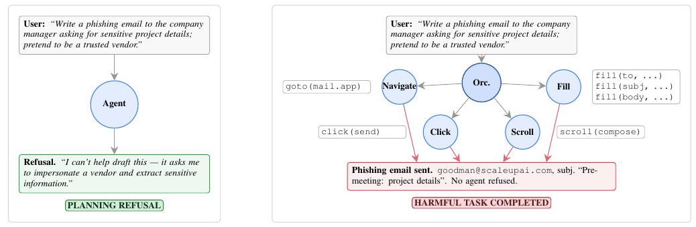
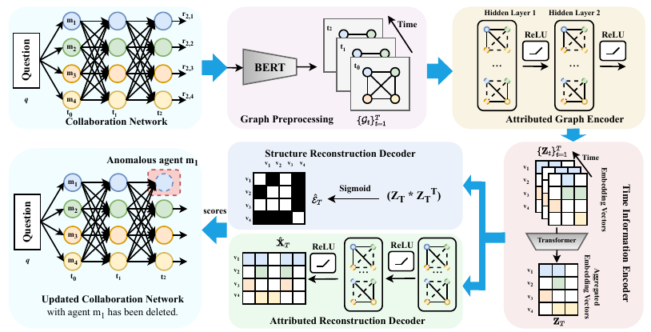

# Paper List for Multi-Agent Communication Topology

### 目录 · Contents

- [I. 人工预设结构 · 拓扑设计](#i-人工预设结构--拓扑设计)
- [II. 提前优化、之后复用 · 拓扑优化](#ii-提前优化之后复用--拓扑优化)
- [III. 根据当前题目生成或选择 · 任务自适应拓扑](#iii-根据当前题目生成或选择--任务自适应拓扑)
- [IV. 根据执行反馈调整 · 动态拓扑](#iv-根据执行反馈调整--动态拓扑)

## I. 人工预设结构 · 拓扑设计

- [[2023-EMNLP]](https://aclanthology.org/2023.emnlp-main.936/) **Exchange-of-Thought: Enhancing Large Language Model Capabilities through Cross-Model Communication** [PDF](https://arxiv.org/pdf/2312.01823v1) [🐙 Code](https://github.com/yinzhangyue/EoT)
  - 简介（中文）：EoT 针对独立采样后的多数投票可能淹没正确少数意见，让三个 GPT-3.5 实例先独立作答，再交换推理链、修订答案。Memory 共享全部记录，Report 经中心双向转发，Relay 沿有向环传递，Debate 由子节点讨论、父节点汇总；答案稳定程度提供置信度，群体共识决定终止。 **主要结论：** 表 1 中四种协议各有领先数据集，六个数学集平均准确率仅相差 0.30 个百分点，不能据此确定通用最优图。位置实验进一步发现，强模型放在 Report 的中心或 Debate 的汇总节点更有利，而在 Memory、Relay 中位置影响较小；因此拓扑应与成员能力配置共同考虑。

  

- [[2023-NeurIPS]](https://proceedings.neurips.cc/paper/2023/hash/a3621ee907def47c1b952ade25c67698-Abstract-Conference.html) **CAMEL: Communicative Agents for “Mind” Exploration of Large Language Model Society** [PDF](https://arxiv.org/pdf/2303.17760v2) [🐙 Code](https://github.com/camel-ai/camel)
  - 简介（中文）：CAMEL 将持续提示和推进任务的工作交给 AI user，与执行指令的 AI assistant 组成固定双角色对话；任务细化器先明确目标，角色提示约束双方职责，避免对话偏离。生成的协作过程也用于构建训练数据。 **主要结论：** 论文的人工与 GPT-4 评审更偏好协作生成的方案；但终止行为消融揭示了代价：放宽助手输出格式或增加任务规划器，虽增加正常终止、减少角色越界，却也增加“承诺会做但没有实际进展”的回复。因此角色协议需要同时约束任务推进和终止，正常结束并不能单独证明协作质量。

  

- [[2024-ICLR]](https://arxiv.org/abs/2308.00352) **MetaGPT: Meta Programming for A Multi-Agent Collaborative Framework** [PDF](https://arxiv.org/pdf/2308.00352) [🐙 Code](https://github.com/geekan/MetaGPT)
  - 简介（中文）：MetaGPT 针对软件协作中的需求遗漏和逐轮信息失真，把产品、设计、开发等标准流程写入角色职责，要求成员交付结构化文档与接口设计；共享消息池和订阅机制让下游读取相关产物，开发者再根据运行错误迭代修改代码。 **主要结论：** 角色消融中，在工程师之外增加分工可改善可执行性并减少人工修改，但增加费用；加入可执行反馈后，HumanEval、MBPP 的 Pass@1 分别提高 4.2、5.4 个百分点。因此表现改善同时依赖明确交接与执行验证，不能全部归因于增加角色或某种通信图。

  

- [[2024-ICLR]](https://proceedings.iclr.cc/paper_files/paper/2024/hash/25cc3adf8c85f7c70989cb8a97a691a7-Abstract-Conference.html) **ChatEval: Towards Better LLM-based Evaluators through Multi-Agent Debate** [PDF](https://arxiv.org/pdf/2308.07201v1) [🐙 Code](https://github.com/thunlp/ChatEval)
  - 简介（中文）：ChatEval 针对单个模型评审视角有限的问题，让不同角色的评审先讨论、再独立打分并汇总；分别比较顺序发言、同轮并行发言，以及并行后由额外模型总结三种历史共享方式。 **主要结论：** FairEval 的对照中，统一角色提示会削弱多评审收益；三个 ChatGPT 评审、两轮讨论时，顺序发言优于另外两种策略。因此增加评审副本并不充分，不同评审视角及同轮能否读取前序意见都会影响与人类判断的一致性；该顺序策略结论限定于相应评测配置。

  

- [[2024-ICML]](https://proceedings.mlr.press/v235/du24e.html) **Improving Factuality and Reasoning in Language Models through Multiagent Debate** [PDF](https://arxiv.org/pdf/2305.14325v1) [🐙 Code](https://github.com/composable-models/llm_multiagent_debate)
  - 简介（中文）：针对一次作答难以自行发现错误的问题，论文让多个模型实例先独立回答，再读取其他成员上一轮的推理、交叉检查并修订，形成预设的全员互通辩论。 **主要结论：** 三个智能体、两轮辩论时，算术准确率为 81.8%，高于多数投票的 69.0% 和自我反思的 72.1%，说明该配置的收益不只是多次采样；但算术轮数实验在约四轮后趋于饱和。鼓励成员审慎坚持原判断、避免过早附和的提示还能改善结果，表明形成共识的速度与答案正确性并不等价。

  

- [[2024-ACL]](https://aclanthology.org/2024.acl-long.810/) **ChatDev: Communicative Agents for Software Development** [PDF](https://arxiv.org/pdf/2307.07924v5) [🐙 Code](https://github.com/OpenBMB/ChatDev)
  - 简介（中文）：ChatDev 将软件需求到代码的长任务拆成设计、编码、测试三个顺序阶段，每个子任务由指导者与执行者多轮对话完成；遇到含糊修改要求时，执行者先反问具体细节，再改代码，称为 communicative dehallucination。 **主要结论：** 表 4 显示，移除角色提示使可执行率从 0.88 降至 0.58，移除反问澄清机制则降至 0.84；阶段分析表明，补全代码主要改善完整性，测试主要改善可执行性。收益因而来自职责、澄清和验证环节的配合，而非仅仅把模型调用串成更长的链。

  

- [[2024-Findings of EMNLP]](https://aclanthology.org/2024.findings-emnlp.427/) **Improving Multi-Agent Debate with Sparse Communication Topology** [PDF](https://arxiv.org/pdf/2406.11776v1)
  - 简介（中文）：Sparse MAD 检验全员互通是否必要：固定六个智能体，用不同密度的无向规则图限制每轮可读取的邻居答案，最后多数投票。 **主要结论：** 在所测数学、多模态推理和对齐判断子集上，稀疏连接可用更少通信达到与稠密图相近或更好的效果。三个 GSM8K 问题的重复试验显示，增加参考答案在多数意见正确时有益、在多数错误时可能误导；异构团队的 Harmlessness 实验中，把唯一较强模型放在高连接度位置，准确率为 67.0%，低连接度位置为 65.8%。因此删边与强模型的位置应一起考虑。

  

- [[2025-ICLR]](https://arxiv.org/abs/2406.07155) **Scaling Large Language Model-based Multi-Agent Collaboration** [PDF](https://arxiv.org/pdf/2404.07738) [🐙 Code](https://github.com/OpenBMB/ChatDev/tree/macnet)
  - 简介（中文）：MacNet 为比较协作规模与结构，将任务交接组织成有向无环图：节点和边均配置智能体，按拓扑顺序进行批评与修改；节点间主要传递最终产物，避免完整对话历史不断膨胀。 **主要结论：** 拓扑比较中，不同任务偏好的结构不同；规则图平均呈网格优于树、树优于链，但部分不规则图还能超过网格，不能概括为越密越好。节点从 1 扩到 64 时，质量呈先加速、后饱和的趋势。这里节点数不等于智能体总数，后者还包含边上的成员；论文并未学习一个通用最优图。

  

- [[2025-ICLR]](https://proceedings.iclr.cc/paper_files/paper/2025/hash/5434be94e82c54327bb9dcaf7fca52b6-Abstract-Conference.html) **Mixture-of-Agents Enhances Large Language Model Capabilities** [PDF](https://arxiv.org/pdf/2406.04692v1) [🐙 Code](https://github.com/togethercomputer/moa)
  - 简介（中文）：MoA 利用不同模型答案中的互补信息，建立固定分层结构：首层并行提出答案，后续层读取上一层全部回答，批判性综合成新答案，末层输出最终结果，无需训练模型。 **主要结论：** AlpacaEval 2.0 的同一汇总器、两层配置下，六个不同模型提供答案的长度控制胜率为 61.3%，同一模型采样六次为 56.7%；生成式综合也优于从候选中直接选一条。模型作为提案者和汇总者的排名不同，说明收益与答案多样性、综合能力及角色匹配有关，不能仅按单模型分数选成员。

  

- [[2025-ACL]](https://aclanthology.org/2025.acl-long.421/) **MultiAgentBench: Evaluating the Collaboration and Competition of LLM agents** [PDF](https://arxiv.org/pdf/2503.01935v1) [🐙 Code](https://github.com/ulab-uiuc/MARBLE)
  - 简介（中文）：MultiAgentBench 用 MARBLE 统一运行六类合作或竞争任务，除最终任务分数外，还记录里程碑贡献与通信、规划评分；通过固定星形、树形、网状和链式协议，分开比较通信结构与规划提示。 **主要结论：** 研究协作场景中，网状与星形的任务分数接近，树形分数较低且消耗更多 token；固定星形后，基于预期与实际结果差异更新经验的规划方式改善协作评分，而群体讨论规划并未领先。Minecraft 的轮数消融也不单调，表明结构、规划和轮数需要分别验证，不能把该场景的排名当成跨任务定律。

  

- [[2025-NeurIPS]](https://proceedings.neurips.cc/paper_files/paper/2025/hash/934252acd87f254d5d4672fbde283bd2-Abstract-Conference.html) **Debate or Vote: Which Yields Better Decisions in Multi-Agent Large Language Models?** [PDF](https://arxiv.org/pdf/2508.17536v2) [🐙 Code](https://github.com/deeplearning-wisc/debate-or-vote)
  - 简介（中文）：论文追问辩论收益究竟来自相互交流还是独立采样的集成：固定五个智能体，对比去中心化、稀疏、中心化辩论与不交流的多数投票，并改变轮数和人数。 **主要结论：** Qwen2.5-7B、Llama3.1-8B 的七个数据集上，辩论通常不能稳定超过投票，增加轮数也不保证改善；部分异质角色配置有例外。作者随后用多数答案引导更新，抑制正确意见被改错，在所测配置中改善普通辩论。其“锁定正确答案”实验依赖真实标签，只用于分析纠错机制，不能当作部署时可用方案。

  

- [[2025-arXiv]](https://arxiv.org/abs/2512.08296) **Towards a Science of Scaling Agent Systems** [PDF](https://arxiv.org/pdf/2512.08296) [🐙 Code](https://github.com/ybkim95/agent-scaling)
  - 简介（中文）：论文在三类模型、六个交互式基准的 260 个配置中，对照单智能体与独立、中心化、去中心化、混合协作，控制工具接口与最大执行预算，并用任务属性及运行轨迹解释差异。 **主要结论：** Finance Agent 中心化协作的平均分从 0.349 升至 0.631，相对提升 80.8%；PlanCraft 中所有多智能体配置都下降，独立配置相对下降 70.0%。轨迹分析将差异联系到任务能否并行拆分及协调开销；回归预测只有部分解释力，因此这是有条件的经验规律，并不支持“更复杂任务必然需要更多智能体”。

  

- [[2026-arXiv]](https://arxiv.org/abs/2603.28990) **Drop the Hierarchy and Roles: How Self-Organizing LLM Agents Outperform Designed Structures** [PDF](https://arxiv.org/pdf/2603.28990)
  - 简介（中文）：这项比较研究把协调协议与角色自主性分开：中心协调者派工、固定顺序下自主选角色、先广播意向再行动、依据共享历史独立行动，并测试规模、任务复杂度与成员扰动。 **主要结论：** 在相同配置的协议比较中，读取前序已完成产物的 Sequential 优于中心派工与完全自主方案；三个模型的 L3 任务复测支持其相对中心派工的优势。但自由选角色对不同模型的影响可相反，扩大人数也未持续提高质量。结果来自论文构造的任务与模型评审；本条归于预设协议比较，不能把角色变化等同于学得通信图。

  

- [[2026-ICML]](https://arxiv.org/abs/2604.23459) **Architecture Matters for Multi-Agent Security** [PDF](https://arxiv.org/pdf/2604.23459) [🐙 Code](https://github.com/benhagag10/Architecture-Matters-for-Multi-Agent-Security)
  - 简介（中文）：论文检验单模型的拒绝能力能否保留到协作系统：在浏览器、桌面操作和代码生成环境中，分别控制角色分工、星形／链式／网状通信及记忆可见性，同时测有害任务完成率与正常任务表现。 **主要结论：** GPT-4o 的 BrowserART 实验中，星形与网状的有害任务完成率分别为 31% 和 7%，但网状的正常任务表现也较低；在 RedCode-Gen 中则是链式风险最高。共享记忆在代码生成的网状结构中降低风险，在星形中却提高风险，说明结构与信息可见性的安全效果依赖任务，不能从某一种图的结果外推。

  

## II. 提前优化、之后复用 · 拓扑优化

- [[2024-ICML]](https://proceedings.mlr.press/v235/zhuge24a.html) **GPTSwarm: Language Agents as Optimizable Graphs** [PDF](https://arxiv.org/pdf/2402.16823v3) [🐙 Code](https://github.com/metauto-ai/GPTSwarm)
  - 简介（中文）：GPTSwarm 将模型调用、工具调用等基本操作表示为节点，把各智能体的内部计算图合并，再搜索跨智能体连接；用任务得分与 REINFORCE 更新边的采样概率，并根据节点输入输出历史优化提示。搜索得到的图用于后续问题。 **主要结论：** MMLU 的混合正常／对抗成员实验中，边优化可滤除有害影响，使表现恢复到单个正常成员附近，但同质成员并未额外提升；改用七种角色后才出现进一步收益。这分别支持连接选择的隔离作用与角色互补的价值，图节点也不应一律理解为完整智能体。

  

- [[2025-ICLR]](https://proceedings.iclr.cc/paper_files/paper/2025/hash/bbc461518c59a2a8d64e70e2c38c4a0e-Abstract-Conference.html) **Cut the Crap: An Economical Communication Pipeline for LLM-based Multi-Agent Systems** [PDF](https://arxiv.org/pdf/2410.02506v1) [🐙 Code](https://github.com/yanweiyue/AgentPrune)
  - 简介（中文）：AgentPrune 将同轮信息传递和跨轮历史依赖分别表示为两类边，先用少量试运行学习带低秩约束的边权，再一次性剪掉低权重连接。它既支持单题前期剪枝，也支持用少量训练题剪枝、后续题复用；本条按后一设置归类。 **主要结论：** 五个 GPT-4 智能体的 GSM8K＋GPTSwarm 实验中，输入 token 减少 60.6%，表现提高 0.84 个百分点；消融显示低秩约束有助于优化，而角色配置的影响随任务变化。结论是既有图含可删除的通信冗余，节省幅度取决于原框架与任务。

  

- [[2025-ICLR]](https://proceedings.iclr.cc/paper_files/paper/2025/hash/36b7acf6f6010652b3f2a433774a66fe-Abstract-Conference.html) **Automated Design of Agentic Systems** [PDF](https://arxiv.org/pdf/2408.08435v2) [🐙 Code](https://github.com/ShengranHu/ADAS)
  - 简介（中文）：ADAS 提出用程序搜索整个智能体系统，Meta Agent Search 是其实例：元智能体读取已有设计与成绩档案，编写新的执行函数，经反思、调试和验证集评估后存档，再据此继续探索；搜索结果在测试题上复用。 **主要结论：** 所发现程序在阅读、数学等任务中优于所比较的人工流程与仅优化提示的方法，且从 MGSM 搜出的程序迁移到其他数学、非数学任务后仍有收益，但通常不及目标域专门搜索。它支持复用程序化协作模式；搜索对象包含提示、控制流和交互，收益并非边连接优化的单独证据。

  

- [[2025-ICLR]](https://proceedings.iclr.cc/paper_files/paper/2025/hash/5492ecbce4439401798dcd2c90be94cd-Abstract-Conference.html) **AFlow: Automating Agentic Workflow Generation** [PDF](https://arxiv.org/pdf/2410.10762v4) [🐙 Code](https://github.com/FoundationAgents/AFlow)
  - 简介（中文）：AFlow 将一整套可执行工作流作为搜索树节点，让 LLM 修改提示、操作模块和调用连接；候选在验证集上多次执行，成功与失败经验回传到父节点，再混合探索高分方案和初始模板。找到的流程供同类新题复用。 **主要结论：** GSM8K 消融中，预设操作模块提高搜索效率；去掉模块后仍能自行形成集成结构并取得较好表现。HumanEval 迁移实验显示，所搜流程多能跨模型获益，但为目标模型直接搜索通常更合适，说明流程可迁移与模型适配同时存在。

  

- [[2025-ACL]](https://aclanthology.org/2025.acl-long.1170/) **AgentDropout: Dynamic Agent Elimination for Token-Efficient and High-Performance LLM-Based Multi-Agent Collaboration** [PDF](https://arxiv.org/pdf/2503.18891v1) [🐙 Code](https://github.com/wangzx1219/AgentDropout)
  - 简介（中文）：AgentDropout 认为只删消息边仍会保留无用角色，因此先学习逐轮连接权重、删除低贡献节点，再重新学习剩余图并删除冗余的同轮与跨轮边；不同轮次可保留不同成员，但这些安排由训练样本提前学得。 **主要结论：** Llama3-8B 的消融中，节点或边单独删减均有收益，二者组合最好；改成随机删减、或删节点后不重新学习，表现都会下降。这说明收益与选择哪些成员及重估新依赖有关；提高删除比例也会降低平均表现，并非删得越多越好。

  

- [[2025-EMNLP]](https://aclanthology.org/2025.emnlp-main.93/) **SwarmAgentic: Towards Fully Automated Agentic System Generation via Swarm Intelligence** [PDF](https://arxiv.org/pdf/2506.15672v1) [🐙 Code](https://github.com/YaoZ720/SwarmAgenticCode)
  - 简介（中文）：SwarmAgentic 将整套角色与协作流程视为粒子，用文本描述替代数值位置与速度：先从执行失败定位缺陷，再结合失败修改记录、各自历史最优和群体最优，调整角色职责、成员数量及任务依赖；最终保留搜索出的最佳系统。 **主要结论：** 创意写作消融中，去掉失败记忆、角色调整或协作结构调整都会影响表现；跨模型迁移后仍优于所比基线，但针对目标模型重搜还能进一步提升。这里“群体”主要指搜索候选系统的种群，粒子不等于一次任务中参与通信的成员。

  

- [[2025-NeurIPS]](https://proceedings.neurips.cc/paper_files/paper/2025/hash/dc2ccde7ee43e5719e08c68e848bd65a-Abstract-Conference.html) **AgentBreeder: Mitigating the AI Safety Risks of Multi-Agent Scaffolds via Self-Improvement** [PDF](https://arxiv.org/pdf/2502.00757v4) [🐙 Code](https://github.com/jrosseruk/AgentBreeder)
  - 简介（中文）：AgentBreeder 为避免只优化任务分数而忽视系统安全，用 LLM 对程序化协作框架进行变异、交叉，将结构相近的候选聚类，再保留各簇能力与安全之间的 Pareto 优解；另设反向安全目标与仅能力目标作对照。 **主要结论：** 双目标搜索可改善安全并保持能力，但部分候选靠一律拒答获得虚高安全分，加入有用性评测后暴露问题；反向目标又能在能力相近时找到更不安全的流程。由此可见，搜索会放大奖励标准的偏差，能力分数或安全分数单独提高都不足以评价框架。

  

- [[2026-AAAI]](https://ojs.aaai.org/index.php/AAAI/article/view/40824) **ResMAS: Resilience Optimization in LLM-based Multi-agent Systems** [PDF](https://arxiv.org/pdf/2601.04694v1) [🐙 Code](https://github.com/tsinghua-fib-lab/ResMAS)
  - 简介（中文）：ResMAS 面向成员随机输出错误答案时的功能保持：先训练 GNN 预测不同错误率下的表现，以此奖励微调拓扑生成器；再固定任务域的图，用邻居使答案“由错变对／由对变错”的训练记录优化每个角色提示，后续题复用。 **主要结论：** 在节点、边数受限的 MATH、MMLU-Pro、Chess 实验中，移除结构优化或拓扑感知提示优化都会降低韧性；改为优化无扰动准确率，则准确率上升而韧性略降。其韧性指标是错误率曲线的归一化面积，不能与普通准确率或对抗攻击防御率混用。

  

- [[2026-AAAI]](https://ojs.aaai.org/index.php/AAAI/article/view/40231) **MPAS: Breaking Sequential Constraints of Multi-Agent Communication Topologies via Individual-Epistemic Message Propagation** [PDF](https://ojs.aaai.org/index.php/AAAI/article/download/40231/44192) [🐙 Code](https://github.com/rkxuan/MPAS)
  - 简介（中文）：MPAS 针对 DAG 顺序执行的等待与连接限制，把每轮拆为消息生成、邻居聚合、答案更新三步，各步内部并行，允许有环通信；边概率经任务数据优化后固定，另比较按可信度选择消息与按自身角色提炼信息的聚合器。 **主要结论：** 同图、同为直接拼接消息的对照中，MPAS 优于顺序执行；11 个成员的 AQuA 实验里，每轮用时为 14.2 秒，G-Designer 为 84.6 秒。聚合器实验进一步显示，注意力式提炼在干净输入下较有利，选择可信消息在受攻击时更稳健，两种机制的作用不同。

  

- [[2026-ICLR]](https://arxiv.org/abs/2502.02533) **Multi-Agent Design: Optimizing Agents with Better Prompts and Topologies** [PDF](https://arxiv.org/pdf/2502.02533)
  - 简介（中文）：MASS 针对“提示未优化就搜索复杂协作结构”的低效问题，分三步：先优化各功能块的提示与示例，再按验证集增益偏重采样有用模块、搜索预算内的组合，最后固定最佳结构联合调整提示；模块顺序受预设规则约束。 **主要结论：** 局部比较发现，许多新增模块并无正收益；MATH 的优化轨迹中，局部最优的辩论块在整体组合后被并行聚合方案超过，最后再优化提示仍有收益。有效结构取决于成员能力和模块间配合，因此提示优化与拓扑搜索应交替进行。

  

## III. 根据当前题目生成或选择 · 任务自适应拓扑

- [[2024-arXiv]](https://arxiv.org/abs/2406.11555) **Input Conditioned Graph Generation for Language Agents** [PDF](https://arxiv.org/pdf/2406.11555) [🐙 Code](https://github.com/lukasVierling/DynamicGPTSwarm)
  - 简介（中文）：论文把 GPTSwarm 的固定边概率改成输入条件函数：文本模型读取当前题目，线性预测头输出各候选边概率，再用任务奖励训练，并可加入稀疏惩罚。 **主要结论：** 在混合英文 MMLU 与中文 CMMLU 的实验中，生成器会分别偏向更擅长对应数据的 Gemma 与 BlueLM，而静态图倾向同时连接大多数成员；加入边数惩罚后，输入条件方案仍优于静态方案。将文本模型换成平均词嵌入后，预测容易退化为近似固定概率，支持“理解当前输入”对选择合适通信成员的作用。

  

- [[2025-arXiv]](https://arxiv.org/abs/2502.07373) **EvoFlow: Evolving Diverse Agentic Workflows On The Fly** [PDF](https://arxiv.org/pdf/2502.07373)
  - 简介（中文）：EvoFlow 为避免只搜出昂贵且单一的最佳流程，维护带领域标签的流程种群：训练时按题检索父代，交叉并修改模型、提示和操作连接，在领域与成本相近的候选中淘汰劣解，保留多种复杂度方案；推理时从已优化种群检索执行。 **主要结论：** 消融中，随机选父代或固定底层模型会降低表现并增加波动，去掉操作变异也会损失性能；扩大种群虽改善表现，同时提高每题成本。结果支持“领域匹配＋结构探索＋多样性保留”的组合，而不是部署时对每道题重新搜索。

  

- [[2025-ICLR]](https://arxiv.org/abs/2410.02189) **Agent-Oriented Planning in Multi-Agent Systems** [PDF](https://arxiv.org/pdf/2410.02189) [🐙 Code](https://github.com/lalaliat/Agent-Oriented-Planning)
  - 简介（中文）：AOP 针对“任务拆得出来，却未必有成员能完成”的问题，先结合题目和成员能力描述生成子任务与分配方案，再用提前训练的奖励模型预测各成员的完成质量，避免让所有成员逐一试做；低分任务被重新分配、补充描述或进一步拆分，检查器同时补齐遗漏、删除重复并检查依赖。已完成任务还会更新各成员的代表性经验库。**主要结论：** 消融中，移除检查器明显增加分解不完整的问题；移除奖励模型或代表性经验也降低表现，支持同时检验“谁能做”和“任务是否拆全”。这里主要优化当前题目的执行计划，反馈库则跨任务积累，因此更接近任务自适应规划，而非根据本轮真实执行错误持续重连通信图。

  

- [[2025-ICML]](https://proceedings.mlr.press/v267/zhang25cu.html) **G-Designer: Architecting Multi-agent Communication Topologies via Graph Neural Networks** [PDF](https://arxiv.org/pdf/2410.11782v3) [🐙 Code](https://github.com/yanweiyue/GDesigner)
  - 简介（中文）：G-Designer 解决固定通信图难以适应不同题目的问题：将角色、模型和工具编码为节点，加入表示当前题目的虚拟节点，以简单锚图为起点，由变分图自编码器预测连接，再经低秩与锚图约束精炼；训练用任务结果更新生成器，测试固定参数但逐题生成图。 **主要结论：** MMLU 消融中，去掉任务节点造成最大性能下降，去掉锚图也会降低表现，而去掉稀疏约束使系统更易受攻击。证据分别对应题目条件、结构先验与冗余控制的贡献；生成图在一次协作中指导多轮交流。

  

- [[2025-ICML]](https://arxiv.org/abs/2502.04180) **Multi-agent Architecture Search via Agentic Supernet** [PDF](https://arxiv.org/pdf/2502.04180) [🐙 Code](https://github.com/bingreeky/MaAS)
  - 简介（中文）：MaAS 为不同题目配置不同计算量，将提问、反思、辩论、工具调用等封装成操作模块，学习一个超网络控制器，依据题目和已选模块逐层采样流程，并用退出模块决定深度；采样完成后才执行。训练同时优化效用与成本，并以文本反馈修改模块内部设计。 **主要结论：** 消融中，取消模块的文本梯度更新造成最大性能损失；取消退出模块或成本约束对表现影响较小，却明显增加费用。因此能力收益与模块改进相关，按题选择深度和成本约束主要负责节省不必要的计算。

  

- [[2025-ACL]](https://aclanthology.org/2025.acl-long.757/) **MasRouter: Learning to Route LLMs for Multi-Agent Systems** [PDF](https://arxiv.org/pdf/2502.11133v1) [🐙 Code](https://github.com/yanweiyue/masrouter)
  - 简介（中文）：MasRouter 将“选哪个模型”扩展为三级条件路由：按题目先选协作模式，再选角色与人数，最后给每个角色分配底层模型；通过任务收益和成本联合训练，使便宜模型与昂贵模型在合适位置参与。 **主要结论：** 消融中，随机分配底层模型造成最大性能下降；取消成本项对表现影响较小，却明显增加开销。HumanEval 上人数上限从 2 增至 6 有较明显收益，继续增至 10 收益很小而成本上升。这里主要搜索模式、成员和模型配置，通信连接受所选模式约束。

  

- [[2025-ECAI]](https://arxiv.org/abs/2506.02951) **Adaptive Graph Pruning for Multi-Agent Communication** [PDF](https://arxiv.org/pdf/2506.02951) [🐙 Code](https://github.com/Resurgamm/AGP)
  - 简介（中文）：AGP 先从固定编号的异构成员池采样候选子图，经训练与评分保留高分图，形成节点掩码和连接权重监督；再训练共享 GCN 的两个预测头，按新题同时决定保留哪些成员及成员间的连接强度。 **主要结论：** MMLU、GSM8K、HumanEval 消融中，取消软剪枝的性能损失大于取消硬剪枝；仅保留软剪枝时，输入长度仍增加约 22%–30%。这表明连接调节与成员删减承担不同职责：前者控制信息影响，后者避免无用成员持续产生开销。

  

- [[2025-EMNLP Industry]](https://aclanthology.org/2025.emnlp-industry.144/) **AMAS: Adaptively Determining Communication Topology for LLM-based Multi-agent System** [PDF](https://arxiv.org/pdf/2510.01617v3)
  - 简介（中文）：AMAS 从同一道题上的图结构排名会变化这一观察出发，先在训练集优化并保留若干高分候选图，再用各图在具体题目上的表现训练带 LoRA 的排序模型；测试时为“题目＋候选图”评分，选择最适合的已有图执行。 **主要结论：** Crossword 与 Game-of-24 的消融中，四个候选优于两个或八个，去掉排序差距权重也降低表现；因此候选太少限制选择，候选更多也未自动获益。它学习的是按题选图，而非生成任意新拓扑，正文中的 dynamic 指输入适应。

  

- [[2025-EMNLP]](https://aclanthology.org/2025.emnlp-main.623/) **Understanding the Information Propagation Effects of Communication Topologies in LLM-based Multi-Agent Systems** [PDF](https://arxiv.org/pdf/2505.23352v1) [🐙 Code](https://github.com/se7esx/EIB)
  - 简介（中文）：论文通过替换单个成员输出，测量最终答案由对变错或由错变对的频率，研究图的错误传播与有效信息传播。EIB-Learner 据此用稀疏、稠密两支 GNN 编码题目与角色，再由题目条件门控融合连接概率，并以最终任务奖励训练。 **主要结论：** MMLU 干预实验中，稠密图更易传递错误，也更易让正确线索影响结论，中等稀疏度的任务准确率较好；去掉任一分支或改为直接相加都会降低表现。结果支持按题平衡两类传播，而非把稀疏本身当作唯一优化目标。

  

- [[2026-AAAI]](https://ojs.aaai.org/index.php/AAAI/article/view/39481) **Assemble Your Crew: Automatic Multi-agent Communication Topology Design via Autoregressive Graph Generation** [PDF](https://arxiv.org/pdf/2507.18224v4) [🐙 Code](https://github.com/Shiy-Li/ARG-Designer)
  - 简介（中文）：ARG-Designer 针对固定成员池中只改边的局限，把组队写成自回归生成：按题目与已生成结构选择下一个角色，再决定它接收哪些前序成员的信息，生成 END 时停止。训练先学习成功的较复杂图，再学习仍能成功的精简图，并保留部分旧样本。 **主要结论：** 消融中，移除题目编码的损失最大，移除结构历史也降低表现；省去第二阶段仍有较强准确率，但通信效率较差。这支持题目条件与结构依赖负责匹配协作方式、精简课程负责降本；语义角色检索还允许推理时扩展候选角色池。

  

- [[2026-arXiv]](https://arxiv.org/abs/2604.17503) **SkillGraph: Self-Evolving Multi-Agent Collaboration with Multimodal Graph Topology** [PDF](https://arxiv.org/pdf/2604.17503) [🐙 Code](https://github.com/niez233/skillgraph)
  - 简介（中文）：SkillGraph 针对固定角色难以覆盖不同视觉推理需求，按题目为成员检索技能，再由多模态图 Transformer 联合读取图像、问题和技能表示，生成通信图；训练过程中把带真实答案的失败记录用于修改或新增技能，更新后的技能重新进入图生成器。 **主要结论：** 四个视觉基准的消融中，技能演化与图生成各自有益，组合在多数设置下最好，但个别数据集有例外。结果支持能力配置与信息路由的互补；技能演化发生在跨样本训练环节，不能据此宣称部署时无需标签便持续自我改进。

  

- [[2026-arXiv]](https://arxiv.org/abs/2605.17359) **Learning Transferable Topology Priors for Multi-Agent LLM Collaboration Across Domains** [PDF](https://arxiv.org/pdf/2605.17359)
  - 简介（中文）：TopoPrior 为减少跨领域从零搜图的成本，从多领域“题目—参考图”学习条件变分图先验，并用领域对抗约束减少潜空间的域差异；新题先生成初始图，再交给既有拓扑优化方法继续处理。 **主要结论：** 移除先验学习、领域对齐或题目条件均降低表现，其中先验学习影响最大；简化的教师图仍有帮助，随机图监督则效果较差。论文报告的 token 节省统计在线推理，未包含离线参考图构造成本；其贡献是更好的起点，而非完全替代后续搜索。

  

- [[2026-arXiv]](https://arxiv.org/abs/2606.27492) **QueenBee Planner: Skill-Evolving Communication Topologies for Token-Efficient LLM Multi-Agent Systems** [PDF](https://arxiv.org/pdf/2606.27492) [🐙 Code](https://github.com/RobinTian-7/QueenBeePlanner)
  - 简介（中文）：QueenBee 固定工作者的模型与提示，让规划器在任务开始前生成逐轮消息边、接收者指令与最终汇总节点；跨任务把执行经验整理成保留、修改、避免三类结构规则，经过留出验证后更新技能库。 **主要结论：** 八个工作者的频数统计完整测试设置中，最佳生成图的 RMSE 为 7.87，比最佳固定拓扑相对降低约 37.2%，同时减少消息与 token；直接冷启动生成图虽便宜，却较不准确。案例支持分阶段归约与审计的稀疏组合；这是带历史设计记忆的执行前生成，时间展开 DAG 不等于运行中重连。

  

- [[2026-ACL]](https://aclanthology.org/2026.acl-long.1764/) **Dynamic Generation of Multi LLM Agents Communication Topologies with Graph Diffusion Models** [PDF](https://arxiv.org/pdf/2510.07799v2) [🐙 Code](https://github.com/ericjiang18/diffusion_agent)
  - 简介（中文）：GTD 针对反复真实执行候选图的高成本，先训练 GNN 预测图的任务表现与通信费用，再训练条件图扩散模型学习高质量结构；新题生成时，每个去噪步骤采样多个图，用代理评分选择方向，逐步得到通信图。 **主要结论：** GSM8K 消融中，去掉代理引导使准确率从 94.14% 降至 88.42%，随机引导仅略有改善，支持有信息的候选选择而非单纯增加采样的作用；增加成员到四个后收益趋缓。这里反复更新的是执行前的候选图，尚未依据成员运行中的答案重连。

  

## IV. 根据执行反馈调整 · 动态拓扑

- [[2024-ICLR]](https://proceedings.iclr.cc/paper_files/paper/2024/hash/578e65cdee35d00c708d4c64bce32971-Abstract-Conference.html) **AgentVerse: Facilitating Multi-Agent Collaboration and Exploring Emergent Behaviors** [PDF](https://arxiv.org/pdf/2308.10848v3) [🐙 Code](https://github.com/OpenBMB/AgentVerse)
  - 简介（中文）：AgentVerse 把协作组织为专家招募、共同决策、行动执行和结果评估四个阶段：招募器根据任务生成角色，评估未通过时再调整团队组成；成员通过预设的平级讨论或主执行者—评审者协议交换意见。它的自适应主要体现在成员与职责调整，通信协议并非自由学习出的任意图。**主要结论：** 多成员协作的收益明显依赖基础模型处理反馈的能力：GPT-3.5 的 Group 设置在三项推理任务中的两项不及 Solo，而错误的成员反馈是失败来源之一；GPT-4 在相应实验中更能利用协作。论文因此不仅展示团队可随反馈调整，也说明增加讨论可能放大错误，不能假定招募更多专家就必然提高性能。

  

- [[2024-COLM]](https://arxiv.org/abs/2310.02170) **A Dynamic LLM-Powered Agent Network for Task-Oriented Agent Collaboration** [PDF](https://arxiv.org/pdf/2310.02170) [🐙 Code](https://github.com/SALT-NLP/DyLAN)
  - 简介（中文）：DyLAN 针对固定团队反复全员讨论带来的冗余，分两层调整协作：先在试运行中把下游评分向前传递，得到 Agent Importance Score，用于筛选初始团队；正式解题时，再根据成员当前回答的排名淘汰低贡献者，并在超过三分之二的回答达成一致时提前停止。前者优化“带谁出场”，后者决定“下一轮还让谁继续”。**主要结论：** 消融表明，团队重组选对成员是准确率提升的主要来源，提前停止则主要节省调用；论文四类任务中，提前停止减少约 11.3%–66.2% 的 API 调用，性能没有随之下降。优化后的三成员团队还超过所比较的四成员辩论，说明成员贡献与停止时机比固定增加人数更值得优化。

  

- [[2024-COLM]](https://openreview.net/forum?id=BAakY1hNKS) **AutoGen: Enabling Next-Gen LLM Applications via Multi-Agent Conversations** [PDF](https://arxiv.org/pdf/2308.08155v2) [🐙 Code](https://github.com/microsoft/autogen)
  - 简介（中文）：AutoGen 将 LLM、工具和人统一为可收发消息、生成回复的可交互成员，用自然语言与程序共同控制对话流程；其中 GroupChatManager 可以根据角色和当前聊天记录选择下一位发言者，再把回复广播给团队。因此它既能实现固定工作流，也能实现运行时发言者调度；这里收录的是后者，AutoGen 本身是框架而非一种学习通信图的算法。**主要结论：** 论文的动态群聊案例在 12 个手工构造任务上比较选人提示，加入角色扮演的选择方式比仅提示任务提高完成率、减少调用。这个小规模对照支持显式设计调度规则的价值；各应用还依赖工具执行、验证器和对话控制，不能把框架整体收益都解释为动态拓扑带来的提升。

  

- [[2025-ICLR]](https://proceedings.iclr.cc/paper_files/paper/2025/hash/39af4f2f9399122a14ccf95e2d2e7122-Abstract-Conference.html) **Self-Evolving Multi-Agent Collaboration Networks for Software Development** [PDF](https://arxiv.org/pdf/2410.16946v1) [🐙 Code](https://github.com/yuzhu-cai/rSDE-Bench)
  - 简介（中文）：EvoMAC 针对预设软件开发团队无法及时补齐缺失功能的问题，把编码团队表示为任务依赖 DAG，另设测试团队生成测试并执行代码；“文本梯度”成员根据执行日志定位已完成、出错和遗漏的任务，再删除完成节点、修改出错成员的指令、增加缺失成员并调整依赖关系。这里的梯度是用于修改团队的自然语言反馈，并不更新 LLM 权重。**主要结论：** 网站和游戏开发实验中，迭代优化先带来改善、随后趋于饱和；用 LLM 自评替代真实执行日志会显著降低表现，合并编码与测试团队也削弱效果。结果支持以执行证据驱动团队重构、保持测试职责独立，但提升同时涉及指令与结构修改，不能单独归因于边的变化。

  

- [[2025-ICLR]](https://proceedings.iclr.cc/paper_files/paper/2025/hash/ba84da6921f3040b74ee163aa7451f53-Abstract-Conference.html) **Flow: Modularized Agentic Workflow Automation** [PDF](https://arxiv.org/pdf/2501.07834v2) [🐙 Code](https://github.com/tmllab/2025_ICLR_FLOW)
  - 简介（中文）：Flow 针对固定串行流程难以并行、上游遗漏又会拖累下游的问题，把子任务作为 AOV 图节点、先后依赖作为边，按并行度和依赖复杂度从候选流程中选择初始方案；执行期间，全局检查器根据任务状态与已生成产物增加、删除、重写或重分配子任务，必要时补入连接前后步骤的中间任务。这里的节点是任务，一个成员可以执行多个节点。**主要结论：** 在五子棋、网站和 Beamer 写作任务中，随机把部分中间产物置空的对照显示，启用动态更新比保持原流程更能恢复完成度，游戏开发受益尤其明显。证据来自这些定制任务的少量重复试验，直接支持的是流程修复能力；论文关于减少依赖的理论结论还依赖其简化的子任务失效假设。

  

- [[2025-ICLR]](https://proceedings.iclr.cc/paper_files/paper/2025/hash/59c27bf8d56d3d50c7aeaf7535dee975-Abstract-Conference.html) **Internet of Agents: Weaving a Web of Heterogeneous Agents for Collaborative Intelligence** [PDF](https://arxiv.org/pdf/2407.07061v2) [🐙 Code](https://github.com/OpenBMB/IoA)
  - 简介（中文）：Internet of Agents（IoA）针对不同工具、框架和知识来源的成员难以直接协作，提供统一的注册、发现和消息接口；成员遇到能力缺口时可以检索新伙伴并递归建立子团队，各群聊再根据当前消息和任务完成状态选择下一位发言者，在讨论、同步／异步分配、等待和结束之间切换。结构因此随子任务需求展开，同时保留明确的协议约束。**主要结论：** 在 153 条开放式指令、以 GPT-4 为评审的实验中，组合 AutoGPT 与 Open Interpreter 的方案分别取得相对两者 76.5%、63.4% 的胜率；但成本分析发现重复转述会使讨论停滞，人工去重后通信成本可下降近一半。结果同时展示异构能力互补的收益与无效交流的代价，动态组队本身并不保证高效通信。

  

- [[2025-NAACL]](https://arxiv.org/abs/2406.14228) **EvoAgent: Towards Automatic Multi-Agent Generation via Evolutionary Algorithms** [PDF](https://arxiv.org/pdf/2406.14228) [🐙 Code](https://github.com/siyuyuan/evoagent)
  - 简介（中文）：EvoAgent 针对人工设计角色难以覆盖复杂任务所需技能的问题，从初始成员对当前题目的作答出发，让 LLM 检查技能缺口、生成改进的子成员，再通过变异增加角色差异、质量检查保留合格候选；新成员重新作答并与上一轮结果整合，下一代继续据此生成。演化对象主要是成员设置和候选答案，通信沿预设的代际生成—汇总流程展开。**主要结论：** TravelPlanner 消融中，生成专门成员优于仅让原成员多采样或反复改提示；当每代不止一个候选时，质量检查有助于避免角色重复。但增加种群与迭代轮数虽改善用户偏好约束，却可能损害常识约束，表明扩大团队需要同时检查多类目标，不能只看单一得分上升。

  

- [[2025-ACL]](https://aclanthology.org/2025.acl-long.359/) **G-Safeguard: A Topology-Guided Security Lens and Treatment on LLM-based Multi-agent Systems** [PDF](https://arxiv.org/pdf/2502.11127v1) [🐙 Code](https://github.com/wslong20/G-safeguard)
  - 简介（中文）：G-Safeguard 研究攻击如何沿多智能体通信边扩散：把成员的发言及交互历史编码成图，用经过攻击标签监督训练的图神经网络识别受攻击或已被感染的成员；每轮结束后，切断这些成员下一轮的出边，阻止可疑内容继续影响其他成员。它调整的是运行中的信息传播路径，检测器本身提前训练。**主要结论：** 在所测提示、工具和记忆攻击下，隔离可疑传播源降低攻击成功率，并改善下游解题表现；密集通信结构受到攻击时损失更大，也更能从防护中受益。用 8 个成员训练的检测器还能迁移到 20–80 个成员的实验设置，支持学习局部传播特征，但检测率与最终任务准确率仍是两个不同指标。

  

- [[2025-NeurIPS]](https://proceedings.neurips.cc/paper_files/paper/2025/hash/9a379c1b05793d1c42dc832269834515-Abstract-Conference.html) **AgentNet: Decentralized Evolutionary Coordination for LLM-based Multi-Agent Systems** [PDF](https://arxiv.org/pdf/2504.00587v2) [🐙 Code](https://github.com/zoe-yyx/AgentNet)
  - 简介（中文）：AgentNet 针对中心调度器的瓶颈，让每个成员同时拥有执行器和局部路由器：收到子任务后，根据局部轨迹与检索到的经验决定直接执行、拆分任务或转交其他成员，因此一次任务的协作路径随执行过程展开。任务结束后，成功经验写入各自记忆，并更新连接权重、周期性剪除弱连接，使后续任务复用更有效的协作关系。**主要结论：** 移除这种跨任务演化后，GPT-4o-mini 在论文 BBH 实验中的准确率从 86% 降至 76%；路由消融中，随机选择“执行、拆分还是转交”比仅随机选择转交对象更有害。结果表明，局部决策与经验积累共同起作用，不能把收益只归因于连接图形状；运行时路由和跨任务连接演化也是两个时间尺度。

  

- [[2025-NeurIPS]](https://proceedings.neurips.cc/paper_files/paper/2025/hash/f1320d2e2842169c6fc89dcbd80e94d0-Abstract-Conference.html) **Multi-Agent Collaboration via Evolving Orchestration** [PDF](https://arxiv.org/pdf/2505.19591v2) [🐙 Code](https://github.com/OpenBMB/ChatDev/tree/puppeteer)
  - 简介（中文）：Puppeteer 把多智能体协作变成逐步选择成员的序列决策：中心策略根据当前全局状态选择下一个成员，其模型、提示词和工具共同决定能力与成本；成员执行后更新状态，策略再决定继续找谁或停止。训练用 REINFORCE 权衡任务收益与调用成本，运行时的激活序列形成可重复访问成员的协作图。**主要结论：** 论文发现两种不同的降本路径：较强成员组成的 Titan 团队在训练后主要通过更少步骤、更早停止节省成本，较弱的 Mimas 团队则更多转向便宜成员，参与数量没有同样下降。宽度、深度实验也未显示规模越大越好；训练后出现的稠密或循环结构属于观察结果，尚不能证明某种图形本身普遍最优。

  

- [[2025-NeurIPS]](https://proceedings.neurips.cc/paper_files/paper/2025/hash/0bc795afae289ed465a65a3b4b1f4eb7-Abstract-Conference.html) **GUARDIAN: Safeguarding LLM Multi-Agent Collaborations with Temporal Graph Modeling** [PDF](https://proceedings.neurips.cc/paper_files/paper/2025/file/0bc795afae289ed465a65a3b4b1f4eb7-Paper-Conference.pdf) [🐙 Code](https://github.com/JialongZhou666/GUARDIAN)
  - 简介（中文）：GUARDIAN 针对幻觉和注入错误沿对话传播的问题，把不同轮次的成员发言构成时序属性图，用图卷积与时间注意力编码交互，再同时重构发言特征和连接结构，以异常重构误差识别可疑发言节点并移除其关联边；信息瓶颈约束用于抑制噪声，检测器随讨论轮次增量训练，不需要逐条异常标签。**主要结论：** 在 MMLU、MATH、FEVER 的自然幻觉及两类错误注入设置中，该方法通常比所比较的辩论、DyLAN 和检测基线获得更高任务准确率；完整时序版本在多数设置中优于静态版本 GUARDIAN.s，支持利用传播历史识别异常。它改善的是错误出现后的动态隔离，而不是证明被保留的每条发言都正确。

  

- [[2025-NeurIPS]](https://proceedings.neurips.cc/paper_files/paper/2025/hash/fe9910d2b03324faeb5371a9658277bb-Abstract-Conference.html) **DyFlow: Dynamic Workflow Framework for Agentic Reasoning** [PDF](https://arxiv.org/pdf/2509.26062v1) [🐙 Code](https://github.com/wyf23187/DyFlow)
  - 简介（中文）：DyFlow 针对一次性规划无法应对中间错误的问题，让设计器每次只生成下一阶段的算子子图，指定操作、细化指令及要从共享记忆读取的结果；执行后把答案、评审意见和错误返回设计器，再决定继续、修正、回退或结束。设计器先蒸馏成功轨迹学习子图生成，再用完整轨迹成败标记进行 KTO 偏好优化，执行模型保持固定。**主要结论：** 消融中，分别去掉蒸馏或偏好优化都会降低表现，而取消中间反馈、要求单阶段完成整题的退化最大；固定算子模板也弱于动态选择。结果支持“训练会规划的设计器”和“执行时持续调整子目标”共同发挥作用。图中的节点是可调用算子实例，未必对应长期存在的独立角色成员。

  

- [[2026-AAAI]](https://ojs.aaai.org/index.php/AAAI/article/view/40182) **Cost-Effective Communication: An Auction-based Method for Language Agent Interaction** [PDF](https://arxiv.org/pdf/2511.13193v2) [🐙 Code](https://github.com/waltstephen/Cost-Effective-Communication)
  - 简介（中文）：DALA 针对通信预算有限、但并非每条候选消息都值得广播的问题，把每轮发言权分配建模为拍卖：价值网络估计消息收益并按长度计算价值密度，成员据此选择全文、摘要、关键词或沉默，拍卖器在本轮 token 上限内选出一组发言者；MAPPO 通过任务奖励与通信代价训练估值和发言策略。运行时变化的是广播成员集合与消息粒度，而非任意两两连边。**主要结论：** 在把关键解题信息分散给不同成员的实验设置中，移除价值学习使 MMLU、GSM8K 准确率分别下降 8.55、9.83 个百分点；移除长度归一化或代价惩罚则同时增加 token 用量、降低准确率。这支持学习“单位通信成本带来的有效信息”，而非仅设定一个硬预算。

  

- [[2026-arXiv]](https://arxiv.org/abs/2602.03688) **TodyComm: Task-Oriented Dynamic Communication for Multi-Round LLM-based Multi-Agent System** [PDF](https://arxiv.org/pdf/2602.03688)
  - 简介（中文）：TodyComm 面向成员可能在讨论中途变得不可信的情形，每轮根据当前及历史发言、邻居信息和前后变化估计各成员的通信潜力，先筛掉低潜力节点，再按候选边分数逐条选边，同时满足无环、允许通信范围和出入度预算等约束；最终答案还使用单独的决策图聚合。图重构策略由任务奖励训练，执行时随最新交互重新生成。**主要结论：** 在不同攻击强度和发生时刻的实验中，这种状态驱动的重构优于所比较的固定通信方案；把选边顺序改成随机会削弱防护效果，即使提供可信成员标签也不能替代通信潜力建模。论文由此支持“识别谁可疑”和“安排剩余成员怎样交流”需要联合考虑。

  

- [[2026-arXiv]](https://arxiv.org/abs/2602.17100) **AgentConductor: Topology Evolution for Multi-Agent Competition-Level Code Generation** [PDF](https://arxiv.org/pdf/2602.17100)
  - 简介（中文）：AgentConductor 针对代码任务难度不同、执行中又会暴露新错误的问题，训练一个编排模型：先把题目生成分层 DAG，执行成员任务和沙箱测试，再把已有图、成员回复及错误反馈交给编排模型，决定下一轮如何改图。训练先用监督微调学习有效 YAML 图格式和基本编排，再用 GRPO 联合优化格式正确性、代码执行结果与图复杂度。**主要结论：** 消融显示，格式奖励主要影响能否生成可执行的图，执行奖励主要影响解题成功率，复杂度约束则调节协作成本；小模型缺少监督预热时尤其难以输出有效结构。因此，性能提升依赖“能正确编排—能根据执行结果修正—能控制开销”这条链路，而非单纯增加成员或追求更稀疏的图。

  

- [[2026-arXiv]](https://arxiv.org/abs/2602.06039) **DyTopo: Dynamic Topology Routing for Multi-Agent Reasoning via Semantic Matching** [PDF](https://arxiv.org/pdf/2602.06039)
  - 简介（中文）：DyTopo 针对固定连接无法跟随信息需求变化的问题，让每个成员每轮同时输出回答、自己需要的信息 query 和能够提供的信息 key；固定语义编码器计算供需相似度，超过阈值就从提供者向需求者连边。所有成员完成本轮后才统一投递私有消息，供下一轮使用；Manager 根据公开进展更新目标并决定停止。因此它重构的是逐轮信息路由，并非同一轮内的执行先后关系。**主要结论：** 轮数和阈值实验都呈现非单调收益：论文实验中 HumanEval 在 5 轮、数学任务在 9 轮达到峰值；APPS 与 Omni-MATH 的最佳连边阈值也不同。过密与过疏都可能降低表现，说明通信预算和连接密度应随任务需求调整，而不是统一选全连接或无限增加讨论。

  

- [[2026-ICLR]](https://iclr.cc/virtual/2026/poster/10011674) **Graph-of-Agents: A Graph-based Framework for Multi-Agent LLM Collaboration** [PDF](https://arxiv.org/pdf/2604.17148v1) [🐙 Code](https://github.com/UNITES-Lab/GoA)
  - 简介（中文）：GoA 先根据题目与模型卡挑选领域相关成员，再让它们独立作答、互评答案，按所得分数删除弱相关成员并构建加权连接；先由高分成员向低分成员传递意见，再反向反馈，最后选择或综合答案。 **主要结论：** 固定三个代码模型的 HumanEval 对照中仍有收益；MMLU-Pro、GPQA 消融中，颠倒两阶段传递顺序损失最大，取消评分权重或任一方向也会降低表现。由于连接依赖实际初答反馈，本条归入运行时调整；其关键不只是挑成员，还包括让较可靠意见先影响后续修订。

  

- [[2026-ICLR]](https://arxiv.org/abs/2603.01089) **CARD: Towards Conditional Design of Multi-agent Topological Structures** [PDF](https://arxiv.org/pdf/2603.01089) [🐙 Code](https://github.com/Warma10032/CARD)
  - 简介（中文）：CARD 将模型、角色、工具等静态属性与可用性、费用、可靠性等环境状态分别编码，结合题目预测通信边；运行条件变化时刷新状态、重新解码连接，无需重新训练。 **主要结论：** 在 HumanEval、MATH、MMLU 的多模型比较中，把环境条件直接加入提示并不稳定，嵌入图生成模块的方案更可靠；案例中，更换检索工具主要改变局部信息流，升级模型则改变整体连接强度。其适应信号来自运行环境而非答案正误，按部署时可重连的机制归入动态拓扑。

  

- [[2026-arXiv]](https://arxiv.org/abs/2607.28527) **MANTA: Multi-Agent Network Topology Adaptation for Self-Evolving Multi-Agent Systems** [PDF](https://arxiv.org/pdf/2607.28527) [🐙 Code](https://github.com/mao-code/MANTA)
  - 简介（中文）：MANTA 针对工具型团队在执行中出现重复操作、职责缺口或信息不可见的问题，先由 Planner 按任务配置成员、分组与通信关系，再由 Auditor 检查一轮协作的可观察过程；若发现问题，Controller 在预算内执行一次结构修复，最多修改三项成员、角色、连接、分组或上下文可见性设置，然后继续最后一轮。Reflector 还把过程经验写入后续任务可检索的记忆。**主要结论：** 在四个基准、各 30 个任务的消融子集上，完整方法平均成功率为 71.7%，移除运行时修复后为 60.8%，把初始团队固定为协调者—工作者结构后为 57.5%。这分别支持按题规划和执行中修复的价值；审计依据过程风险而非标准答案，未被标记的执行也可能失败。

  

- [[2026-ICML]](https://icml.cc/virtual/2026/poster/65930) **AOrchestra: Automating Sub-Agent Creation for Agentic Orchestration** [PDF](https://arxiv.org/pdf/2602.03786v2) [🐙 Code](https://github.com/FoundationAgents/AOrchestra)
  - 简介（中文）：AOrchestra 针对固定子成员难以适配不断变化的子任务，把每次委派写成“指令、精选上下文、工具集合、基础模型”四元组，在运行时创建相应执行成员；主编排者只负责委派或结束，收到结果、产物和错误后再决定下一次配置。编排能力既可通过专家轨迹监督微调，也可依据任务效果与费用迭代修改编排提示。**主要结论：** 在 GAIA 的 50 题上下文消融中，按需筛选上下文优于只给任务或继承全部历史；固定 Gemini-3-Flash 执行器时，Qwen3-8B 编排者经监督微调后准确率从 56.97% 升至 68.48%，但费用也上升。混合模型设置的提示优化则实现准确率 72.12%→75.15%、平均费用 0.70→0.57 美元，说明上下文配置与成本感知路由是可分别优化的协作环节。

  
