# Paper List for Multi-Agent Communication Topology

### 目录 · Contents

- [A. 通信拓扑](#a-通信拓扑)
  - [A1. 人工预设的通信结构](#a1-人工预设的通信结构)
  - [A2. 离线优化后复用的通信结构](#a2-离线优化后复用的通信结构)
  - [A3. 根据当前题目生成或选择通信结构](#a3-根据当前题目生成或选择通信结构)
  - [A4. 执行过程中调整通信结构](#a4-执行过程中调整通信结构)
- [B. 通信机制](#b-通信机制)
  - [B1. 信息筛选与压缩](#b1-信息筛选与压缩)
  - [B2. 证据传递与聚合](#b2-证据传递与聚合)
  - [B3. 消息生成与表达](#b3-消息生成与表达)
  - [B4. 潜在状态与缓存通信](#b4-潜在状态与缓存通信)
- [C. 协作记忆](#c-协作记忆)
  - [C1. 共享工作区与跨轮状态](#c1-共享工作区与跨轮状态)
  - [C2. 跨任务经验积累与复用](#c2-跨任务经验积累与复用)
  - [C3. 角色化记忆分配与检索](#c3-角色化记忆分配与检索)
- [D. 组队与执行编排](#d-组队与执行编排)
  - [D1. 角色与成员选择](#d1-角色与成员选择)
  - [D2. 异构模型分工与路由](#d2-异构模型分工与路由)
  - [D3. 工作流组织与搜索](#d3-工作流组织与搜索)
  - [D4. 运行框架与异步调度](#d4-运行框架与异步调度)
- [E. 协作规律与评估](#e-协作规律与评估)
  - [E1. 协作收益与规模规律](#e1-协作收益与规模规律)
  - [E2. 协作能力基准](#e2-协作能力基准)
  - [E3. 过程诊断与失败归因](#e3-过程诊断与失败归因)

## A. 通信拓扑

### A1. 人工预设的通信结构

- [[2023-EMNLP]](https://aclanthology.org/2023.emnlp-main.936/) **Exchange-of-Thought: Enhancing Large Language Model Capabilities through Cross-Model Communication** [PDF](https://arxiv.org/pdf/2312.01823v1) [🐙 Code](https://github.com/yinzhangyue/EoT)
  - 简介：EoT 针对独立采样后的多数投票可能淹没正确少数意见，让三个 GPT-3.5 实例先独立作答，再交换推理链、修订答案。Memory 共享全部记录，Report 经中心双向转发，Relay 沿有向环传递，Debate 由子节点讨论、父节点汇总；答案稳定程度提供置信度，群体共识决定终止。 **主要结论：** 表 1 中四种协议各有领先数据集，六个数学集平均准确率仅相差 0.30 个百分点，不能据此确定通用最优图。位置实验进一步发现，强模型放在 Report 的中心或 Debate 的汇总节点更有利，而在 Memory、Relay 中位置影响较小；因此拓扑应与成员能力配置共同考虑。

  

- [[2024-ICLR]](https://proceedings.iclr.cc/paper_files/paper/2024/hash/25cc3adf8c85f7c70989cb8a97a691a7-Abstract-Conference.html) **ChatEval: Towards Better LLM-based Evaluators through Multi-Agent Debate** [PDF](https://arxiv.org/pdf/2308.07201v1) [🐙 Code](https://github.com/thunlp/ChatEval)
  - 简介：ChatEval 针对单个模型评审视角有限的问题，让不同角色的评审先讨论、再独立打分并汇总；分别比较顺序发言、同轮并行发言，以及并行后由额外模型总结三种历史共享方式。 **主要结论：** FairEval 的对照中，统一角色提示会削弱多评审收益；三个 ChatGPT 评审、两轮讨论时，顺序发言优于另外两种策略。因此增加评审副本并不充分，不同评审视角及同轮能否读取前序意见都会影响与人类判断的一致性；该顺序策略结论限定于相应评测配置。

  

- [[2024-ICML]](https://proceedings.mlr.press/v235/du24e.html) **Improving Factuality and Reasoning in Language Models through Multiagent Debate** [PDF](https://arxiv.org/pdf/2305.14325v1) [🐙 Code](https://github.com/composable-models/llm_multiagent_debate)
  - 简介：针对一次作答难以自行发现错误的问题，论文让多个模型实例先独立回答，再读取其他成员上一轮的推理、交叉检查并修订，形成预设的全员互通辩论。 **主要结论：** 三个智能体、两轮辩论时，算术准确率为 81.8%，高于多数投票的 69.0% 和自我反思的 72.1%，说明该配置的收益不只是多次采样；但算术轮数实验在约四轮后趋于饱和。鼓励成员审慎坚持原判断、避免过早附和的提示还能改善结果，表明形成共识的速度与答案正确性并不等价。

  

- [[2024-Findings of EMNLP]](https://aclanthology.org/2024.findings-emnlp.427/) **Improving Multi-Agent Debate with Sparse Communication Topology** [PDF](https://arxiv.org/pdf/2406.11776v1)
  - 简介：Sparse MAD 检验全员互通是否必要：固定六个智能体，用不同密度的无向规则图限制每轮可读取的邻居答案，最后多数投票。 **主要结论：** 在所测数学、多模态推理和对齐判断子集上，稀疏连接可用更少通信达到与稠密图相近或更好的效果。三个 GSM8K 问题的重复试验显示，增加参考答案在多数意见正确时有益、在多数错误时可能误导；异构团队的 Harmlessness 实验中，把唯一较强模型放在高连接度位置，准确率为 67.0%，低连接度位置为 65.8%。因此删边与强模型的位置应一起考虑。

  

- [[2025-ICLR]](https://arxiv.org/abs/2406.07155) **Scaling Large Language Model-based Multi-Agent Collaboration** [PDF](https://arxiv.org/pdf/2406.07155v3) [🐙 Code](https://github.com/OpenBMB/ChatDev/tree/macnet)
  - 简介：MacNet 为比较协作规模与结构，将任务交接组织成有向无环图：节点和边均配置智能体，按拓扑顺序进行批评与修改；节点间主要传递最终产物，避免完整对话历史不断膨胀。 **主要结论：** 拓扑比较中，不同任务偏好的结构不同；规则图平均呈网格优于树、树优于链，但部分不规则图还能超过网格，不能概括为越密越好。节点从 1 扩到 64 时，质量呈先加速、后饱和的趋势。这里节点数不等于智能体总数，后者还包含边上的成员；论文并未学习一个通用最优图。

  

- [[2025-ICLR]](https://proceedings.iclr.cc/paper_files/paper/2025/hash/5434be94e82c54327bb9dcaf7fca52b6-Abstract-Conference.html) **Mixture-of-Agents Enhances Large Language Model Capabilities** [PDF](https://arxiv.org/pdf/2406.04692v1) [🐙 Code](https://github.com/togethercomputer/moa)
  - 简介：MoA 利用不同模型答案中的互补信息，建立固定分层结构：首层并行提出答案，后续层读取上一层全部回答，批判性综合成新答案，末层输出最终结果，无需训练模型。 **主要结论：** AlpacaEval 2.0 的同一汇总器、两层配置下，六个不同模型提供答案的长度控制胜率为 61.3%，同一模型采样六次为 56.7%；生成式综合也优于从候选中直接选一条。模型作为提案者和汇总者的排名不同，说明收益与答案多样性、综合能力及角色匹配有关，不能仅按单模型分数选成员。

  

- [[2025-ICML]](https://proceedings.mlr.press/v267/yi25c.html) **From Debate to Equilibrium: Belief-Driven Multi-Agent LLM Reasoning via Bayesian Nash Equilibrium** [PDF](https://raw.githubusercontent.com/mlresearch/v267/main/assets/yi25c/yi25c.pdf) [🐙 Code](https://github.com/tmlr-group/ECON)
  - 简介：ECON 针对反复交换完整推理会放大冗余与协调成本的问题，采用固定的协调者—执行者结构：协调者提供策略与输出格式，执行者独立作答，再由协调者汇总。它额外学习个体信念网络及共享信念编码、价值混合网络，通过调节采样温度与重复惩罚促进隐式协调，而非学习通信边。 **主要结论：** 数学任务成本对比中，相对三轮辩论平均减少约 21.4% token；扩大执行者数量到四个以上后收益有限，部分设置下降。异构执行模型也未必更好，论文中其协调更困难、表现弱于同构配置；这里的贝叶斯纳什均衡分析依赖论文规定的建模假设。

  [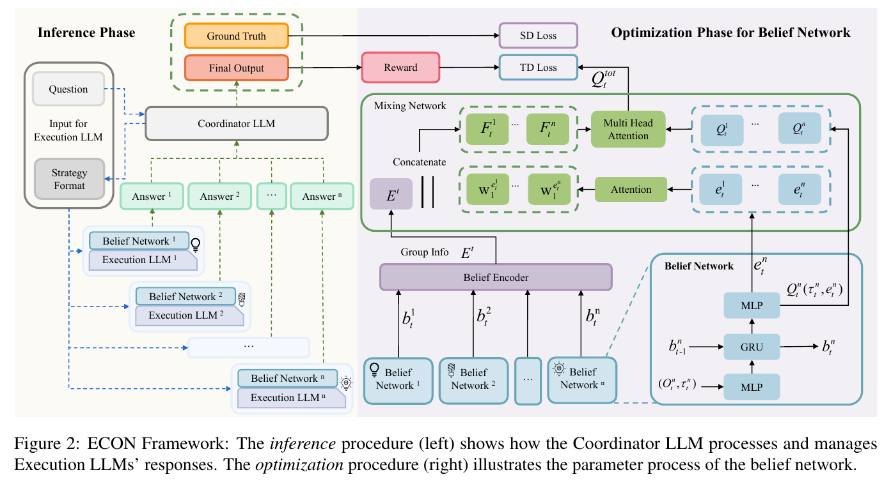](https://proceedings.mlr.press/v267/yi25c.html)

### A2. 离线优化后复用的通信结构

- [[2024-ICML]](https://proceedings.mlr.press/v235/zhuge24a.html) **GPTSwarm: Language Agents as Optimizable Graphs** [PDF](https://arxiv.org/pdf/2402.16823v3) [🐙 Code](https://github.com/metauto-ai/GPTSwarm)
  - 简介：GPTSwarm 将模型调用、工具调用等基本操作表示为节点，把各智能体的内部计算图合并，再搜索跨智能体连接；用任务得分与 REINFORCE 更新边的采样概率，并根据节点输入输出历史优化提示。搜索得到的图用于后续问题。 **主要结论：** MMLU 的混合正常／对抗成员实验中，边优化可滤除有害影响，使表现恢复到单个正常成员附近，但同质成员并未额外提升；改用七种角色后才出现进一步收益。这分别支持连接选择的隔离作用与角色互补的价值，图节点也不应一律理解为完整智能体。

  

- [[2025-ICLR]](https://proceedings.iclr.cc/paper_files/paper/2025/hash/bbc461518c59a2a8d64e70e2c38c4a0e-Abstract-Conference.html) **Cut the Crap: An Economical Communication Pipeline for LLM-based Multi-Agent Systems** [PDF](https://arxiv.org/pdf/2410.02506v1) [🐙 Code](https://github.com/yanweiyue/AgentPrune)
  - 简介：AgentPrune 将同轮信息传递和跨轮历史依赖分别表示为两类边，先用少量试运行学习带低秩约束的边权，再一次性剪掉低权重连接。它既支持单题前期剪枝，也支持用少量训练题剪枝、后续题复用；本条按后一设置归类。 **主要结论：** 五个 GPT-4 智能体的 GSM8K＋GPTSwarm 实验中，输入 token 减少 60.6%，表现提高 0.84 个百分点；消融显示低秩约束有助于优化，而角色配置的影响随任务变化。结论是既有图含可删除的通信冗余，节省幅度取决于原框架与任务。

  

- [[2025-ACL]](https://aclanthology.org/2025.acl-long.1170/) **AgentDropout: Dynamic Agent Elimination for Token-Efficient and High-Performance LLM-Based Multi-Agent Collaboration** [PDF](https://arxiv.org/pdf/2503.18891v1) [🐙 Code](https://github.com/wangzx1219/AgentDropout)
  - 简介：AgentDropout 认为只删消息边仍会保留无用角色，因此先学习逐轮连接权重、删除低贡献节点，再重新学习剩余图并删除冗余的同轮与跨轮边；不同轮次可保留不同成员，但这些安排由训练样本提前学得。 **主要结论：** Llama3-8B 的消融中，节点或边单独删减均有收益，二者组合最好；改成随机删减、或删节点后不重新学习，表现都会下降。这说明收益与选择哪些成员及重估新依赖有关；提高删除比例也会降低平均表现，并非删得越多越好。

  

- [[2026-ACL]](https://aclanthology.org/2026.acl-long.1387/) **AgentSlimming: Towards Efficient and Cost-Aware Multi-Agent Systems** [PDF](https://aclanthology.org/2026.acl-long.1387.pdf) [🐙 Code](https://github.com/CitrusYL/AgentSlimming)
  - 简介：AgentSlimming 针对自动搜索得到的工作流含冗余节点、昂贵节点的问题，融合度、介数、移除节点造成的分数变化与费用变化来排序，依次删节点并补接依赖，再把部分节点换成较便宜模型；验证集性能超过容忍阈值才接受修改，必要时用 MCTS 调整压缩后的提示与配置。其“语义量化”指模型替换，不是权重量化。 **主要结论：** 表 4 中 MATH 准确率保持 74.8%，每题 API 费用下降约 79.7%；AIME 则有准确率损失且节费较少，说明压缩收益依任务而变。反转删节点与换模型的顺序，最终取舍相近；采用先剪枝主要为了缩小后续搜索空间，还需用重复执行摊销一次性优化成本。

  [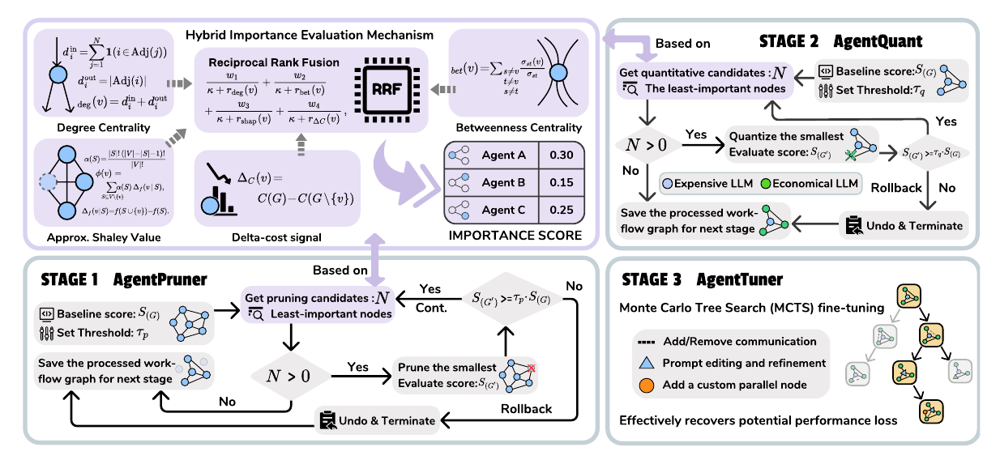](https://aclanthology.org/2026.acl-long.1387/)

### A3. 根据当前题目生成或选择通信结构

- [[2024-arXiv]](https://arxiv.org/abs/2406.11555) **Input Conditioned Graph Generation for Language Agents** [PDF](https://arxiv.org/pdf/2406.11555) [🐙 Code](https://github.com/lukasVierling/DynamicGPTSwarm)
  - 简介：论文把 GPTSwarm 的固定边概率改成输入条件函数：文本模型读取当前题目，线性预测头输出各候选边概率，再用任务奖励训练，并可加入稀疏惩罚。 **主要结论：** 在混合英文 MMLU 与中文 CMMLU 的实验中，生成器会分别偏向更擅长对应数据的 Gemma 与 BlueLM，而静态图倾向同时连接大多数成员；加入边数惩罚后，输入条件方案仍优于静态方案。将文本模型换成平均词嵌入后，预测容易退化为近似固定概率，支持“理解当前输入”对选择合适通信成员的作用。

  

- [[2025-ICML]](https://proceedings.mlr.press/v267/zhang25cu.html) **G-Designer: Architecting Multi-agent Communication Topologies via Graph Neural Networks** [PDF](https://arxiv.org/pdf/2410.11782v3) [🐙 Code](https://github.com/yanweiyue/GDesigner)
  - 简介：G-Designer 解决固定通信图难以适应不同题目的问题：将角色、模型和工具编码为节点，加入表示当前题目的虚拟节点，以简单锚图为起点，由变分图自编码器预测连接，再经低秩与锚图约束精炼；训练用任务结果更新生成器，测试固定参数但逐题生成图。 **主要结论：** MMLU 消融中，去掉任务节点造成最大性能下降，去掉锚图也会降低表现，而去掉稀疏约束使系统更易受攻击。证据分别对应题目条件、结构先验与冗余控制的贡献；生成图在一次协作中指导多轮交流。

  

- [[2025-ECAI]](https://arxiv.org/abs/2506.02951) **Adaptive Graph Pruning for Multi-Agent Communication** [PDF](https://arxiv.org/pdf/2506.02951) [🐙 Code](https://github.com/Resurgamm/AGP)
  - 简介：AGP 先从固定编号的异构成员池采样候选子图，经训练与评分保留高分图，形成节点掩码和连接权重监督；再训练共享 GCN 的两个预测头，按新题同时决定保留哪些成员及成员间的连接强度。 **主要结论：** MMLU、GSM8K、HumanEval 消融中，取消软剪枝的性能损失大于取消硬剪枝；仅保留软剪枝时，输入长度仍增加约 22%–30%。这表明连接调节与成员删减承担不同职责：前者控制信息影响，后者避免无用成员持续产生开销。

  

- [[2025-EMNLP Industry]](https://aclanthology.org/2025.emnlp-industry.144/) **AMAS: Adaptively Determining Communication Topology for LLM-based Multi-agent System** [PDF](https://arxiv.org/pdf/2510.01617v3)
  - 简介：AMAS 从同一道题上的图结构排名会变化这一观察出发，先在训练集优化并保留若干高分候选图，再用各图在具体题目上的表现训练带 LoRA 的排序模型；测试时为“题目＋候选图”评分，选择最适合的已有图执行。 **主要结论：** Crossword 与 Game-of-24 的消融中，四个候选优于两个或八个，去掉排序差距权重也降低表现；因此候选太少限制选择，候选更多也未自动获益。它学习的是按题选图，而非生成任意新拓扑，正文中的 dynamic 指输入适应。

  

- [[2025-EMNLP]](https://aclanthology.org/2025.emnlp-main.623/) **Understanding the Information Propagation Effects of Communication Topologies in LLM-based Multi-Agent Systems** [PDF](https://arxiv.org/pdf/2505.23352v1) [🐙 Code](https://github.com/se7esx/EIB)
  - 简介：论文通过替换单个成员输出，测量最终答案由对变错或由错变对的频率，研究图的错误传播与有效信息传播。EIB-Learner 据此用稀疏、稠密两支 GNN 编码题目与角色，再由题目条件门控融合连接概率，并以最终任务奖励训练。 **主要结论：** MMLU 干预实验中，稠密图更易传递错误，也更易让正确线索影响结论，中等稀疏度的任务准确率较好；去掉任一分支或改为直接相加都会降低表现。结果支持按题平衡两类传播，而非把稀疏本身当作唯一优化目标。

  

- [[2026-AAAI]](https://ojs.aaai.org/index.php/AAAI/article/view/39481) **Assemble Your Crew: Automatic Multi-agent Communication Topology Design via Autoregressive Graph Generation** [PDF](https://arxiv.org/pdf/2507.18224v4) [🐙 Code](https://github.com/Shiy-Li/ARG-Designer)
  - 简介：ARG-Designer 针对固定成员池中只改边的局限，把组队写成自回归生成：按题目与已生成结构选择下一个角色，再决定它接收哪些前序成员的信息，生成 END 时停止。训练先学习成功的较复杂图，再学习仍能成功的精简图，并保留部分旧样本。 **主要结论：** 消融中，移除题目编码的损失最大，移除结构历史也降低表现；省去第二阶段仍有较强准确率，但通信效率较差。这支持题目条件与结构依赖负责匹配协作方式、精简课程负责降本；语义角色检索还允许推理时扩展候选角色池。

  

- [[2026-arXiv]](https://arxiv.org/abs/2604.17503) **SkillGraph: Self-Evolving Multi-Agent Collaboration with Multimodal Graph Topology** [PDF](https://arxiv.org/pdf/2604.17503) [🐙 Code](https://github.com/niez233/skillgraph)
  - 简介：SkillGraph 针对固定角色难以覆盖不同视觉推理需求，按题目为成员检索技能，再由多模态图 Transformer 联合读取图像、问题和技能表示，生成通信图；训练过程中把带真实答案的失败记录用于修改或新增技能，更新后的技能重新进入图生成器。 **主要结论：** 四个视觉基准的消融中，技能演化与图生成各自有益，组合在多数设置下最好，但个别数据集有例外。结果支持能力配置与信息路由的互补；技能演化发生在跨样本训练环节，不能据此宣称部署时无需标签便持续自我改进。

  

- [[2026-ICLR]](https://proceedings.iclr.cc/paper_files/paper/2026/hash/dbb8193ad7e6fcbc7bb62ed9ee835110-Abstract-Conference.html) **Learning to Orchestrate Agents in Natural Language with the Conductor** [PDF](https://proceedings.iclr.cc/paper_files/paper/2026/file/dbb8193ad7e6fcbc7bb62ed9ee835110-Paper-Conference.pdf)
  - 简介：Conductor 针对固定协作模板限制模型互补的问题，用 GRPO 训练 7B 协调模型，按当前题目一次输出子任务文本、执行模型及可读取的前序回答索引，再按该方案调用工作模型，以最终答案正确性奖励协调器。 **主要结论：** 同一工作模型池的对照中，学习到的编排优于所比较的路由和多轮协作基线；较难代码题倾向使用更多步骤，简单问答使用更短流程。3B 与 7B 协调器学到相近的模型选择分布，但 7B 的任务指令更有效，说明选对模型之外还要把任务交代清楚。基础版属于按题生成结构；递归扩展才会利用执行回答重新编排。

  [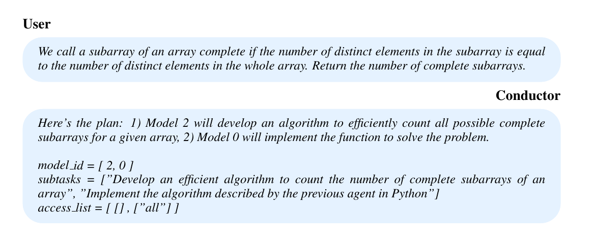](https://proceedings.iclr.cc/paper_files/paper/2026/hash/dbb8193ad7e6fcbc7bb62ed9ee835110-Abstract-Conference.html)

- [[2026-WWW]](https://doi.org/10.1145/3774904.3792537) **OFA-MAS: One-for-All Multi-Agent System Topology Design based on Mixture-of-Experts Graph Generative Models** [PDF](https://arxiv.org/pdf/2601.12996) [🐙 Code](https://github.com/Shiy-Li/OFA-MAS)
  - 简介：OFA-MAS 针对每个任务域单独训练拓扑生成器、难以共享结构知识的问题，用统一角色池和一个条件自回归生成器，逐步选角色、预测入边。图编码持续注入题目信息，混合专家预测头按任务组合不同生成策略；训练依次学习无条件图结构、LLM 合成的题目—图对应关系，再用实际验证的图微调。 **主要结论：** 六基准平均成绩中，仅合成数据预训练版为 92.15%，完整微调版为 93.02%；移除任务感知编码、混合专家或预训练阶段均有损失。未见 GAIA 上仍有迁移收益，但实验未启用工具调用，不能与完整工具型代理系统直接比较。

  [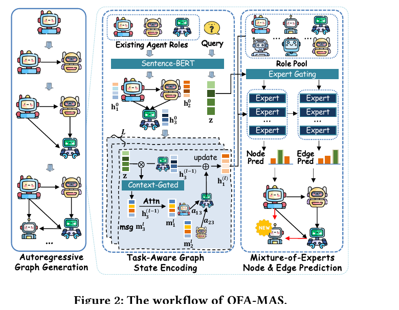](https://doi.org/10.1145/3774904.3792537)

- [[2026-arXiv]](https://arxiv.org/abs/2605.17359) **Learning Transferable Topology Priors for Multi-Agent LLM Collaboration Across Domains** [PDF](https://arxiv.org/pdf/2605.17359)
  - 简介：TopoPrior 为减少跨领域从零搜图的成本，从多领域“题目—参考图”学习条件变分图先验，并用领域对抗约束减少潜空间的域差异；新题先生成初始图，再交给既有拓扑优化方法继续处理。 **主要结论：** 移除先验学习、领域对齐或题目条件均降低表现，其中先验学习影响最大；简化的教师图仍有帮助，随机图监督则效果较差。论文报告的 token 节省统计在线推理，未包含离线参考图构造成本；其贡献是更好的起点，而非完全替代后续搜索。

  

- [[2026-arXiv]](https://arxiv.org/abs/2606.27492) **QueenBee Planner: Skill-Evolving Communication Topologies for Token-Efficient LLM Multi-Agent Systems** [PDF](https://arxiv.org/pdf/2606.27492) [🐙 Code](https://github.com/RobinTian-7/QueenBeePlanner)
  - 简介：QueenBee 固定工作者的模型与提示，让规划器在任务开始前生成逐轮消息边、接收者指令与最终汇总节点；跨任务把执行经验整理成保留、修改、避免三类结构规则，经过留出验证后更新技能库。 **主要结论：** 八个工作者的频数统计完整测试设置中，最佳生成图的 RMSE 为 7.87，比最佳固定拓扑相对降低约 37.2%，同时减少消息与 token；直接冷启动生成图虽便宜，却较不准确。案例支持分阶段归约与审计的稀疏组合；这是带历史设计记忆的执行前生成，时间展开 DAG 不等于运行中重连。

  

- [[2026-ACL]](https://aclanthology.org/2026.acl-long.1764/) **Dynamic Generation of Multi LLM Agents Communication Topologies with Graph Diffusion Models** [PDF](https://arxiv.org/pdf/2510.07799v2) [🐙 Code](https://github.com/ericjiang18/diffusion_agent)
  - 简介：GTD 针对反复真实执行候选图的高成本，先训练 GNN 预测图的任务表现与通信费用，再训练条件图扩散模型学习高质量结构；新题生成时，每个去噪步骤采样多个图，用代理评分选择方向，逐步得到通信图。 **主要结论：** GSM8K 消融中，去掉代理引导使准确率从 94.14% 降至 88.42%，随机引导仅略有改善，支持有信息的候选选择而非单纯增加采样的作用；增加成员到四个后收益趋缓。这里反复更新的是执行前的候选图，尚未依据成员运行中的答案重连。

  

- [[2026-ICML]](https://icml.cc/virtual/2026/poster/65087) **RADAR: Redundancy-Aware Diffusion for Multi-Agent Communication Structure Generation** [PDF](https://arxiv.org/pdf/2605.09907) [🐙 Code](https://github.com/cszhangzhen/RADAR)
  - 简介：RADAR 针对稀疏图仍可能让多个同质成员重复传话的问题，把角色重复与邻域重叠纳入“有效规模”指标。训练时据此学习遮蔽节点及其边的顺序，反向去噪网络结合题目逐步恢复角色和连接，并用任务收益与调用成本微调生成器。 **主要结论：** 消融中，去掉题目条件或有效规模信号都会降低成绩，说明按题生成与控制结构冗余各有贡献；生成图通常比所比图生成方法更稀疏、信息来源重叠更少。效率实验显示 token 减少，但逐题生成图会增加推理时间，不能把“省 token”等同于“延迟更低”。

  [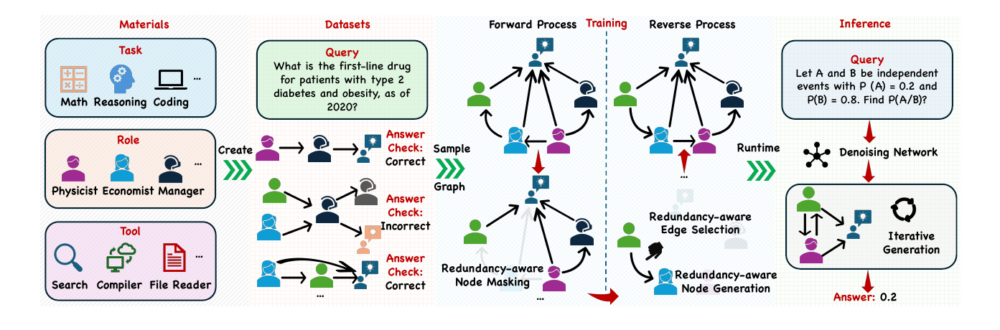](https://icml.cc/virtual/2026/poster/65087)

### A4. 执行过程中调整通信结构

- [[2024-COLM]](https://arxiv.org/abs/2310.02170) **A Dynamic LLM-Powered Agent Network for Task-Oriented Agent Collaboration** [PDF](https://arxiv.org/pdf/2310.02170) [🐙 Code](https://github.com/SALT-NLP/DyLAN)
  - 简介：DyLAN 针对固定团队反复全员讨论带来的冗余，分两层调整协作：先在试运行中把下游评分向前传递，得到 Agent Importance Score，用于筛选初始团队；正式解题时，再根据成员当前回答的排名淘汰低贡献者，并在超过三分之二的回答达成一致时提前停止。前者优化“带谁出场”，后者决定“下一轮还让谁继续”。**主要结论：** 消融表明，团队重组选对成员是准确率提升的主要来源，提前停止则主要节省调用；论文四类任务中，提前停止减少约 11.3%–66.2% 的 API 调用，性能没有随之下降。优化后的三成员团队还超过所比较的四成员辩论，说明成员贡献与停止时机比固定增加人数更值得优化。

  

- [[2025-ICLR]](https://proceedings.iclr.cc/paper_files/paper/2025/hash/39af4f2f9399122a14ccf95e2d2e7122-Abstract-Conference.html) **Self-Evolving Multi-Agent Collaboration Networks for Software Development** [PDF](https://arxiv.org/pdf/2410.16946v1) [🐙 Code](https://github.com/yuzhu-cai/rSDE-Bench)
  - 简介：EvoMAC 针对预设软件开发团队无法及时补齐缺失功能的问题，把编码团队表示为任务依赖 DAG，另设测试团队生成测试并执行代码；“文本梯度”成员根据执行日志定位已完成、出错和遗漏的任务，再删除完成节点、修改出错成员的指令、增加缺失成员并调整依赖关系。这里的梯度是用于修改团队的自然语言反馈，并不更新 LLM 权重。**主要结论：** 网站和游戏开发实验中，迭代优化先带来改善、随后趋于饱和；用 LLM 自评替代真实执行日志会显著降低表现，合并编码与测试团队也削弱效果。结果支持以执行证据驱动团队重构、保持测试职责独立，但提升同时涉及指令与结构修改，不能单独归因于边的变化。

  

- [[2025-EMNLP]](https://aclanthology.org/2025.emnlp-main.584/) **AnyMAC: Cascading Flexible Multi-Agent Collaboration via Next-Agent Prediction** [PDF](https://aclanthology.org/2025.emnlp-main.584.pdf) [🐙 Code](https://github.com/SongW-SW/AnyMAC)
  - 简介：AnyMAC 针对固定图难以反复调用同一专家、按需读取历史的问题，把协作展开为逐步决策：Transformer 编码题目、候选角色与已生成回答，分别预测下一角色和应传给它的历史消息；新回答产生后再决策，直到选中裁判或达到步数上限。训练用正确性奖励、路径长度折扣与消息稀疏约束平衡效果和成本。 **主要结论：** GSM8K 消融中，随机选人或随机选历史均低于完整方案，说明执行者与上下文需要联合选择。效率版限制历史范围并鼓励较短路径，用约五分之一的 G-Designer 输入 token 换取略低于完整 AnyMAC 的准确率；完整方案本身并非最低成本。

  [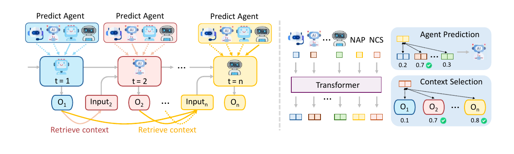](https://aclanthology.org/2025.emnlp-main.584/)

- [[2025-NeurIPS]](https://proceedings.neurips.cc/paper_files/paper/2025/hash/9a379c1b05793d1c42dc832269834515-Abstract-Conference.html) **AgentNet: Decentralized Evolutionary Coordination for LLM-based Multi-Agent Systems** [PDF](https://arxiv.org/pdf/2504.00587v2) [🐙 Code](https://github.com/zoe-yyx/AgentNet)
  - 简介：AgentNet 针对中心调度器的瓶颈，让每个成员同时拥有执行器和局部路由器：收到子任务后，根据局部轨迹与检索到的经验决定直接执行、拆分任务或转交其他成员，因此一次任务的协作路径随执行过程展开。任务结束后，成功经验写入各自记忆，并更新连接权重、周期性剪除弱连接，使后续任务复用更有效的协作关系。**主要结论：** 移除这种跨任务演化后，GPT-4o-mini 在论文 BBH 实验中的准确率从 86% 降至 76%；路由消融中，随机选择“执行、拆分还是转交”比仅随机选择转交对象更有害。结果表明，局部决策与经验积累共同起作用，不能把收益只归因于连接图形状；运行时路由和跨任务连接演化也是两个时间尺度。

  

- [[2025-NeurIPS]](https://proceedings.neurips.cc/paper_files/paper/2025/hash/f1320d2e2842169c6fc89dcbd80e94d0-Abstract-Conference.html) **Multi-Agent Collaboration via Evolving Orchestration** [PDF](https://arxiv.org/pdf/2505.19591v2) [🐙 Code](https://github.com/OpenBMB/ChatDev/tree/puppeteer)
  - 简介：Puppeteer 把多智能体协作变成逐步选择成员的序列决策：中心策略根据当前全局状态选择下一个成员，其模型、提示词和工具共同决定能力与成本；成员执行后更新状态，策略再决定继续找谁或停止。训练用 REINFORCE 权衡任务收益与调用成本，运行时的激活序列形成可重复访问成员的协作图。**主要结论：** 论文发现两种不同的降本路径：较强成员组成的 Titan 团队在训练后主要通过更少步骤、更早停止节省成本，较弱的 Mimas 团队则更多转向便宜成员，参与数量没有同样下降。宽度、深度实验也未显示规模越大越好；训练后出现的稠密或循环结构属于观察结果，尚不能证明某种图形本身普遍最优。

  

- [[2026-arXiv]](https://arxiv.org/abs/2602.06039) **DyTopo: Dynamic Topology Routing for Multi-Agent Reasoning via Semantic Matching** [PDF](https://arxiv.org/pdf/2602.06039)
  - 简介：DyTopo 针对固定连接无法跟随信息需求变化的问题，让每个成员每轮同时输出回答、自己需要的信息 query 和能够提供的信息 key；固定语义编码器计算供需相似度，超过阈值就从提供者向需求者连边。所有成员完成本轮后才统一投递私有消息，供下一轮使用；Manager 根据公开进展更新目标并决定停止。因此它重构的是逐轮信息路由，并非同一轮内的执行先后关系。**主要结论：** 轮数和阈值实验都呈现非单调收益：论文实验中 HumanEval 在 5 轮、数学任务在 9 轮达到峰值；APPS 与 Omni-MATH 的最佳连边阈值也不同。过密与过疏都可能降低表现，说明通信预算和连接密度应随任务需求调整，而不是统一选全连接或无限增加讨论。

  

- [[2026-ICLR]](https://iclr.cc/virtual/2026/poster/10011674) **Graph-of-Agents: A Graph-based Framework for Multi-Agent LLM Collaboration** [PDF](https://arxiv.org/pdf/2604.17148v1) [🐙 Code](https://github.com/UNITES-Lab/GoA)
  - 简介：GoA 先根据题目与模型卡挑选领域相关成员，再让它们独立作答、互评答案，按所得分数删除弱相关成员并构建加权连接；先由高分成员向低分成员传递意见，再反向反馈，最后选择或综合答案。 **主要结论：** 固定三个代码模型的 HumanEval 对照中仍有收益；MMLU-Pro、GPQA 消融中，颠倒两阶段传递顺序损失最大，取消评分权重或任一方向也会降低表现。由于连接依赖实际初答反馈，本条归入运行时调整；其关键不只是挑成员，还包括让较可靠意见先影响后续修订。

  

- [[2026-ICLR]](https://arxiv.org/abs/2603.01089) **CARD: Towards Conditional Design of Multi-agent Topological Structures** [PDF](https://arxiv.org/pdf/2603.01089) [🐙 Code](https://github.com/Warma10032/CARD)
  - 简介：CARD 将模型、角色、工具等静态属性与可用性、费用、可靠性等环境状态分别编码，结合题目预测通信边；运行条件变化时刷新状态、重新解码连接，无需重新训练。 **主要结论：** 在 HumanEval、MATH、MMLU 的多模型比较中，把环境条件直接加入提示并不稳定，嵌入图生成模块的方案更可靠；案例中，更换检索工具主要改变局部信息流，升级模型则改变整体连接强度。其适应信号来自运行环境而非答案正误，按部署时可重连的机制归入动态拓扑。

  

- [[2026-ICLR]](https://proceedings.iclr.cc/paper_files/paper/2026/hash/43833a8a514392cb19ca09b52cf4b5b7-Abstract-Conference.html) **Stochastic Self-Organization in Multi-Agent Systems** [PDF](https://proceedings.iclr.cc/paper_files/paper/2026/file/43833a8a514392cb19ca09b52cf4b5b7-Paper-Conference.pdf) [🐙 Code](https://github.com/tnurbek/selforg)
  - 简介：SELFORG 针对同一成员在不同轮次可能表现不同的问题，先让成员独立回答，再用回答嵌入与群体平均嵌入的余弦相似度近似贡献分数；按语义相似度筛边，让较高分成员向较低分成员传话，构成 DAG，并在新回答产生后重建图。最终按贡献加权的语义中心选择回答。 **主要结论：** 动态重建相较固定初始图，在消融中使 GSM8K 和 MMLU 分别提高 0.6、1.4 个百分点，增益存在但较温和；增加成员也带来更高 token 与延迟。贡献分数衡量群体语义一致性，并不直接检验答案正确性，不能理解为无需验证就能识别正确专家。

  [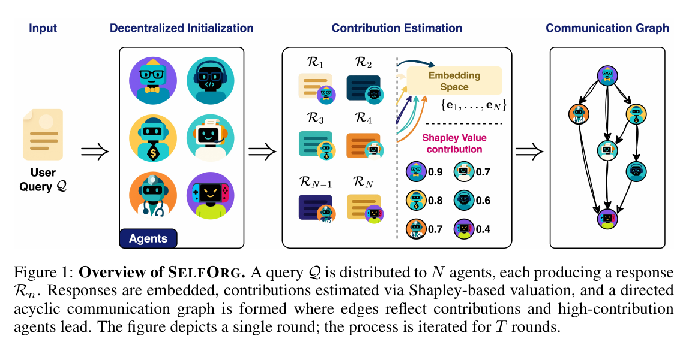](https://proceedings.iclr.cc/paper_files/paper/2026/hash/43833a8a514392cb19ca09b52cf4b5b7-Abstract-Conference.html)

- [[2026-ICML]](https://icml.cc/virtual/2026/poster/66333) **AgentConductor: Topology Evolution for Multi-Agent Competition-Level Code Generation** [PDF](https://arxiv.org/pdf/2602.17100)
  - 简介：AgentConductor 针对代码任务难度不同、执行中又会暴露新错误的问题，训练一个编排模型：先把题目生成分层 DAG，执行成员任务和沙箱测试，再把已有图、成员回复及错误反馈交给编排模型，决定下一轮如何改图。训练先用监督微调学习有效 YAML 图格式和基本编排，再用 GRPO 联合优化格式正确性、代码执行结果与图复杂度。**主要结论：** 消融显示，格式奖励主要影响能否生成可执行的图，执行奖励主要影响解题成功率，复杂度约束则调节协作成本；小模型缺少监督预热时尤其难以输出有效结构。因此，性能提升依赖“能正确编排—能根据执行结果修正—能控制开销”这条链路，而非单纯增加成员或追求更稀疏的图。

  

- [[2026-arXiv]](https://arxiv.org/abs/2607.28527) **MANTA: Multi-Agent Network Topology Adaptation for Self-Evolving Multi-Agent Systems** [PDF](https://arxiv.org/pdf/2607.28527) [🐙 Code](https://github.com/mao-code/MANTA)
  - 简介：MANTA 针对工具型团队在执行中出现重复操作、职责缺口或信息不可见的问题，先由 Planner 按任务配置成员、分组与通信关系，再由 Auditor 检查一轮协作的可观察过程；若发现问题，Controller 在预算内执行一次结构修复，最多修改三项成员、角色、连接、分组或上下文可见性设置，然后继续最后一轮。Reflector 还把过程经验写入后续任务可检索的记忆。**主要结论：** 在四个基准、各 30 个任务的消融子集上，完整方法平均成功率为 71.7%，移除运行时修复后为 60.8%，把初始团队固定为协调者—工作者结构后为 57.5%。这分别支持按题规划和执行中修复的价值；审计依据过程风险而非标准答案，未被标记的执行也可能失败。

  [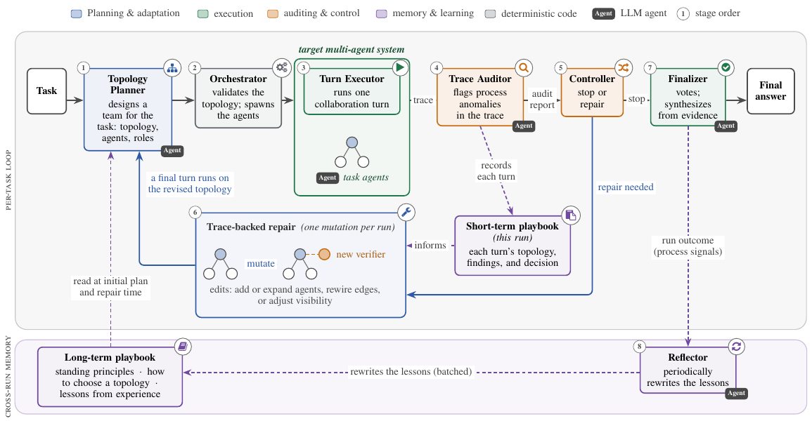](https://arxiv.org/abs/2607.28527)

- [[2026-Findings of ACL]](https://aclanthology.org/2026.findings-acl.1258/) **EvoHyper: Evolving Hypergraph Topologies for Unified Collaboration in Multi-Agent Communication** [PDF](https://aclanthology.org/2026.findings-acl.1258.pdf)
  - 简介：EvoHyper 将“谁一起协作”和“这一组共享什么记忆”统一成超图：每条超边绑定一组智能体及其共享记忆。任务条件化生成器先建立初始分组；执行中，控制器读取交互与记忆状态，选择更新组内记忆、新建协作组或合并已有组，分层压缩长期保留的经验。控制策略通过任务得分、token 成本与结构复杂度联合训练。 **主要结论：** 在 MMLU、GSM8K、HumanEval 的三任务消融中，完整方案均分为 91.73%；去掉控制器降至 88.41%，不用超图降至 88.81%，取消分层记忆降至 90.74%。因此动态分组与记忆管理都对结果有贡献；此处超边不仅代表多人连通，也规定共享上下文的归属，属于记忆与运行时拓扑的联合设计。

  [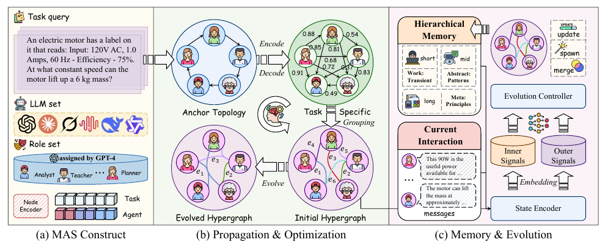](https://aclanthology.org/2026.findings-acl.1258/)

## B. 通信机制

### B1. 信息筛选与压缩

- [[2024-ICLR]](https://proceedings.iclr.cc/paper_files/paper/2024/hash/54b8b4e0b4ba4aad112e84f32e3b5dbb-Abstract-Conference.html) **Building Cooperative Embodied Agents Modularly with Large Language Models** [PDF](https://proceedings.iclr.cc/paper_files/paper/2024/file/54b8b4e0b4ba4aad112e84f32e3b5dbb-Paper-Conference.pdf) [🐙 Code](https://github.com/UMass-Embodied-AGI/CoELA)
  - 简介：CoELA 研究局部观察、通信占用行动时间时，成员如何决定说什么、是否值得说。它把感知、记忆、通信、规划和执行拆成五个模块：先根据地图、进度及交互历史拟好消息，再由规划模块比较发送消息与导航、操作等行动，决定是否发送；记忆持续跟踪自己和同伴的状态。 **主要结论：** 两个 GPT-4 成员在 TDW-MAT 的运输完成比例为 0.71，高于两个规则规划器的 0.61；但消融未观察到禁用 AI 成员间通信造成显著性能下降，去掉记忆却使完成任务所需步数近乎翻倍。8 人参与的人机实验中，通信提高协作表现，信任评分由无通信时的 4.7 增至 6.3。因此其价值在于把消息发送纳入行动决策，并揭示通信收益取决于搭档与任务。

  [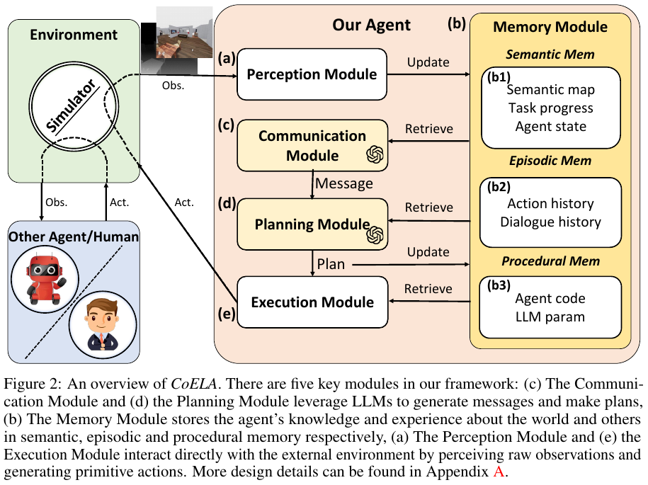](https://proceedings.iclr.cc/paper_files/paper/2024/hash/54b8b4e0b4ba4aad112e84f32e3b5dbb-Abstract-Conference.html)

- [[2026-AAAI]](https://ojs.aaai.org/index.php/AAAI/article/view/40182) **Cost-Effective Communication: An Auction-based Method for Language Agent Interaction** [PDF](https://arxiv.org/pdf/2511.13193v2) [🐙 Code](https://github.com/waltstephen/Cost-Effective-Communication)
  - 简介：DALA 针对通信预算有限、但并非每条候选消息都值得广播的问题，把每轮发言权分配建模为拍卖：价值网络估计消息收益并按长度计算价值密度，成员据此选择全文、摘要、关键词或沉默，拍卖器在本轮 token 上限内选出一组发言者；MAPPO 通过任务奖励与通信代价训练估值和发言策略。运行时变化的是广播成员集合与消息粒度，而非任意两两连边。**主要结论：** 在把关键解题信息分散给不同成员的实验设置中，移除价值学习使 MMLU、GSM8K 准确率分别下降 8.55、9.83 个百分点；移除长度归一化或代价惩罚则同时增加 token 用量、降低准确率。这支持学习“单位通信成本带来的有效信息”，而非仅设定一个硬预算。

  [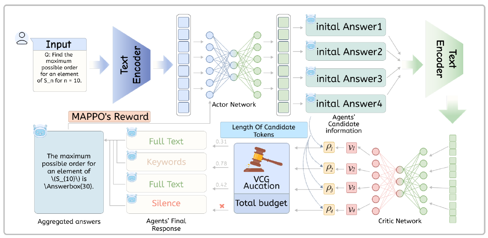](https://ojs.aaai.org/index.php/AAAI/article/view/40182)

- [[2026-ICLR]](https://proceedings.iclr.cc/paper_files/paper/2026/hash/09425891e393e64b0535194a81ba15b7-Abstract-Conference.html) **Multi-Agent Debate with Memory Masking** [PDF](https://proceedings.iclr.cc/paper_files/paper/2026/file/09425891e393e64b0535194a81ba15b7-Paper-Conference.pdf) [🐙 Code](https://github.com/tmlr-group/MAD-MM)
  - 简介：MAD-M² 针对辩论把错误回答反复写入下一轮上下文的问题，在两轮之间先评估上一轮回答，再屏蔽疑似错误内容：一种用 LLM 判断保留哪些回答，另一种只保留困惑度最低的回答；成员据此重新推理，最终多数投票。 **主要结论：** 过滤方式的效果依赖模型与任务：较弱模型通常更适合显式评判，较强推理模型在困难数学任务上更受益于困惑度选择。显式评判增加约 13%–41% token，困惑度版本在多数设置中减少约 30%；增加辩论轮数并不总能提高成绩。这里的“记忆”是上一轮消息，核心贡献是内容筛选。

  [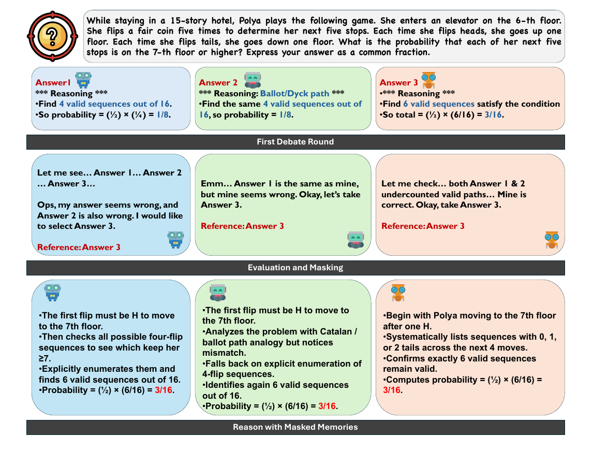](https://proceedings.iclr.cc/paper_files/paper/2026/hash/09425891e393e64b0535194a81ba15b7-Abstract-Conference.html)

### B2. 证据传递与聚合

- [[2024-NeurIPS]](https://proceedings.neurips.cc/paper_files/paper/2024/hash/ee71a4b14ec26710b39ee6be113d7750-Abstract-Conference.html) **Chain of Agents: Large Language Models Collaborating on Long-Context Tasks** [PDF](https://proceedings.neurips.cc/paper_files/paper/2024/file/ee71a4b14ec26710b39ee6be113d7750-Paper-Conference.pdf)
  - 简介：CoA 针对长文截断和检索遗漏跨段证据的问题，把文档分块交给一串工作智能体：每个节点读取自己的片段与前一个节点传来的证据，更新通信摘要；最后由独立管理者生成答案。问答传证据、摘要任务传阶段摘要、代码任务传函数与类信息，通信内容随任务改变。 **主要结论：** 表 6 中，顺序传递在八项长上下文任务上均优于独立处理后合并及分层汇总；移除管理者后，MuSiQue 从 37.09 降至 26.79。结果支持跨块传递中间推理及分离阅读、作答职责的价值；多路径实验也显示，投票与模型裁判各有适用任务，增加路径并非稳定增益。

  

- [[2025-Findings of EMNLP]](https://aclanthology.org/2025.findings-emnlp.246/) **Tree of Agents: Improving Long-Context Capabilities of Large Language Models through Multi-Perspective Reasoning** [PDF](https://aclanthology.org/2025.findings-emnlp.246.pdf) [🐙 Code](https://github.com/Aireduce952/Tree-of-Agents)
  - 简介：TOA 针对单一阅读顺序可能遗漏长文线索的问题，先让每个智能体读取一段文档、共享证据与候选答案，再据此选择其他相关片段，以不同顺序继续阅读。相同阅读前缀的中间状态用树缓存复用，并剪掉无效路径；各成员选择较完整路径形成答案，最后跨成员投票。 **主要结论：** 在论文抽样的 DetectiveQA、NovelQA 上，相同 32K 分块时优于 CoA，且成员数量并非越多越好：五个成员的准确率分别为 54.3%、45.0%，高于三个和七个。结果支持多视角补读，但也显示过度分块会损害信息整合；这里的树主要组织阅读路径与状态缓存。

  [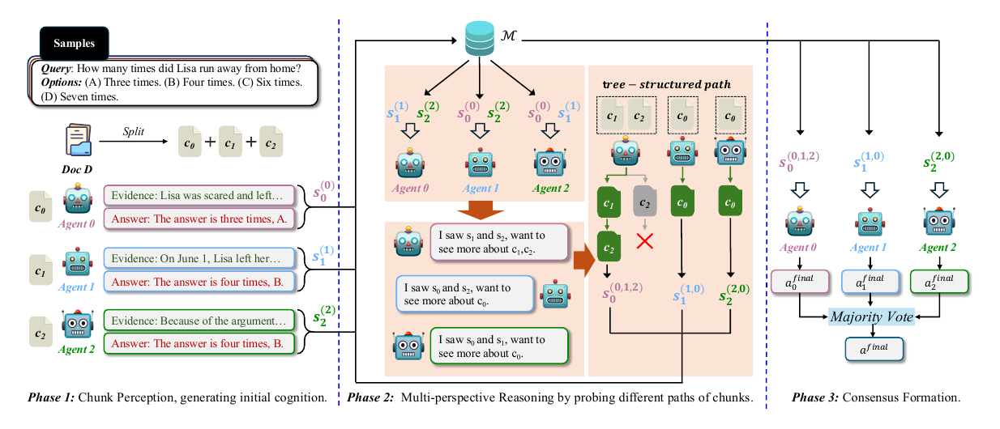](https://aclanthology.org/2025.findings-emnlp.246/)

- [[2026-AAAI]](https://ojs.aaai.org/index.php/AAAI/article/view/40231) **MPAS: Breaking Sequential Constraints of Multi-Agent Communication Topologies via Individual-Epistemic Message Propagation** [PDF](https://ojs.aaai.org/index.php/AAAI/article/download/40231/44192) [🐙 Code](https://github.com/rkxuan/MPAS)
  - 简介：MPAS 针对 DAG 顺序执行的等待与连接限制，把每轮拆为消息生成、邻居聚合、答案更新三步，各步内部并行，允许有环通信；边概率经任务数据优化后固定，另比较按可信度选择消息与按自身角色提炼信息的聚合器。 **主要结论：** 同图、同为直接拼接消息的对照中，MPAS 优于顺序执行；11 个成员的 AQuA 实验里，每轮用时为 14.2 秒，G-Designer 为 84.6 秒。聚合器实验进一步显示，注意力式提炼在干净输入下较有利，选择可信消息在受攻击时更稳健，两种机制的作用不同。

  [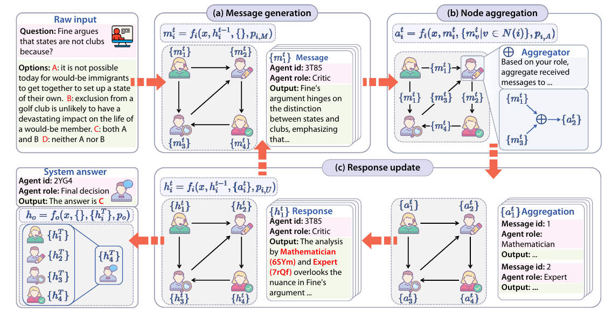](https://ojs.aaai.org/index.php/AAAI/article/view/40231)

- [[2026-ACL]](https://aclanthology.org/2026.acl-long.468/) **Scaling External Knowledge Input Beyond Context Windows of LLMs via Multi-Agent Collaboration** [PDF](https://aclanthology.org/2026.acl-long.468.pdf) [🐙 Code](https://github.com/THUNLP-MT/ExtAgents)
  - 简介：ExtAgents 针对长上下文协作中的局部信息交换不足与汇总过载，把任务分成并行读取知识块的检索成员和最终推理成员。前者对消息按相关性排序，在窗口允许范围内同步全局信息；后者逐步扩大读取的高相关消息集合，检查是否已有足够证据回答，而非一次吞入所有摘要。 **主要结论：** 多跳问答与长综述实验支持利用更大外部知识输入；去掉渐进知识累积，在输入增加时尤其损害成绩，去掉全局同步也会退化。异构配置中，用 3B 负责读取、8B 负责推理可明显缩短耗时，说明信息筛选、汇总节奏和角色能力配置共同决定扩展效果。

  [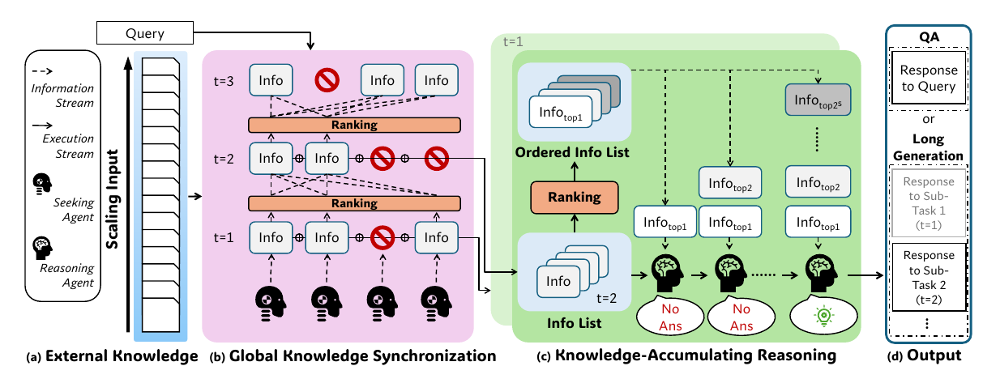](https://aclanthology.org/2026.acl-long.468/)

- [[2026-Findings of ACL]](https://aclanthology.org/2026.findings-acl.1600/) **Free-MAD: Consensus-Free Multi-Agent Debate** [PDF](https://aclanthology.org/2026.findings-acl.1600.pdf) [🐙 Code（论文致谢实现）](https://github.com/jonathansantilli/freemad)
  - 简介：Free-MAD 针对最终轮投票会丢掉早期正确意见的问题，将全部轮次纳入决策：记录初始答案、坚持与改口，对旧答案扣分、对新答案加分，并随轮次衰减权重，最后选择累计分最高的答案。辩论可使用反从众提示，也可保留常规从众模式，无需等所有成员达成共识。 **主要结论：** 四变体对照支持跨轮评分机制本身有贡献；一轮方案可达到或超过所比两轮基线的准确率。反从众并非总更好：较弱模型在数学任务中可能固守错误，知识不足时适度采纳他人意见反而有效。因此应区分“保留推理历史”和“一律坚持己见”。

  [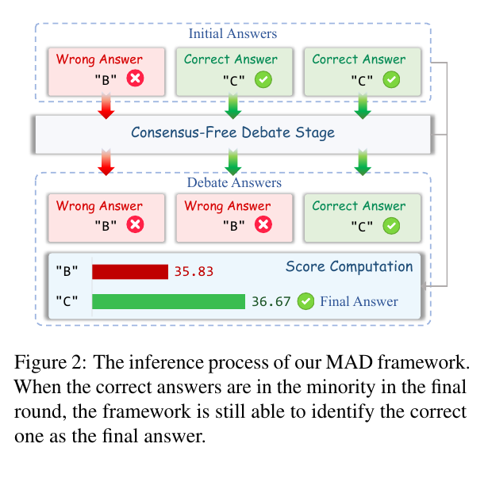](https://aclanthology.org/2026.findings-acl.1600/)

- [[2026-ICML]](https://icml.cc/virtual/2026/poster/60749) **MOC: Multi-Order Communication in LLM-based Multi-Agent Systems** [PDF](https://arxiv.org/pdf/2606.02359) [🐙 Code](https://github.com/yao-guan/MOC)
  - 简介：MOC 针对逐跳转述会遗漏远端原始证据的问题，在已有 DAG 上让接收者直接收集 K 跳祖先的回答，按最短跳数去重、按拓扑顺序组织。为控制冗余，再反复选择语义最相近的消息对，用 LLM 合并并保留原有先后关系，直到满足消息数量和长度预算。 **主要结论：** 多跳收集相对只读直接前驱通常提高推理成绩，但三跳不总优于两跳；合并能降低未经压缩的多跳通信开销，在较大团队中也可低于原始基线。成本下降并不普遍：DeepSeek-V3.2 设置的输入 token 仍增加约 17%–22%，说明保留远端证据的收益需要与额外读取、合并成本一起衡量。

  [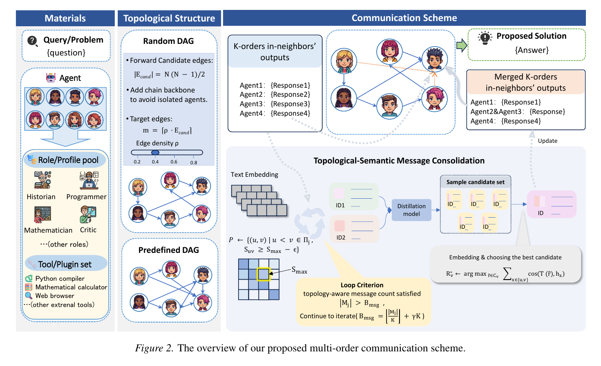](https://icml.cc/virtual/2026/poster/60749)

### B3. 消息生成与表达

- [[2024-Findings of EMNLP]](https://aclanthology.org/2024.findings-emnlp.623/) **Beyond Natural Language: LLMs Leveraging Alternative Formats for Enhanced Reasoning and Communication** [PDF](https://aclanthology.org/2024.findings-emnlp.623.pdf) [🐙 Code](https://github.com/thunlp/AutoForm)
  - 简介：针对自然语言交流冗长、固定表达格式又未必适合不同任务的问题，AutoForm 通过提示让模型自行选择并使用 JSON、表格、列表或符号表达，无需训练模型。在多智能体实验中，两个成员分别持有部分资料，轮流交换信息以完成多跳或长文问答。 **主要结论：** 由 GPT-4 先发言的主实验中，AutoForm 在维持或提高答题表现的同时，将所统计的通信 token 减少 9.4%–72.7%；其中 HotpotQA 的 GPT-4/GPT-3.5 组合由平均 345.5 降至 94.3。但附录中改由 GPT-3.5 先发言时，过度简写与幻觉可能使答题表现下降。因此收益依赖模型选择和理解表达格式的能力，压缩后的消息仍须保留解题信息。

  [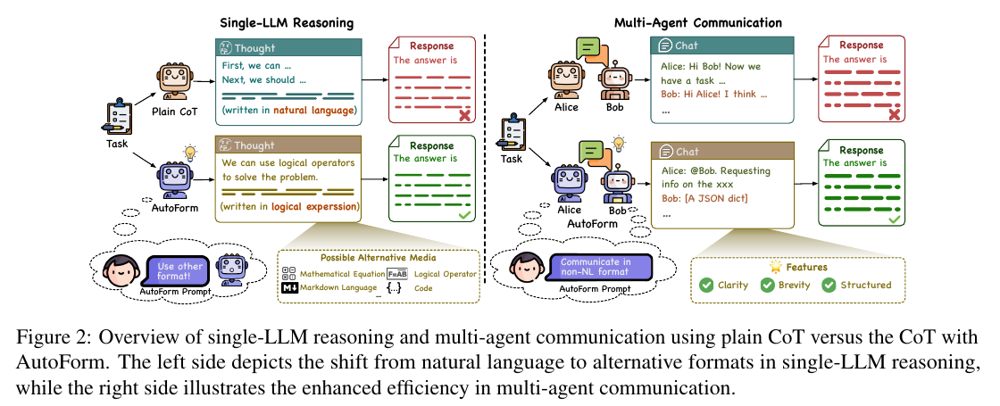](https://aclanthology.org/2024.findings-emnlp.623/)

- [[2026-ICLR]](https://proceedings.iclr.cc/paper_files/paper/2026/hash/a1c1bb8d4cc0fc2bcb5fcb61163008df-Abstract-Conference.html) **Context Learning for Multi-Agent Discussion** [PDF](https://proceedings.iclr.cc/paper_files/paper/2026/file/a1c1bb8d4cc0fc2bcb5fcb61163008df-Paper-Conference.pdf) [🐙 Code](https://github.com/HansenHua/M2CL-ICLR26)
  - 简介：M2CL 针对成员各有视角却缺少吸收他人意见的指导、又可能过早趋同的问题，先从提示池选择互补的初始上下文，再学习逐轮上下文生成器，结合题目、初始指令与上一轮讨论调整协作指令。优化同时约束偏离初始视角的程度、促进跨轮表征一致，并自适应调节两者权重。 **主要结论：** 消融中，初始视角选择、逐轮更新和权重调节均有贡献；允许改动过小会难以协调，过大会让答案同质化。4–64 个成员的实验显示，增加成员带来的收益最终饱和；关键是保留互补视角的同时学会整合讨论，不是单纯追求一致。

  [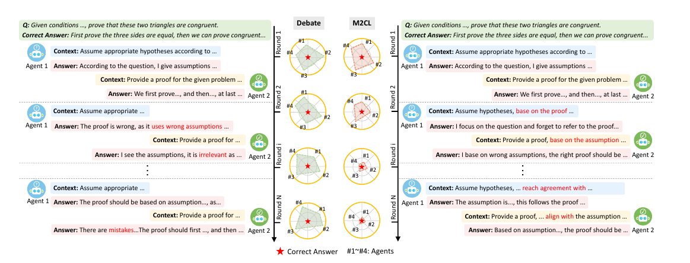](https://proceedings.iclr.cc/paper_files/paper/2026/hash/a1c1bb8d4cc0fc2bcb5fcb61163008df-Abstract-Conference.html)

- [[2026-Findings of ACL]](https://aclanthology.org/2026.findings-acl.1441/) **Learning Optimal Message Representations for Agentic Communication** [PDF](https://aclanthology.org/2026.findings-acl.1441.pdf)
  - 简介：OPTiMACS 研究同一条消息该用自然语言、代码、公式还是结构化格式表达。系统结合消息内容与收发双方职责识别任务类型，再以任务成功奖励学习格式选择策略；探索期间允许发现新任务类别和新格式，而不是只在预设 JSON 等选项中挑选。 **主要结论：** 数学协作与多跳问答实验中，学习的策略整体优于自然语言及固定格式；表 2 没有一种固定格式在所有数据集都最好。token 在 GSM+、WikiHop、HotpotQA 上下降，但 NarrativeQA 上增加 19.3%。因此它改善的是按任务选择表达方式的能力，不能概括为结构化消息总比自然语言好或总更省 token。

  [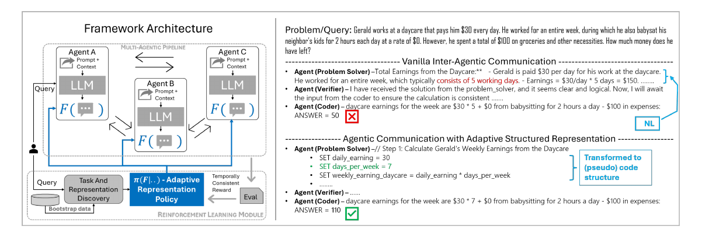](https://aclanthology.org/2026.findings-acl.1441/)

- [[2026-ICML]](https://icml.cc/virtual/2026/poster/61557) **When LLMs Develop Languages: Symbolic Communication for Efficient Multi-Agent Reasoning** [PDF](https://arxiv.org/pdf/2606.29354) [🐙 Code](https://github.com/pzqpzq/LSF_MDia)
  - 简介：针对自然语言消息冗长、每次任务都要重新组织表达的问题，本文把符号词典、组合语法和推理规则封装成可复用的 LSF 卡片。冻结的 LLM 群体在训练题上提出、批评和变异这些卡片，按正确率与生成 token 效率筛选；执行新题时，路由器选择单个卡片，或让多个卡片并行投票、跨轮交流。 **主要结论：** 扩大演化群体和增加演化轮次能改善所得符号协议，但收益逐渐饱和；多轮组合还需权衡准确率与生成长度。论文的主要效率指标统计各轮输出 token，并非全部输入输出成本；扩大的群体主要用于离线寻找协议，不能直接解释为测试时成员越多越好。

  [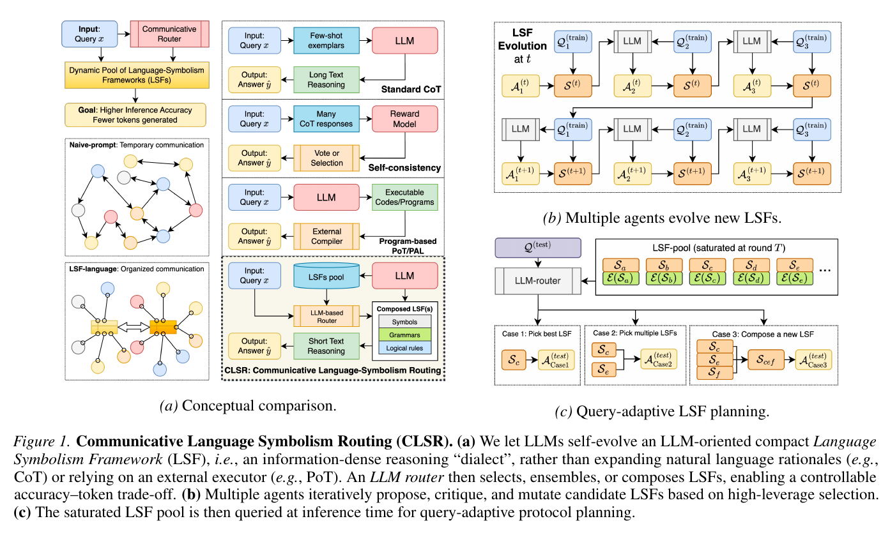](https://icml.cc/virtual/2026/poster/61557)

### B4. 潜在状态与缓存通信

- [[2025-ICML]](https://proceedings.mlr.press/v267/ramesh25a.html) **Communicating Activations Between Language Model Agents** [PDF](https://raw.githubusercontent.com/mlresearch/v267/main/assets/ramesh25a/ramesh25a.pdf)
  - 简介：该论文跳过把内部状态解码成文字再传给其他模型的过程：在接收模型的中间层暂停计算，将发送模型的激活与当前激活相加、平均或替换，再继续前向传播；另比较利用通用文本学习线性映射的版本。 **主要结论：** 两个 LLaMA-3.2-3B 实例的协作游戏中，替换激活优于自然语言通信，且省去中间文本生成；但效果取决于融合方式和任务。LLaMA 3B→8B 的 GSM8K 实验里，直接激活通信为 64%，低于文字辩论的 75%，学习映射也非处处改善。因此内部状态是可用的通信媒介，实验尚不能支持它普遍优于文本；实现需要访问并处理模型内部激活。

  

- [[2025-NeurIPS]](https://proceedings.neurips.cc/paper_files/paper/2025/hash/b2b502c3629beadda06311386d2c6f73-Abstract-Conference.html) **Thought Communication in Multiagent Collaboration** [PDF](https://proceedings.neurips.cc/paper_files/paper/2025/file/b2b502c3629beadda06311386d2c6f73-Paper-Conference.pdf)
  - 简介：ThoughtComm 针对文本交流难以传递模型内部推理信息的问题，用带 Jacobian 稀疏约束的自编码器，从各成员回复末尾的隐藏状态中提取潜在因子；按因子与成员的依赖关系筛选、加权，再通过可训练前缀适配器注入下一轮生成。底层 LLM 保持冻结，文本回复仍参与迭代，新增的是内部表示层面的协作通道。 **主要结论：** 三个智能体、两轮交流的数学实验中，多数配置优于论文的 Multiagent Finetuning 基线，例如 Qwen3-1.7B 的 MATH 准确率从 75.8% 升至 93.0%；但 Llama3-8B 的 GSM8K 共识率提高时，准确率反而从 69.2% 降至 68.4%。因此潜在因子交流可以改善推理，但共识增加并不保证答案更正确。

  

- [[2025-NeurIPS]](https://proceedings.neurips.cc/paper_files/paper/2025/hash/1a074a28c3a6f2056562d00649ae6416-Abstract-Conference.html) **KVCOMM: Online Cross-context KV-cache Communication for Efficient LLM-based Multi-agent Systems** [PDF](https://proceedings.neurips.cc/paper_files/paper/2025/file/1a074a28c3a6f2056562d00649ae6416-Paper-Conference.pdf) [🐙 Code](https://github.com/FastMAS/KVCOMM)
  - 简介：Ye 等提出的 KVCOMM 针对多个成员重复预填充相同文本的开销：同一段文字在不同前文下的 KV 缓存并不相同，因此先对齐位置编码，再用在线积累的锚点插值估计共享文本及相邻前缀的缓存偏移；没有合适锚点时执行完整预填充，并将结果加入锚点池。 **主要结论：** 在 MMLU、GSM8K 与 HumanEval 的 2–5 成员实验中，答题表现接近完整预填充基线；五成员 Llama-3.1-8B 配置下，第五个成员的首 token 延迟由 428.6 ms 降至 54.8 ms，约加速 7.82 倍。消融显示，位置对齐和两类缓存偏移均影响准确率。该速度是单成员首 token 指标，方法不加速后续解码；验证范围为使用同一模型权重的成员。

  

- [[2026-ICLR]](https://proceedings.iclr.cc/paper_files/paper/2026/hash/474ada926b331d78f06d95e8913111cc-Abstract-Conference.html) **Cache-to-Cache: Direct Semantic Communication Between Large Language Models** [PDF](https://proceedings.iclr.cc/paper_files/paper/2026/file/474ada926b331d78f06d95e8913111cc-Paper-Conference.pdf) [🐙 Code](https://github.com/thu-nics/C2C)
  - 简介：C2C 针对模型间“先生成文本、再重新编码”造成的信息损失与延迟，让两个模型并行编码同一输入，直接融合 KV cache。方法先对齐 token 与网络层，再用残差融合器、输入相关权重和逐层门控，将发送方表示注入接收方；两个 LLM 冻结，仅训练融合模块。 **主要结论：** 以 Qwen3-0.6B 为接收方、搭配三种发送模型的四基准实验中，相比文本通信，平均准确率分别提高 5.36、4.15、3.06 个百分点。消融显示，直接用投影后的外部缓存覆盖原缓存效果很差，保留自身信息的残差融合明显改善，再加门控进一步提高均分。因此关键是学习怎样整合两种表示，而非简单复制缓存；主要证据来自模型两两通信，尚不能直接推广为任意多轮智能体网络。

  

- [[2026-ICLR]](https://proceedings.iclr.cc/paper_files/paper/2026/hash/883105b282fe15275991b411e6b200c5-Abstract-Conference.html) **KVComm: Enabling Efficient LLM Communication through Selective KV Sharing** [PDF](https://proceedings.iclr.cc/paper_files/paper/2026/file/883105b282fe15275991b411e6b200c5-Paper-Conference.pdf) [🐙 Code](https://github.com/Zephyroam/KVComm)
  - 简介：KVComm 针对自然语言转述可能丢失上下文、完整状态传输又昂贵的问题，让发送者对上下文做预填充，只共享选定层的 KV 缓存，接收者将其接入对应层的注意力。层选择结合校准样本上的注意力分数与偏向中间层的高斯先验，校准后固定。 **主要结论：** 在所测上下文问答任务中，传输约 70% 层可接近直接获得完整上下文的参照，低传输比例时优于随机选层的优势更明显；中间层通常比任意连续层段更有用，数学提示任务增益较小。实验主要针对相同模型或同一底座的微调模型，尚不能据此声称支持任意异构模型互传缓存。

  [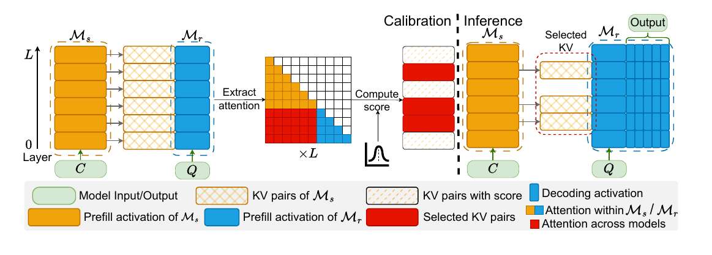](https://proceedings.iclr.cc/paper_files/paper/2026/hash/883105b282fe15275991b411e6b200c5-Abstract-Conference.html)

- [[2026-ACL]](https://aclanthology.org/2026.acl-long.1248/) **Enabling Agents to Communicate Entirely in Latent Space** [PDF](https://aclanthology.org/2026.acl-long.1248.pdf) [🐙 Code](https://github.com/XiaoDu-flying/Interlat)
  - 简介：Interlat 将推理者给执行者的文字计划替换为隐藏状态序列，由注意力适配器转成执行者可接收的表示。训练先逐步从文本嵌入过渡到潜在表示，再用正确／错配计划的区分损失防止执行者忽略消息，并约束计划对齐；随后训练推理者生成更紧凑的潜在计划。 **主要结论：** 消融表明，去掉适配器或渐进训练会严重损害执行成功率，说明“直接传隐藏状态”本身不充分。ACL 正式版还在 ALFWorld 比较双智能体链、三智能体链和三智能体树：同一结构下潜在通信均优于文字通信；Qwen2.5-0.5B-Base 三节点树在未见环境的成功率为 60.77%，文本版为 56.75%。结果支持通信表示与组织结构都影响协作，但没有证明树形在其他任务也最优。

  

- [[2026-ICML]](https://arxiv.org/abs/2511.20639) **Latent Collaboration in Multi-Agent Systems** [PDF](https://arxiv.org/pdf/2511.20639v3) [🐙 Code](https://github.com/Gen-Verse/LatentMAS)
  - 简介：LatentMAS 同时把成员内部推理和成员间交接移到潜在空间：用由模型输入、输出嵌入计算的线性对齐映射，使隐藏状态继续参与下一步推理；再把各层 KV cache 传给后续成员，保留累积计算，仅由最终成员解码文字答案。该过程无需额外训练，论文在使用同一底层模型的链式与分层四角色团队中评估。 **主要结论：** 多个推理与代码任务显示其可减少生成 token、降低延迟并改善准确率；混合消融进一步比较“潜在推理＋文本通信”和“文本推理＋潜在通信”，两者均低于完整方案，说明收益来自内部推理与信息交接的配合。该消融的文本交接仅保留末尾 128 个解码 token，且直接共享缓存依赖模型兼容性，不能据此断言所有异构模型都可无训练互通。

  

- [[2026-ACL]](https://aclanthology.org/2026.acl-long.327/) **When KV Cache Reuse Fails in Multi-Agent Systems: Cross-Candidate Interaction is Crucial for LLM Judges** [PDF](https://aclanthology.org/2026.acl-long.327.pdf) [🐙 Code](https://github.com/dbsxfz/kv_reuse_fails)
  - 简介：该研究考察执行智能体的 KV 缓存能否直接复用于比较多个答案的裁判。候选内容虽相同，但裁判把它们放到同一上下文后，各候选的有效前缀与相互注意力已改变；论文比较直接拼接、KVCOMM 修正及跨成员共享锚点，并用 JCR 衡量所选候选是否与完整重算一致。 **主要结论：** 三个基准上，最终准确率接近并不保证裁判选择稳定，打乱候选顺序常使一致率进一步下降。屏蔽候选间注意力也会显著改变选择，支持跨候选交互是关键；保守回退能够恢复一致性，却牺牲大部分缓存复用率。它研究的是缓存近似带来的计算偏差。

  [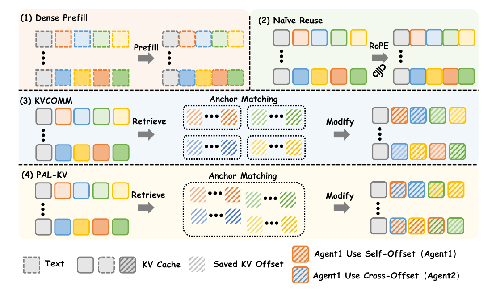](https://aclanthology.org/2026.acl-long.327/)

- [[2026-Findings of ACL]](https://aclanthology.org/2026.findings-acl.669/) **CondenseFlow: Scalable Latent Space Collaboration via Semantic Compression for Multi-Agent Systems** [PDF](https://aclanthology.org/2026.findings-acl.669.pdf) [🐙 Code](https://github.com/xxy33/condenseflow)
  - 简介：CondenseFlow 针对传递完整 KV 缓存会随上下文和轮数膨胀的问题，用可学习探针通过交叉注意力把各层缓存聚合成固定数量的槽位；训练时匹配压缩前后的注意力输出，并约束覆盖度和探针差异。下一成员把压缩结果作为 KV 前缀，新一轮替换旧前缀而非无限追加。 **主要结论：** Qwen3-14B 的实验中，64 槽位保留了接近完整缓存的平均准确率，通信缓存占用降低超过 99%；压到 16 槽位则在多轮测试中明显退化。固定大小约束的是传递缓存，并不意味着整个系统的计算或总通信量不再随轮数增长。

  [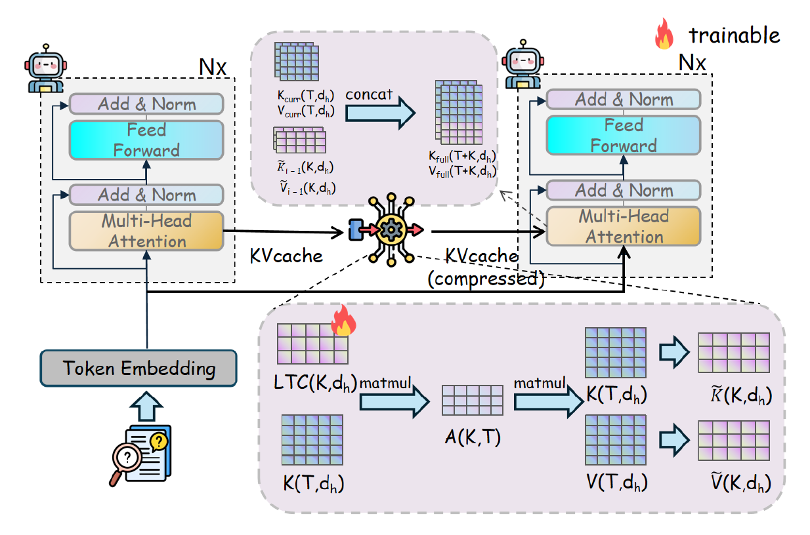](https://aclanthology.org/2026.findings-acl.669/)

- [[2026-ICML]](https://icml.cc/virtual/2026/poster/63256) **Dual Latent Memory for Visual Multi-agent System** [PDF](https://arxiv.org/pdf/2602.00471)
  - 简介：L²-VMAS 针对视觉智能体把感知细节与推理过程混成文字传递、协作加深反而丢失信息的问题，分别维护潜在感知记忆和潜在推理记忆：前者保留多粒度视觉表示，后者压缩并合并推理片段；生成熵升高时才触发记忆访问，选择所需类型并注入当前推理。底座模型冻结，训练外部记忆模块。 **主要结论：** 分类型消融中，感知记忆更有利于感知任务，推理记忆更有利于思考任务，混合任务以两者结合最好；所测文字通信基线随轮次增加会退化，双记忆方案能维持更好的扩展表现。结果说明传递的信息类型和调用时机都重要，不能只比较拓扑形状。

  [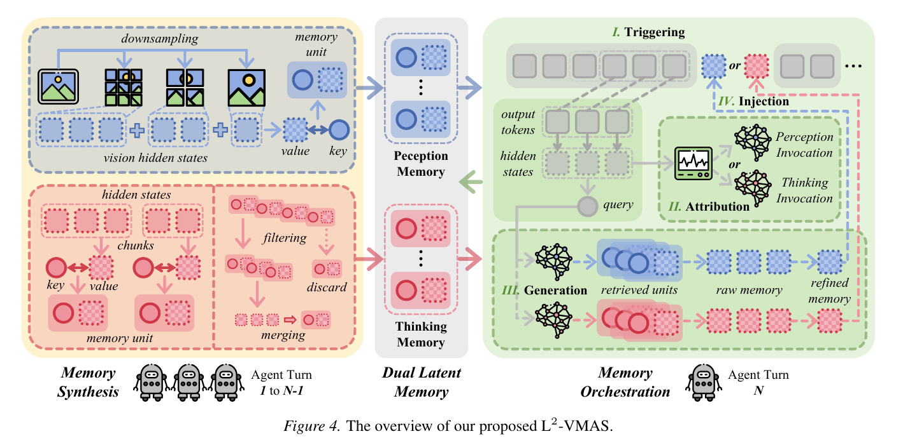](https://icml.cc/virtual/2026/poster/63256)

- [[2026-ICML]](https://icml.cc/virtual/2026/poster/66638) **RelayCaching: Accelerating LLM Collaboration via Decoding KV Cache Reuse** [PDF](https://arxiv.org/pdf/2603.13289) [🐙 Code](https://github.com/YingshengGeng/RelayCaching)
  - 简介：RelayCaching 针对下游成员重新读取上游输出时重复计算 KV、而直接复用又受前缀变化影响的问题，先在校准数据上定位偏差集中的模型层，再在运行时结合偏差大小、注意力影响和末尾位置，仅重算关键层中的部分 token，其余复用上游解码缓存，无需训练。 **主要结论：** 所测数学、知识和代码任务中，多数配置复用超过 80% KV，同时保持接近完整预填充的成绩；效率实验中第五个成员的首 token 延迟加速达 4.71 倍。该加速来自 Qwen3-0.6B 的特定配置，既不是整项任务加速，也不表示不同底座模型间可以直接通用地交换缓存。

  [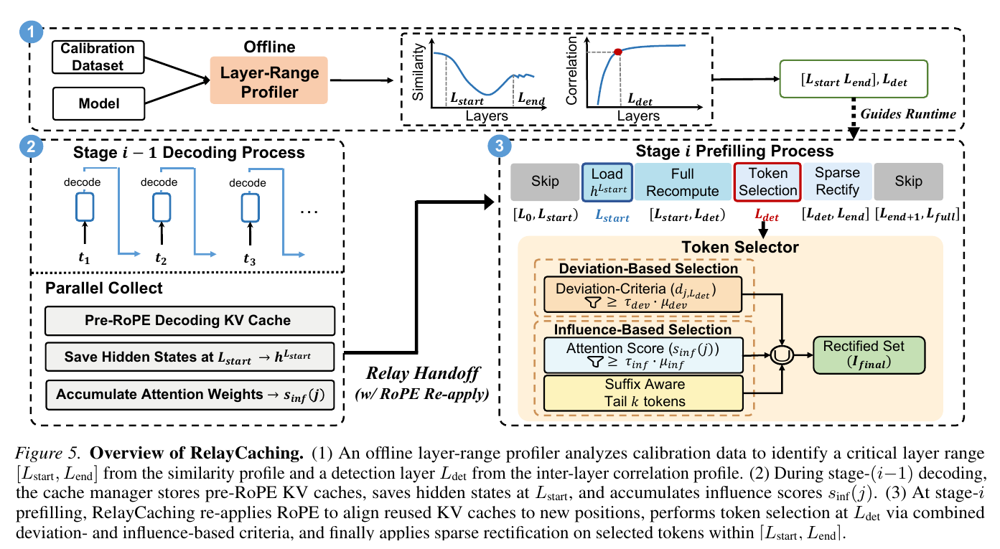](https://icml.cc/virtual/2026/poster/66638)

## C. 协作记忆

### C1. 共享工作区与跨轮状态

- [[2023-UIST]](https://doi.org/10.1145/3586183.3606763) **Generative Agents: Interactive Simulacra of Human Behavior** [PDF](https://arxiv.org/pdf/2304.03442) [🐙 Code](https://github.com/joonspk-research/generative_agents)
  - 简介：为让成员在持续互动中记住经历、形成判断并协调行动，该工作在 Smallville 中构建 25 个基于 GPT-3.5 的智能体：每个成员独立保存观察、对话、计划与反思，按相关性、近期性和重要性检索记忆，再据此规划行动；反思将具体经历归纳为更高层认识并写回记忆。成员通过对话传播信息，记忆本身并非全员共享。 **主要结论：** 100 人参与的访谈回答评估中，完整架构的行为可信度高于逐步屏蔽反思、计划及观察记忆的三个消融版本；两天模拟中，派对消息的知情者由 1 人增至 13 人，12 位受邀者中有 5 位实际到场。这说明记忆与反思可支撑跨轮信息传播和社会协调，但检索遗漏、计划未执行仍会造成失败；实验评估的是行为可信度与社会交互。

  

- [[2025-arXiv]](https://arxiv.org/abs/2507.01701) **Exploring Advanced LLM Multi-Agent Systems Based on Blackboard Architecture** [PDF](https://arxiv.org/pdf/2507.01701) [🐙 Code](https://github.com/bc200/LbMAS)
  - 简介：LbMAS 将全部协作放到黑板上：按问题生成专家角色，控制器根据当前板上内容选择执行者；规划、批评、冲突解决和清理角色持续修改共享状态，决策角色判断能否结束。它省去各成员分别维护完整对话的做法，并允许删除无用消息。 **主要结论：** 六个基准的平均成绩领先所比较的静态系统，但并非每项都优于较强单模型。移除控制器后，MATH 准确率近乎不变，token 却由约 472 万增至 1,386 万；停用消息删除也使所测三项成绩下降。因此黑板的收益同时依赖参与者调度与内容清理，不能只归因于扩大信息共享。

  

- [[2025-Findings of ACL]](https://aclanthology.org/2025.findings-acl.366/) **Select, Read, and Write: A Multi-Agent Framework of Full-Text-based Related Work Generation** [PDF](https://aclanthology.org/2025.findings-acl.366.pdf) [🐙 Code](https://github.com/1190200817/Full_Text_RWG)
  - 简介：该论文针对相关工作生成只读摘要、逐篇罗列而缺少联系的问题，设置选择者、阅读者与写作者：选择者按当前记忆和阅读历史决定下一篇论文及章节，阅读者将新证据整理进有长度上限的共享工作记忆，最后写作者据此组织综述；引用图或共引图约束阅读跳转。 **主要结论：** OARelatedWork 子集上，引用图引导的版本在三个骨干模型中均优于所比基线；20 篇论文的人评中，相对检索基线的综合胜率约为 59%–61%，逻辑组织改善最明显。直接一次输入全文不如逐步阅读整理；这里的图连接参考论文，共享记忆负责成员间交接，并非在优化智能体通信边。

  [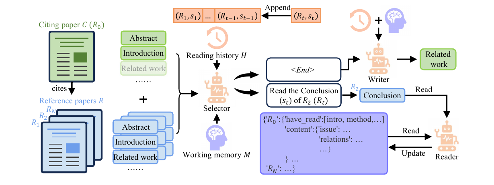](https://aclanthology.org/2025.findings-acl.366/)

- [[2025-arXiv]](https://arxiv.org/abs/2510.01285) **LLM-Based Multi-Agent Blackboard System for Information Discovery in Data Science** [PDF](https://arxiv.org/pdf/2510.01285)
  - 简介：该系统针对数据湖中主智能体难以知道哪个成员掌握所需文件的问题，先把文件分组交给文件智能体，再由主智能体把求助请求广播到黑板，成员自行判断是否能够提供文件处理方案或外部知识。回复进入仅主智能体读取的独立响应板，避免成员互相影响；主智能体据此编写和执行代码。 **主要结论：** 在 KramaBench 及经数据发现改造的 DS-Bench、DA-Code 上，各骨干模型的宏平均成绩均高于所比较的定向委派与 RAG 基线，文件发现指标也改善。但抽样成本实验中，token 费用约为主从方案的 1.8 倍，运行时间相近；自主响应提高了发现相关信息的能力，并不等于更省钱。

  

- [[2026-ACL]](https://aclanthology.org/2026.acl-long.503/) **Memory-Augmented LLM-based Multi-Agent System for Automated Feature Generation on Tabular Data** [PDF](https://aclanthology.org/2026.acl-long.503.pdf) [🐙 Code](https://github.com/fxdong24/MALMAS)
  - 简介：MALMAS 在表格特征生成中研究如何让不同专家复用彼此的探索：路由者按轮选择特征变换角色，成员并行生成和评估候选，私有程序记忆记录尝试、反馈记忆记录收益，概念记忆提炼规律；汇总者再形成共享概念记忆，指导下一轮选人和生成。 **主要结论：** 在所测分类与回归数据中，多角色探索与记忆各有贡献；完整六角色配置加入记忆后，平均排名进一步改善。Adult 数据的轮数实验中，无记忆较早停滞，有记忆则持续提高后趋于饱和。这里的共享主要服务同一数据集上的跨轮搜索，不能直接当作已验证跨任务终身学习的证据。

  [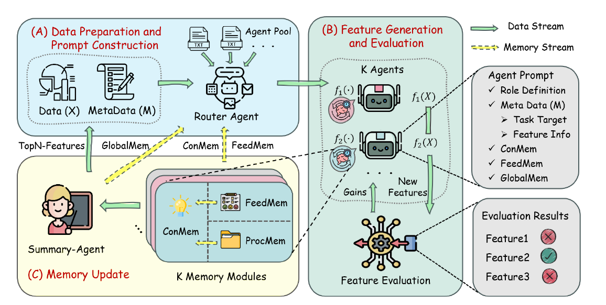](https://aclanthology.org/2026.acl-long.503/)

### C2. 跨任务经验积累与复用

- [[2025-NeurIPS]](https://proceedings.neurips.cc/paper_files/paper/2025/hash/136a45cd9b841bf785625709a19c6508-Abstract-Conference.html) **G-Memory: Tracing Hierarchical Memory for Multi-Agent Systems** [PDF](https://papers.neurips.cc/paper_files/paper/2025/file/136a45cd9b841bf785625709a19c6508-Paper-Conference.pdf) [🐙 Code](https://github.com/bingreeky/GMemory)
  - 简介：G-Memory 针对团队记忆只存最终答案、丢失协作过程的问题，建立“经验洞见—历史问题—交互轨迹”三层图。新题先检索相似问题并沿邻居扩展，向上取可迁移经验，向下提取精简协作路径，再按当前角色分配不同记忆；任务结束后用执行反馈更新三层图。 **主要结论：** 固定 GPT-4o-mini 与 AutoGen 时，五项任务均分从无记忆的 48.27% 升至 57.18%；部分其他记忆方案反而使某些任务退步。消融中，单独保留高层洞见或具体交互都弱于两者结合；扩大检索邻居和历史题数量也不持续改善表现。结果支持同时保存“可复用经验”和“当时怎样协作”，并筛掉无关记录，而非把更多历史直接塞进上下文。

  

- [[2026-arXiv]](https://arxiv.org/abs/2604.03295) **Scaling Teams or Scaling Time? Memory Enabled Lifelong Learning in LLM Multi-Agent Systems** [PDF](https://arxiv.org/pdf/2604.03295) [🐙 Code](https://github.com/ShanglinWu/MAS_lifelong_learning)
  - 简介：LLMA-Mem 把团队扩展拆成增加成员与积累跨任务经验两个维度：保存具体执行事件、可复用操作程序，以及谁擅长什么的协作统计，并定期把成功经历归纳成程序。它比较私有、全共享和混合记忆，同时保持通信图不变来考察成员数量。 **主要结论：** 所测编码、研究、数据库任务中，记忆通常改善完成质量，但协作评分不一定同步提高。Qwen3-32B 的编码消融里，私有记忆优于全共享和混合记忆；研究任务子集上也出现三个成员优于五个、五个优于七个的情况。因此更多共享和更大团队都不是稳定收益，角色匹配与长期积累同样影响性能。

  

- [[2026-arXiv]](https://arxiv.org/abs/2606.08702) **ConMem: Structured Memory-Guided Adaptation in Training-Free Multi-Agent Systems** [PDF](https://arxiv.org/pdf/2606.08702)
  - 简介：ConMem 针对把检索到的历史直接塞给团队会引入冲突、冗余和错误经验的问题，将成功策略与失败警示整理成带适用条件、计划、执行、评估字段的卡片。新任务先按需求检索，再沿支持、约束和冲突等关系扩展、去重与协调，最后在 token 预算内组成记忆前缀；模型参数、角色和执行日程保持固定。 **主要结论：** 在 Qwen3-4B 驱动的 AutoGen、CAMEL、MacNet 上，问答、代码和规划指标均较无记忆配置改善；去掉图扩展、协调或失败反思会损失部分收益。协调阶段删去超过半数扩展候选，说明关键是组合相容且适用的经验，而非尽量多检索；这里的图连接的是记忆卡片。

  

- [[2026-ICML]](https://icml.cc/virtual/2026/poster/62950) **MEMO: Memory-Augmented Model Context Optimization for Robust Multi-Turn Multi-Agent LLM Games** [PDF](https://arxiv.org/pdf/2603.09022) [🐙 Code](https://github.com/openverse-ai/MEMO)
  - 简介：MEMO 针对多轮博弈中提示优化难以积累经验的问题，以自对弈锦标赛评价候选上下文，用含不确定性惩罚的 TrueSkill 分数选择候选；从完整轨迹提炼策略，持续增删合并进共享记忆，并优先重放较少出现的状态来补充经验，再据此更新提示。 **主要结论：** 消融中，保留记忆比只做锦标赛选择贡献更大，两者结合并加入重放效果最好；跨局复用也降低了运行波动。但不同游戏之间的迁移具有方向性，转给其他模型也可能负迁移。该工作研究博弈代理的经验学习，不等同于合作团队共享事实记忆。

  [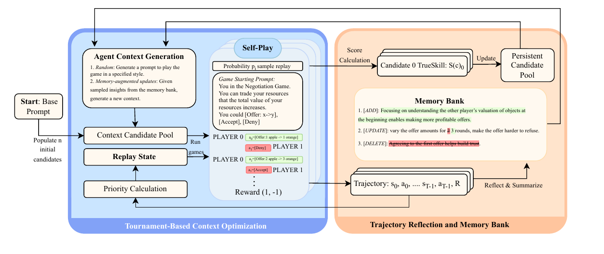](https://icml.cc/virtual/2026/poster/62950)

### C3. 角色化记忆分配与检索

- [[2024-ACL]](https://aclanthology.org/2024.acl-long.305/) **Experiential Co-Learning of Software-Developing Agents** [PDF](https://aclanthology.org/2024.acl-long.305.pdf) [🐙 Code](https://github.com/OpenBMB/ChatDev)
  - 简介：Experiential Co-Learning 针对软件开发智能体反复经历相似修改、完整旧轨迹又包含回退的问题，先记录指导者与助手的代码迭代，把相同代码状态合并成图，再结合编译和语义信号提取跨步骤捷径。指导者保存“代码状态→修改指令”，助手保存“指令→代码结果”，新任务分别检索各自经验辅助交流。 **主要结论：** 相比 ChatDev，实验中的代码质量提高、迭代减少；两名成员都使用经验优于只给一方经验，助手经验的贡献更大。直接记相邻步骤、只记首尾或不去重轨迹均不如完整方案，支持按角色存储经过筛选的经验，而非堆积对话。

  [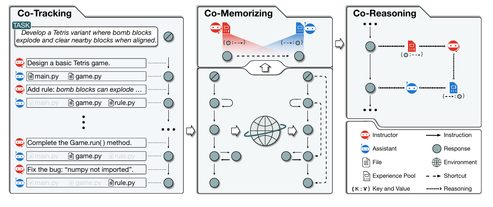](https://aclanthology.org/2024.acl-long.305/)

- [[2026-arXiv]](https://arxiv.org/abs/2602.03036) **LatentMem: Customizing Latent Memory for Multi-Agent Systems** [PDF](https://arxiv.org/pdf/2602.03036) [🐙 Code](https://github.com/KANABOON1/LatentMem)
  - 简介：LatentMem 针对所有角色收到同一份历史记录造成的冗余与职责错配，从经验库检索原始协作轨迹，再由可学习的记忆生成器结合当前角色，压成定长潜在 token 注入模型。LMPO 用任务奖励训练生成器，保持智能体骨干冻结；任务结束后持续追加新轨迹。 **主要结论：** 在所测问答、代码、规划任务和未见协作框架中，角色化记忆能改善结果。去掉角色输入后，KodCode 上 AutoGen 下降 2.30 个百分点，结构更复杂的 MacNet 下降 6.45 个百分点；停用在线经验更新又明显损害规划成绩。收益不仅来自压缩长度，也依赖角色区分与持续经验更新；该方案需要访问模型内部表示。

  

- [[2026-AAMAS]](https://www.microsoft.com/en-us/research/publication/legomem-modular-procedural-memory-for-multi-agent-llm-systems-for-workflow-automation/) **LEGOMem: Modular Procedural Memory for Multi-agent LLM Systems for Workflow Automation** [PDF](https://arxiv.org/pdf/2510.04851)
  - 简介：LEGOMem 研究历史经验应交给团队中的谁：把成功执行轨迹拆为完整任务记忆和子任务记忆，前者帮助编排者分解、委派与恢复，后者为对应执行者提供工具操作示例。论文比较从整条轨迹静态分配、执行时按子任务检索，以及提前改写子任务再检索三种方式。 **主要结论：** OfficeBench 中，基础方案使大模型团队成功率从 45.83% 升至 58.44%，小模型团队从 24.78% 升至 38.16%。记忆放置消融表明，编排者的完整经验比仅给执行者记忆更关键；细粒度检索在混合团队、仅执行者有记忆时更有帮助，而完整记忆配置下三种检索方式的差距较小。

  

- [[2026-ICML]](https://icml.cc/virtual/2026/poster/65274) **E-mem: Multi-Agent Based Episodic Context Reconstruction for LLM Agent Memory** [PDF](https://arxiv.org/pdf/2601.21714) [🐙 Code](https://github.com/dog-last/E-mem)
  - 简介：E-mem 针对把历史对话压成摘要会丢掉时间、指代和多跳证据的问题，将带重叠的原始片段分配给多个记忆助手，摘要仅辅助定位。主智能体融合摘要、实体关键词和语义检索三路结果，激活相关助手在各自完整片段内推理；助手返回带时间信息的证据，主智能体整合后可继续追问。 **主要结论：** 长对话与多文档问答中，这种局部推理再汇总的方式优于所比检索基线；模型消融显示，更强助手对多跳问题的帮助比单跳问题明显。固定检索预算的片段实验也显示块越大并非越好，但该消融只用 LoCoMo 的一段对话，不能据此认定通用最佳块大小。

  [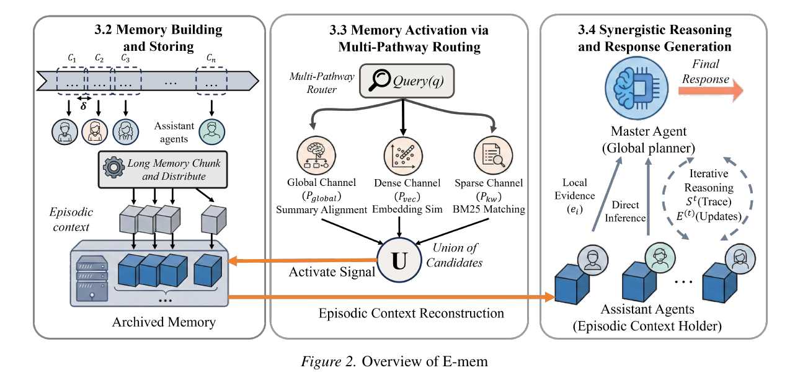](https://icml.cc/virtual/2026/poster/65274)

## D. 组队与执行编排

### D1. 角色与成员选择

- [[2023-NeurIPS]](https://proceedings.neurips.cc/paper/2023/hash/a3621ee907def47c1b952ade25c67698-Abstract-Conference.html) **CAMEL: Communicative Agents for “Mind” Exploration of Large Language Model Society** [PDF](https://arxiv.org/pdf/2303.17760v2) [🐙 Code](https://github.com/camel-ai/camel)
  - 简介：CAMEL 将持续提示和推进任务的工作交给 AI user，与执行指令的 AI assistant 组成固定双角色对话；任务细化器先明确目标，角色提示约束双方职责，避免对话偏离。生成的协作过程也用于构建训练数据。 **主要结论：** 论文的人工与 GPT-4 评审更偏好协作生成的方案；但终止行为消融揭示了代价：放宽助手输出格式或增加任务规划器，虽增加正常终止、减少角色越界，却也增加“承诺会做但没有实际进展”的回复。因此角色协议需要同时约束任务推进和终止，正常结束并不能单独证明协作质量。

  

- [[2024-ICLR]](https://proceedings.iclr.cc/paper_files/paper/2024/hash/578e65cdee35d00c708d4c64bce32971-Abstract-Conference.html) **AgentVerse: Facilitating Multi-Agent Collaboration and Exploring Emergent Behaviors** [PDF](https://arxiv.org/pdf/2308.10848v3) [🐙 Code](https://github.com/OpenBMB/AgentVerse)
  - 简介：AgentVerse 把协作组织为专家招募、共同决策、行动执行和结果评估四个阶段：招募器根据任务生成角色，评估未通过时再调整团队组成；成员通过预设的平级讨论或主执行者—评审者协议交换意见。它的自适应主要体现在成员与职责调整，通信协议并非自由学习出的任意图。**主要结论：** 多成员协作的收益明显依赖基础模型处理反馈的能力：GPT-3.5 的 Group 设置在三项推理任务中的两项不及 Solo，而错误的成员反馈是失败来源之一；GPT-4 在相应实验中更能利用协作。论文因此不仅展示团队可随反馈调整，也说明增加讨论可能放大错误，不能假定招募更多专家就必然提高性能。

  

- [[2024-IJCAI]](https://www.ijcai.org/proceedings/2024/3) **AutoAgents: A Framework for Automatic Agent Generation** [PDF](https://www.ijcai.org/proceedings/2024/0003.pdf) [🐙 Code](https://github.com/OWD-AI/AutoAgents)
  - 简介：AutoAgents 针对手工设定角色难以覆盖不同任务所需专长的问题，先让规划者按题生成角色提示、职责、工具与步骤，再由成员观察者检查角色的缺漏、冗余，由计划观察者检查步骤是否匹配。执行时由动作观察者分配工作、检查结果和调整计划，成员可独立改进或共同讨论。 **主要结论：** 在 GPT-4 的开放问答和知识融入写作实验中优于所比单模型与团队基线；二十例写作消融中，移除观察者或自我改进均使正确知识覆盖率从 90% 降至 87%。这支持生成团队后的检查与改进有价值，但小样本消融不能证明角色越多或团队结构越复杂越好。

  [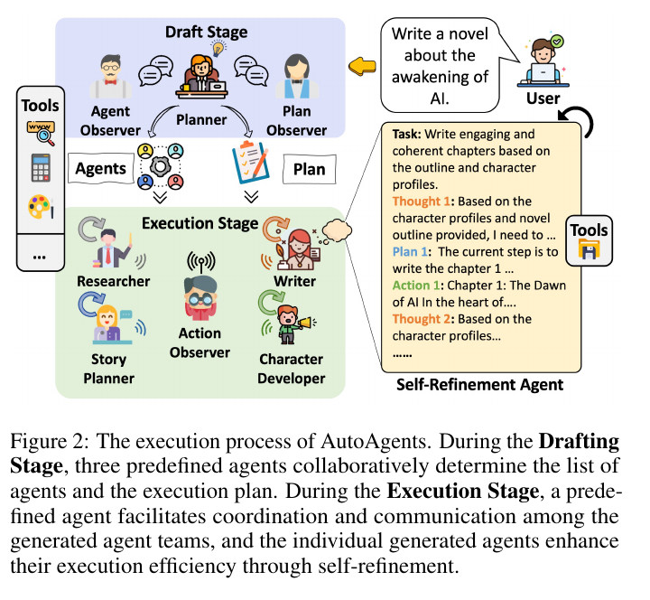](https://www.ijcai.org/proceedings/2024/3)

- [[2025-ICLR]](https://arxiv.org/abs/2410.02189) **Agent-Oriented Planning in Multi-Agent Systems** [PDF](https://arxiv.org/pdf/2410.02189) [🐙 Code](https://github.com/lalaliat/Agent-Oriented-Planning)
  - 简介：AOP 针对“任务拆得出来，却未必有成员能完成”的问题，先结合题目和成员能力描述生成子任务与分配方案，再用提前训练的奖励模型预测各成员的完成质量，避免让所有成员逐一试做；低分任务被重新分配、补充描述或进一步拆分，检查器同时补齐遗漏、删除重复并检查依赖。已完成任务还会更新各成员的代表性经验库。**主要结论：** 消融中，移除检查器明显增加分解不完整的问题；移除奖励模型或代表性经验也降低表现，支持同时检验“谁能做”和“任务是否拆全”。这里主要优化当前题目的执行计划，反馈库则跨任务积累，因此更接近任务自适应规划，而非根据本轮真实执行错误持续重连通信图。

  

- [[2025-NAACL]](https://arxiv.org/abs/2406.14228) **EvoAgent: Towards Automatic Multi-Agent Generation via Evolutionary Algorithms** [PDF](https://arxiv.org/pdf/2406.14228) [🐙 Code](https://github.com/siyuyuan/evoagent)
  - 简介：EvoAgent 针对人工设计角色难以覆盖复杂任务所需技能的问题，从初始成员对当前题目的作答出发，让 LLM 检查技能缺口、生成改进的子成员，再通过变异增加角色差异、质量检查保留合格候选；新成员重新作答并与上一轮结果整合，下一代继续据此生成。演化对象主要是成员设置和候选答案，通信沿预设的代际生成—汇总流程展开。**主要结论：** TravelPlanner 消融中，生成专门成员优于仅让原成员多采样或反复改提示；当每代不止一个候选时，质量检查有助于避免角色重复。但增加种群与迭代轮数虽改善用户偏好约束，却可能损害常识约束，表明扩大团队需要同时检查多类目标，不能只看单一得分上升。

  

### D2. 异构模型分工与路由

- [[2023-NeurIPS]](https://proceedings.neurips.cc/paper_files/paper/2023/hash/77c33e6a367922d003ff102ffb92b658-Abstract-Conference.html) **HuggingGPT: Solving AI Tasks with ChatGPT and its Friends in Hugging Face** [PDF](https://proceedings.neurips.cc/paper_files/paper/2023/file/77c33e6a367922d003ff102ffb92b658-Paper-Conference.pdf) [🐙 Code](https://github.com/microsoft/JARVIS)
  - 简介：HuggingGPT 用 LLM 充当控制器，将请求拆成带资源依赖的子任务，依据模型描述从 Hugging Face 选择专家，按依赖执行并汇总结果；图像、语音等专家可以是专用模型，并非每个节点都是会自主对话的 LLM。 **主要结论：** 人工标注任务与 130 条请求评估表明，模型可通过语言描述连接多种能力，但计划正确、选模合理与最终成功之间仍存在差距。任务规划消融中，增加示例类型能改善规划表现，示例数量超过约四个后收益有限；因此可用专家多不代表任务就能可靠完成，控制器的任务分解和依赖处理仍是瓶颈。

  

- [[2024-ACL]](https://aclanthology.org/2024.acl-long.381/) **ReConcile: Round-Table Conference Improves Reasoning via Consensus among Diverse LLMs** [PDF](https://aclanthology.org/2024.acl-long.381.pdf) [🐙 Code](https://github.com/dinobby/ReConcile)
  - 简介：ReConcile 针对同一模型多次采样的错误相关性，让不同模型先独立给出答案、解释与置信度，再按候选答案分组交换意见。讨论提示加入曾使其他模型纠正错误的人类解释示例，最后按重校准置信度投票，达成一致可提前停止。 **主要结论：** StrategyQA 消融中，完整三模型团队为 79.0%，换成三个 ChatGPT 实例降至 72.2%，去掉说服示例降至 74.5%；仅改写同一回答也不能复制多模型收益。结果把提升具体联系到能力与判断的多样性、以及纠错信息的组织，而非仅增加发言次数。

  [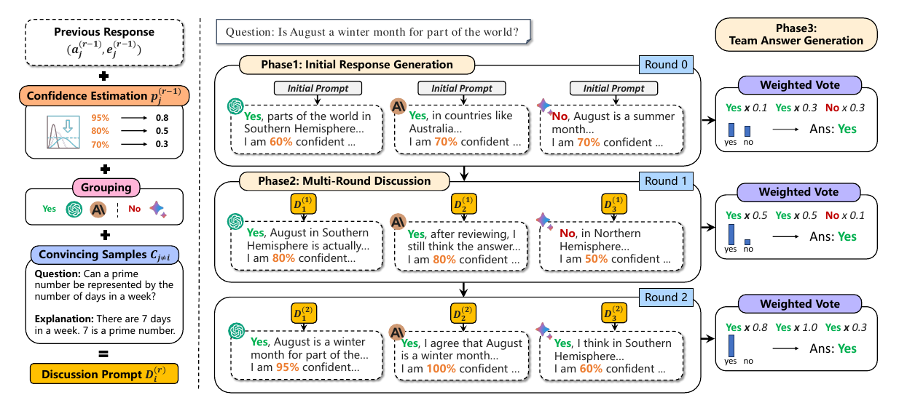](https://aclanthology.org/2024.acl-long.381/)

- [[2025-ACL]](https://aclanthology.org/2025.acl-long.757/) **MasRouter: Learning to Route LLMs for Multi-Agent Systems** [PDF](https://arxiv.org/pdf/2502.11133v1) [🐙 Code](https://github.com/yanweiyue/masrouter)
  - 简介：MasRouter 将“选哪个模型”扩展为三级条件路由：按题目先选协作模式，再选角色与人数，最后给每个角色分配底层模型；通过任务收益和成本联合训练，使便宜模型与昂贵模型在合适位置参与。 **主要结论：** 消融中，随机分配底层模型造成最大性能下降；取消成本项对表现影响较小，却明显增加开销。HumanEval 上人数上限从 2 增至 6 有较明显收益，继续增至 10 收益很小而成本上升。这里主要搜索模式、成员和模型配置，通信连接受所选模式约束。

  

- [[2025-arXiv]](https://arxiv.org/abs/2509.07571) **Towards Generalized Routing: Model and Agent Orchestration for Adaptive and Efficient Inference** [PDF](https://arxiv.org/pdf/2509.07571)
  - 简介：MoMA 将“调用现成专业智能体还是直接请求 LLM”和“选哪个 LLM”纳入统一路由：先按功能分组检索候选智能体，以状态机约束可选名称；需要 LLM 时，用带专家头的预测器估计候选模型成绩，再结合费用偏好选择。 **主要结论：** 在 AIME2024、LiveCodeBench、SimpleQA 上，性能优先设置的平均分为 70.1，高于所测最佳单模型的 68.6，表中费用也更低；切到低费用偏好则明显牺牲成绩。因此路由偏好必须与目标一起报告。这篇主要验证请求分派及模型选择，不能据其结果认定它学出了更好的多轮通信图。

  

- [[2026-ICLR]](https://proceedings.iclr.cc/paper_files/paper/2026/hash/77b874452cdb52ea04c15b33122969e9-Abstract-Conference.html) **SLM-MUX: Orchestrating Small Language Models for Reasoning** [PDF](https://proceedings.iclr.cc/paper_files/paper/2026/file/77b874452cdb52ea04c15b33122969e9-Paper-Conference.pdf) [🐙 Code](https://github.com/slm-mux/SLM-MUX)
  - 简介：SLM-MUX 针对小模型能力互补却难以可靠选答案的问题，让同一组模型各自多次独立采样，以答案出现频率估计置信度，再输出置信度最高模型的多数答案；离线选择模型组合时，同时奖励正确答案覆盖率、惩罚高置信度错误压过其他模型正确答案的情况。 **主要结论：** 三模型组合在 MATH 和 GSM8K 上超过其中最佳单模型自一致性基线，但 GPQA 上略低；增加成员并不保证提高成绩，模型的互补性与置信度可靠性比单纯扩容更关键。成员之间没有交换推理消息，可作为异构模型协作研究中的独立集成对照。

  [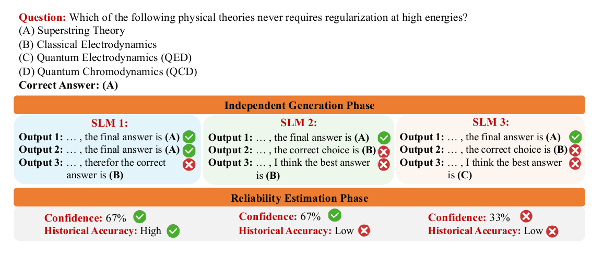](https://proceedings.iclr.cc/paper_files/paper/2026/hash/77b874452cdb52ea04c15b33122969e9-Abstract-Conference.html)

- [[2026-ICLR]](https://proceedings.iclr.cc/paper_files/paper/2026/hash/c86ed90b14e55f2ecf838a755e404b06-Abstract-Conference.html) **GraphPlanner: Graph Memory-Augmented Agentic Routing for Multi-Agent LLMs** [PDF](https://proceedings.iclr.cc/paper_files/paper/2026/file/c86ed90b14e55f2ecf838a755e404b06-Paper-Conference.pdf) [🐙 Code](https://github.com/ulab-uiuc/GraphPlanner)
  - 简介：GraphPlanner 针对一次性选模型难以处理多步任务的问题，将每步动作设为“模型＋角色”，在规划者、执行者与总结者之间动态路由。它把历史任务轨迹与当前执行过程组织为图，通过角色节点传递历史经验，再用强化学习权衡最终任务质量和调用成本；每次实际回答都会更新当前图。 **主要结论：** 消融表明，历史图记忆和区分节点关系的图编码均有贡献；允许生成工作流比只在固定工作流中换模型更有利于数学和代码任务，对识别类任务的收益较小。更强效果伴随额外调用与记忆开销，不能概括为对所有路由基线都更便宜。

  [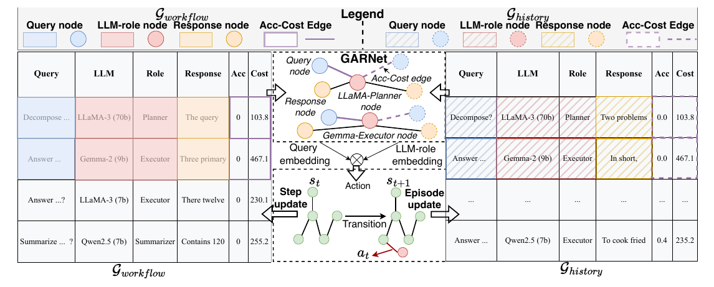](https://proceedings.iclr.cc/paper_files/paper/2026/hash/c86ed90b14e55f2ecf838a755e404b06-Abstract-Conference.html)

- [[2026-ICML]](https://icml.cc/virtual/2026/poster/61537) **HieraMAS: Optimizing Intra-Node LLM Mixtures and Inter-Node Topology for Multi-Agent Systems** [PDF](https://arxiv.org/pdf/2602.20229) [🐙 Code](https://github.com/tianyao-aka/HieraMAS)
  - 简介：HieraMAS 针对“角色选什么模型”和“角色之间如何连接”相互影响的问题，把每个角色做成多个异构提议模型加一个综合模型的超级节点。先训练按题选择节点内模型的选择器，再冻结它，训练图评分器从候选拓扑中选出适合当前题目的图；节点内提议—综合结构本身固定，选择器也可跳过成员。 **主要结论：** 去掉图评分器后，MATH、MMLU 分别下降 3.45、3.36 个百分点；全部使用较强模型会显著增加成本，却不保证更高准确率。分析中跳过角色并不常见，节省更多来自较稀疏的连接。因此它优化的是模型配置与图结构的配合，而非单独寻找一种通用最优图。

  [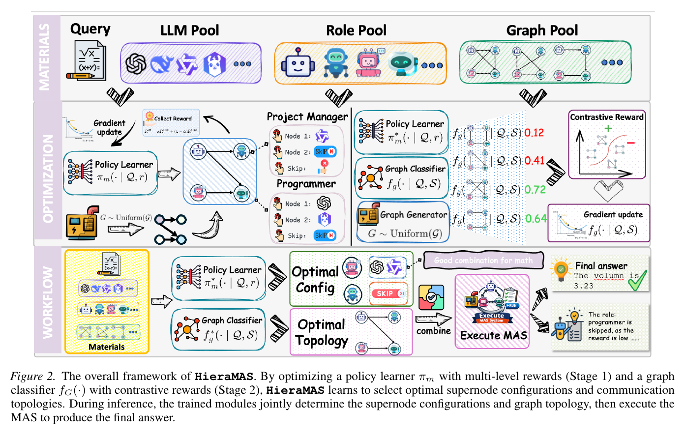](https://icml.cc/virtual/2026/poster/61537)

### D3. 工作流组织与搜索

- [[2024-ICLR]](https://arxiv.org/abs/2308.00352) **MetaGPT: Meta Programming for A Multi-Agent Collaborative Framework** [PDF](https://arxiv.org/pdf/2308.00352) [🐙 Code](https://github.com/geekan/MetaGPT)
  - 简介：MetaGPT 针对软件协作中的需求遗漏和逐轮信息失真，把产品、设计、开发等标准流程写入角色职责，要求成员交付结构化文档与接口设计；共享消息池和订阅机制让下游读取相关产物，开发者再根据运行错误迭代修改代码。 **主要结论：** 角色消融中，在工程师之外增加分工可改善可执行性并减少人工修改，但增加费用；加入可执行反馈后，HumanEval、MBPP 的 Pass@1 分别提高 4.2、5.4 个百分点。因此表现改善同时依赖明确交接与执行验证，不能全部归因于增加角色或某种通信图。

  

- [[2024-ACL]](https://aclanthology.org/2024.acl-long.810/) **ChatDev: Communicative Agents for Software Development** [PDF](https://arxiv.org/pdf/2307.07924v5) [🐙 Code](https://github.com/OpenBMB/ChatDev)
  - 简介：ChatDev 将软件需求到代码的长任务拆成设计、编码、测试三个顺序阶段，每个子任务由指导者与执行者多轮对话完成；遇到含糊修改要求时，执行者先反问具体细节，再改代码，称为 communicative dehallucination。 **主要结论：** 表 4 显示，移除角色提示使可执行率从 0.88 降至 0.58，移除反问澄清机制则降至 0.84；阶段分析表明，补全代码主要改善完整性，测试主要改善可执行性。收益因而来自职责、澄清和验证环节的配合，而非仅仅把模型调用串成更长的链。

  

- [[2024-ACL]](https://aclanthology.org/2024.acl-long.269/) **MapCoder: Multi-Agent Code Generation for Competitive Problem Solving** [PDF](https://aclanthology.org/2024.acl-long.269.pdf) [🐙 Code](https://github.com/Md-Ashraful-Pramanik/MapCoder)
  - 简介：MapCoder 针对直接写代码或只反复修补同一解法的局限，组织检索、规划、编码、调试四个角色。检索角色由 LLM 自行生成相似题及解法，规划角色据此分别提出候选方案并评估置信度；编码角色按顺序尝试，调试角色利用题目给出的样例和原计划修复代码，达到调试上限仍失败则换下一方案。 **主要结论：** GPT-4 在 HumanEval 的 Pass@1 从直接提示的 80.1% 提高到 93.9%，在 CodeContests 从 12.1% 提高到 28.5%；ChatGPT 消融中去掉调试角色使 HumanEval 成绩从 80% 降至 66%。但这些结果包含内部多次尝试：GPT-4 在 HumanEval 平均调用 15 次、使用约 1.28 万 token，且通过可见样例仍不能保证通过隐藏测试。

  [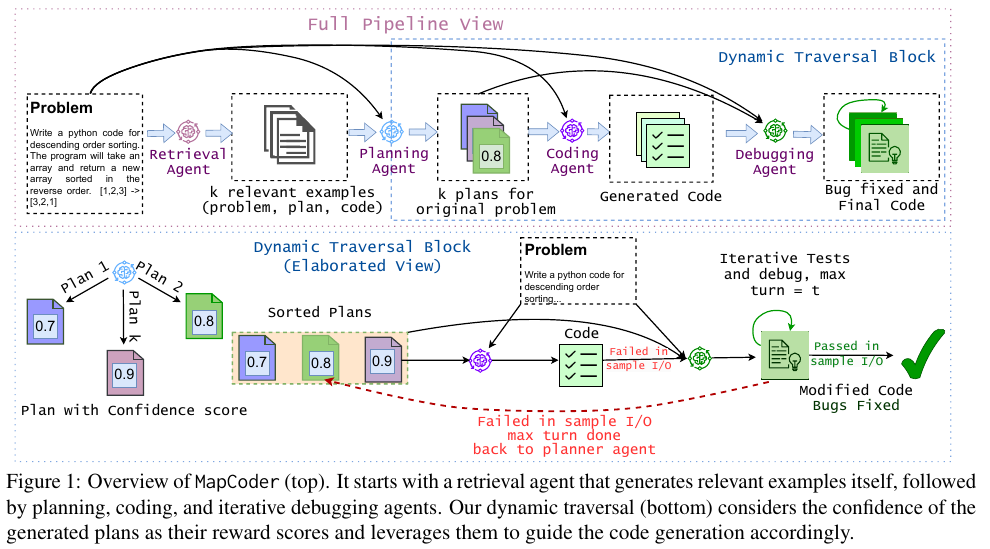](https://aclanthology.org/2024.acl-long.269/)

- [[2024-arXiv]](https://arxiv.org/abs/2411.04468) **Magentic-One: A Generalist Multi-Agent System for Solving Complex Tasks** [PDF](https://arxiv.org/pdf/2411.04468) [🐙 Code](https://github.com/microsoft/autogen)
  - 简介：Magentic-One 针对浏览、读文件和写代码交织的长程任务，用一个编排者协调四个工具专家。外层任务账本保存事实、待查事项和计划，内层进度账本判断是否完成、是否重复、是否前进及下一执行者；短暂停滞允许继续尝试，持续停滞则更新计划并重置成员上下文。 **主要结论：** GAIA 验证集消融中，把完整编排器换成仅选择下一发言者的 GroupChat，成功表现明显下降；移除任一工具专家也会损害对应能力任务。这支持显式进度管理与专业能力互补的价值，但论文在 GAIA、WebArena、AssistantBench 的结果并非全面超过各领域专用最佳系统。

  

- [[2025-arXiv]](https://arxiv.org/abs/2502.07373) **EvoFlow: Evolving Diverse Agentic Workflows On The Fly** [PDF](https://arxiv.org/pdf/2502.07373)
  - 简介：EvoFlow 为避免只搜出昂贵且单一的最佳流程，维护带领域标签的流程种群：训练时按题检索父代，交叉并修改模型、提示和操作连接，在领域与成本相近的候选中淘汰劣解，保留多种复杂度方案；推理时从已优化种群检索执行。 **主要结论：** 消融中，随机选父代或固定底层模型会降低表现并增加波动，去掉操作变异也会损失性能；扩大种群虽改善表现，同时提高每题成本。结果支持“领域匹配＋结构探索＋多样性保留”的组合，而不是部署时对每道题重新搜索。

  

- [[2025-ICLR]](https://proceedings.iclr.cc/paper_files/paper/2025/hash/36b7acf6f6010652b3f2a433774a66fe-Abstract-Conference.html) **Automated Design of Agentic Systems** [PDF](https://arxiv.org/pdf/2408.08435v2) [🐙 Code](https://github.com/ShengranHu/ADAS)
  - 简介：ADAS 提出用程序搜索整个智能体系统，Meta Agent Search 是其实例：元智能体读取已有设计与成绩档案，编写新的执行函数，经反思、调试和验证集评估后存档，再据此继续探索；搜索结果在测试题上复用。 **主要结论：** 所发现程序在阅读、数学等任务中优于所比较的人工流程与仅优化提示的方法，且从 MGSM 搜出的程序迁移到其他数学、非数学任务后仍有收益，但通常不及目标域专门搜索。它支持复用程序化协作模式；搜索对象包含提示、控制流和交互，收益并非边连接优化的单独证据。

  

- [[2025-ICLR]](https://proceedings.iclr.cc/paper_files/paper/2025/hash/5492ecbce4439401798dcd2c90be94cd-Abstract-Conference.html) **AFlow: Automating Agentic Workflow Generation** [PDF](https://arxiv.org/pdf/2410.10762v4) [🐙 Code](https://github.com/FoundationAgents/AFlow)
  - 简介：AFlow 将一整套可执行工作流作为搜索树节点，让 LLM 修改提示、操作模块和调用连接；候选在验证集上多次执行，成功与失败经验回传到父节点，再混合探索高分方案和初始模板。找到的流程供同类新题复用。 **主要结论：** GSM8K 消融中，预设操作模块提高搜索效率；去掉模块后仍能自行形成集成结构并取得较好表现。HumanEval 迁移实验显示，所搜流程多能跨模型获益，但为目标模型直接搜索通常更合适，说明流程可迁移与模型适配同时存在。

  

- [[2025-ICLR]](https://proceedings.iclr.cc/paper_files/paper/2025/hash/ba84da6921f3040b74ee163aa7451f53-Abstract-Conference.html) **Flow: Modularized Agentic Workflow Automation** [PDF](https://arxiv.org/pdf/2501.07834v2) [🐙 Code](https://github.com/tmllab/2025_ICLR_FLOW)
  - 简介：Flow 针对固定串行流程难以并行、上游遗漏又会拖累下游的问题，把子任务作为 AOV 图节点、先后依赖作为边，按并行度和依赖复杂度从候选流程中选择初始方案；执行期间，全局检查器根据任务状态与已生成产物增加、删除、重写或重分配子任务，必要时补入连接前后步骤的中间任务。这里的节点是任务，一个成员可以执行多个节点。**主要结论：** 在五子棋、网站和 Beamer 写作任务中，随机把部分中间产物置空的对照显示，启用动态更新比保持原流程更能恢复完成度，游戏开发受益尤其明显。证据来自这些定制任务的少量重复试验，直接支持的是流程修复能力；论文关于减少依赖的理论结论还依赖其简化的子任务失效假设。

  

- [[2025-ICLR]](https://proceedings.iclr.cc/paper_files/paper/2025/hash/b07091c16719ad3990e3d1ccee6641f1-Abstract-Conference.html) **CaPo: Cooperative Plan Optimization for Efficient Embodied Multi-Agent Cooperation** [PDF](https://proceedings.iclr.cc/paper_files/paper/2025/file/b07091c16719ad3990e3d1ccee6641f1-Paper-Conference.pdf) [🐙 Repo（代码待发布）](https://github.com/jliu4ai/CaPo)
  - 简介：CaPo 针对成员只规划下一步、容易重复搬运或争抢同一物体的问题，先随机指定一名计划设计者，由其他成员结合局部观察评议，共同形成明确分工和执行步骤的长期计划。执行中，发现目标物或完成子任务会触发重新讨论；没有关键进展时继续原计划，避免频繁重规划。 **主要结论：** 在 TDW-MAT 的理想感知设置下，GPT-3.5 双成员运输完成比例从 CoELA 的 72% 提高到 84%；消融中，仅初始化计划为 74%，加入协商为 77%，再允许随进展更新达到 84%，说明收益不止来自预先写一份计划。C-WAH 中增至三个成员更快，四个成员却不再稳定改善。这里动态变化的是计划与任务分工，主要不涉及重新学习通信连接。

  [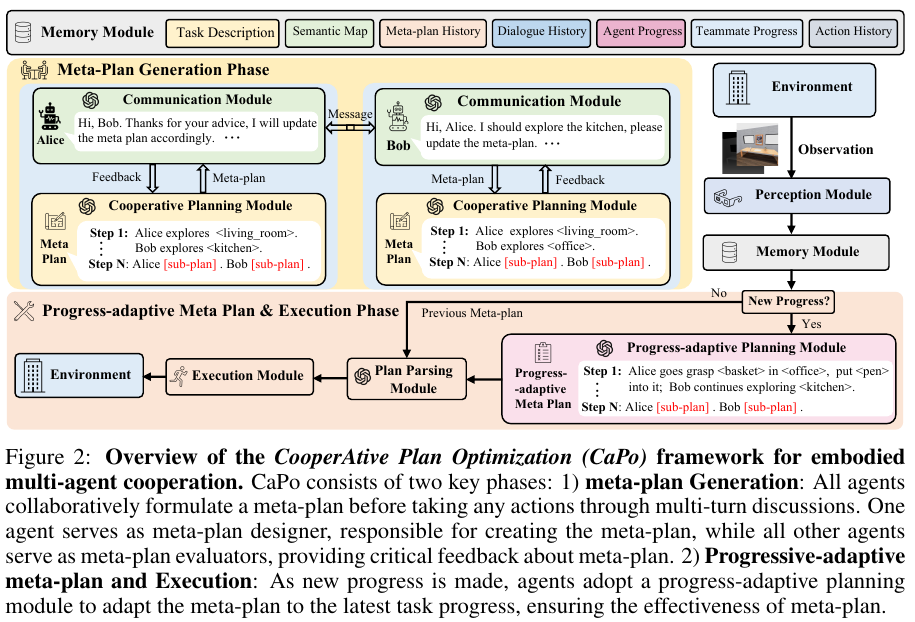](https://proceedings.iclr.cc/paper_files/paper/2025/hash/b07091c16719ad3990e3d1ccee6641f1-Abstract-Conference.html)

- [[2025-arXiv]](https://arxiv.org/abs/2506.12508) **AgentOrchestra: Orchestrating Multi-Agent Intelligence with the Tool-Environment-Agent(TEA) Protocol** [PDF](https://arxiv.org/pdf/2506.12508v6) [🐙 Code](https://github.com/SkyworkAI/DeepResearchAgent)
  - 简介：AgentOrchestra 针对工具、环境和智能体缺乏统一管理的问题，用 TEA 协议为三者规定注册、上下文、生命周期与版本接口；中心规划者通过统一调用接口调度检索、浏览、分析和工具生成成员，根据执行反馈重新规划，并复用演化后的组件。 **主要结论：** 2026 年修订版的 GAIA 累积消融中，规划者加入研究成员后均分从 36.54% 升至 57.14%，再加入浏览成员升至 72.76%；在研究、浏览、分析已齐备时，工具生成成员又使得分从 79.07% 升至 89.04%。这支持不同执行能力互补，但累积消融不能完全分离每个模块的独立贡献。数学与科学题部分仅使用分析成员，其收益主要来自提示和解题经验演化，不能一并归功于多智能体拓扑。

  

- [[2025-ICML]](https://arxiv.org/abs/2502.04180) **Multi-agent Architecture Search via Agentic Supernet** [PDF](https://arxiv.org/pdf/2502.04180) [🐙 Code](https://github.com/bingreeky/MaAS)
  - 简介：MaAS 为不同题目配置不同计算量，将提问、反思、辩论、工具调用等封装成操作模块，学习一个超网络控制器，依据题目和已选模块逐层采样流程，并用退出模块决定深度；采样完成后才执行。训练同时优化效用与成本，并以文本反馈修改模块内部设计。 **主要结论：** 消融中，取消模块的文本梯度更新造成最大性能损失；取消退出模块或成本约束对表现影响较小，却明显增加费用。因此能力收益与模块改进相关，按题选择深度和成本约束主要负责节省不必要的计算。

  

- [[2025-ICML]](https://proceedings.mlr.press/v267/zhang25bc.html) **MetaAgent: Automatically Constructing Multi-Agent Systems Based on Finite State Machines** [PDF](https://raw.githubusercontent.com/mlresearch/v267/main/assets/zhang25bc/zhang25bc.pdf) [🐙 Code](https://github.com/SaFo-Lab/MetaAgent)
  - 简介：MetaAgent 针对固定流水线难以回退纠错的问题，按一类任务的描述生成角色、工具及有限状态机：每个状态指定执行者、指令、结果接收者和自然语言转移条件，验证者据执行结果决定前进、留在原状态修改或回到此前状态；部署前再由 LLM 合并职责相近的冗余状态。 **主要结论：** GPT-4o 实验中，五项软件开发任务的检查点通过比例为 0.85，高于所比较的 MetaGPT 的 0.35；移除回溯后也降至 0.35，支持回退纠错的作用。ML Bench 平均分为 0.83，仍低于专门设计的 Data Interpreter 的 0.86。状态机按任务类别构建后复用，运行时选择其中的转移；核心贡献是可验证、可回退的执行流程，而不是每题重新生成通信图。

  [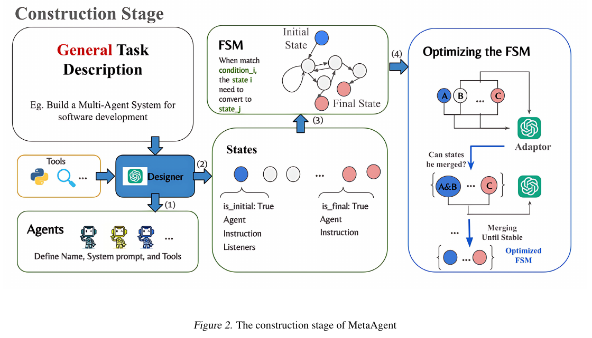](https://proceedings.mlr.press/v267/zhang25bc.html)

- [[2025-EMNLP]](https://aclanthology.org/2025.emnlp-main.93/) **SwarmAgentic: Towards Fully Automated Agentic System Generation via Swarm Intelligence** [PDF](https://arxiv.org/pdf/2506.15672v1) [🐙 Code](https://github.com/YaoZ720/SwarmAgenticCode)
  - 简介：SwarmAgentic 将整套角色与协作流程视为粒子，用文本描述替代数值位置与速度：先从执行失败定位缺陷，再结合失败修改记录、各自历史最优和群体最优，调整角色职责、成员数量及任务依赖；最终保留搜索出的最佳系统。 **主要结论：** 创意写作消融中，去掉失败记忆、角色调整或协作结构调整都会影响表现；跨模型迁移后仍优于所比基线，但针对目标模型重搜还能进一步提升。这里“群体”主要指搜索候选系统的种群，粒子不等于一次任务中参与通信的成员。

  

- [[2025-NeurIPS]](https://proceedings.neurips.cc/paper_files/paper/2025/hash/fe9910d2b03324faeb5371a9658277bb-Abstract-Conference.html) **DyFlow: Dynamic Workflow Framework for Agentic Reasoning** [PDF](https://arxiv.org/pdf/2509.26062v1) [🐙 Code](https://github.com/wyf23187/DyFlow)
  - 简介：DyFlow 针对一次性规划无法应对中间错误的问题，让设计器每次只生成下一阶段的算子子图，指定操作、细化指令及要从共享记忆读取的结果；执行后把答案、评审意见和错误返回设计器，再决定继续、修正、回退或结束。设计器先蒸馏成功轨迹学习子图生成，再用完整轨迹成败标记进行 KTO 偏好优化，执行模型保持固定。**主要结论：** 消融中，分别去掉蒸馏或偏好优化都会降低表现，而取消中间反馈、要求单阶段完成整题的退化最大；固定算子模板也弱于动态选择。结果支持“训练会规划的设计器”和“执行时持续调整子目标”共同发挥作用。图中的节点是可调用算子实例，未必对应长期存在的独立角色成员。

  

- [[2025-NeurIPS]](https://proceedings.neurips.cc/paper_files/paper/2025/hash/48dcc43a534c5b582f9d0fdb778e9b84-Abstract-Conference.html) **OWL: Optimized Workforce Learning for General Multi-Agent Assistance in Real-World Task Automation** [PDF](https://proceedings.neurips.cc/paper_files/paper/2025/file/48dcc43a534c5b582f9d0fdb778e9b84-Paper-Conference.pdf) [🐙 Code](https://github.com/camel-ai/owl)
  - 简介：OWL 针对跨领域任务需要反复改造整套团队的问题，提出 WORKFORCE：规划者拆解任务，协调者管理依赖和分配，专业执行者使用浏览、文档或代码工具；共享任务频道只传递子任务及结果，详细工具轨迹留在各自上下文中，失败反馈可触发重规划。训练时对规划者先做监督微调，再用成功与失败轨迹进行 DPO。 **主要结论：** 固定执行者为 GPT-4 时，Qwen2.5-32B 规划者经训练后，系统 GAIA 验证集成绩从 36.36% 提高到 52.73%；仅监督微调为 41.21%，且 Level 3 一度退步，加入 DPO 后恢复并提升。另组消融中，仅训练规划者优于仅训练执行者，同时训练两者增益较小；这些结果支持把任务拆解与专业执行分开优化。

  [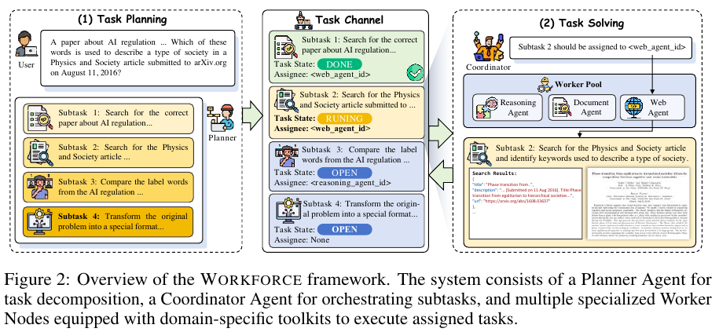](https://proceedings.neurips.cc/paper_files/paper/2025/hash/48dcc43a534c5b582f9d0fdb778e9b84-Abstract-Conference.html)

- [[2026-ICLR]](https://arxiv.org/abs/2502.02533) **Multi-Agent Design: Optimizing Agents with Better Prompts and Topologies** [PDF](https://arxiv.org/pdf/2502.02533)
  - 简介：MASS 针对“提示未优化就搜索复杂协作结构”的低效问题，分三步：先优化各功能块的提示与示例，再按验证集增益偏重采样有用模块、搜索预算内的组合，最后固定最佳结构联合调整提示；模块顺序受预设规则约束。 **主要结论：** 局部比较发现，许多新增模块并无正收益；MATH 的优化轨迹中，局部最优的辩论块在整体组合后被并行聚合方案超过，最后再优化提示仍有收益。有效结构取决于成员能力和模块间配合，因此提示优化与拓扑搜索应交替进行。

  

- [[2026-WWW]](https://doi.org/10.1145/3774904.3792240) **Difficulty-Aware Agentic Orchestration for Query-Specific Multi-Agent Workflows** [PDF](https://arxiv.org/pdf/2509.11079) [🐙 Code](https://github.com/AutoAgents-ai/DAAO)
  - 简介：DAAO 针对固定流程与统一模型配置难以兼顾简单题成本和难题能力的问题，用带成功率校准的变分编码器估计题目难度，据此生成不同深度、宽度的操作流程，并为各操作选择异构 LLM。训练目标同时考虑任务表现和费用，因而联合决定投入多少推理步骤、采用什么操作、由哪个模型执行。 **主要结论：** HumanEval、MATH 的消融中，移除难度估计或模型选择均使成绩下降、费用上升；取消费用约束只带来很小的成绩增益，却明显增费。增加操作激活阈值后，成绩较早趋于饱和而成本继续增加，支持按难度配置团队计算，而非所有问题统一扩张。

  

- [[2026-ICLR]](https://proceedings.iclr.cc/paper_files/paper/2026/hash/b88318174aad2cc174a4e05ab6bfad80-Abstract-Conference.html) **MAS²: Self-Generative, Self-Configuring, Self-Rectifying Multi-Agent Systems** [PDF](https://proceedings.iclr.cc/paper_files/paper/2026/file/b88318174aad2cc174a4e05ab6bfad80-Paper-Conference.pdf) [🐙 Code](https://github.com/yeyeyeah2/MAS2)
  - 简介：MAS² 针对任务设计、模型分配和执行纠错相互割裂的问题，训练三个元智能体：生成者写出角色、通信与工具工作流，实施者分配具体模型，纠错者在超预算或执行失败时修改提示、工具或流程。训练把候选设计及执行分支展开为树，将成功与成本奖励向上回传，再按价值差构造偏好数据分别训练。 **主要结论：** 将生成者或实施者替换为未训练模型、或移除运行时纠错，均降低所测任务成绩；消融支持三阶段配合，而非把增益全部归给拓扑。成本分析中，按任务分配模型和工作流复杂度改善了问答任务的成本—效果平衡。

  [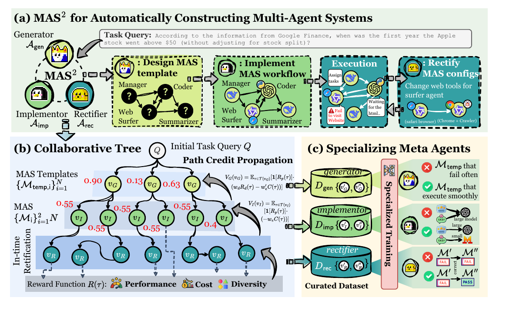](https://proceedings.iclr.cc/paper_files/paper/2026/hash/b88318174aad2cc174a4e05ab6bfad80-Abstract-Conference.html)

- [[2026-ICML]](https://icml.cc/virtual/2026/poster/65930) **AOrchestra: Automating Sub-Agent Creation for Agentic Orchestration** [PDF](https://arxiv.org/pdf/2602.03786v2) [🐙 Code](https://github.com/FoundationAgents/AOrchestra)
  - 简介：AOrchestra 针对固定子成员难以适配不断变化的子任务，把每次委派写成“指令、精选上下文、工具集合、基础模型”四元组，在运行时创建相应执行成员；主编排者只负责委派或结束，收到结果、产物和错误后再决定下一次配置。编排能力既可通过专家轨迹监督微调，也可依据任务效果与费用迭代修改编排提示。**主要结论：** 在 GAIA 的 50 题上下文消融中，按需筛选上下文优于只给任务或继承全部历史；固定 Gemini-3-Flash 执行器时，Qwen3-8B 编排者经监督微调后准确率从 56.97% 升至 68.48%，但费用也上升。混合模型设置的提示优化则实现准确率 72.12%→75.15%、平均费用 0.70→0.57 美元，说明上下文配置与成本感知路由是可分别优化的协作环节。

  

- [[2026-ICML]](https://icml.cc/virtual/2026/poster/66164) **OMAC: A Holistic Optimization Framework for LLM-Based Multi-Agent Collaboration** [PDF](https://arxiv.org/pdf/2505.11765) [🐙 Code](https://github.com/xiwenchao/OMAC)
  - 简介：OMAC 针对只优化提示词或通信边、其他协作环节仍受限的问题，把优化对象扩展到个体功能、成员生成、按题组队、运行中参与决策和消息路由。它先生成候选智能体及控制器提示，在训练任务上执行并评分，再对比高低分配置以提出修改；多维优化采用交替改进，而非每次同时重写所有组件。 **主要结论：** 单维优化中，增强个体功能往往已有较大收益；组合多个维度还能进一步改善所测任务，而同时修改全部维度更不稳定。这里提前优化的是组件与决策规则，控制器执行时仍可调整参与者和通信，不能等同于预先学好一张固定图。

  [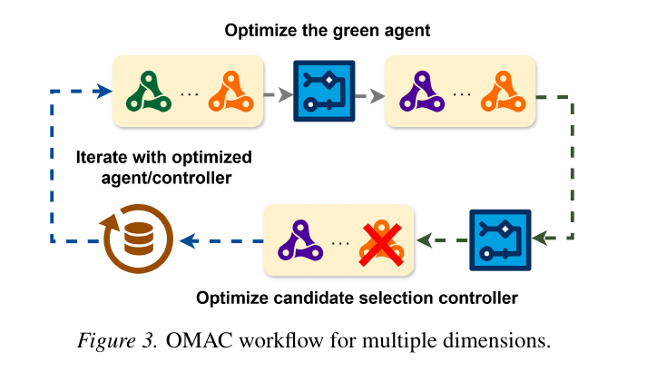](https://icml.cc/virtual/2026/poster/66164)

- [[2026-ICML]](https://icml.cc/virtual/2026/poster/62216) **EvoMAS: Evolutionary Generation of Multi-Agent Systems** [PDF](https://arxiv.org/pdf/2602.06511) [🐙 Code](https://github.com/amazon-science/EvoMAS)
  - 简介：EvoMAS 针对直接生成整套代理代码容易产生不可执行配置的问题，搜索结构化的角色、提示、工具、模型和拓扑配置。每题从已有池检索起点，实际执行候选，以 LLM 评审结合 token、延迟代价评分；变异只改一种组件，交叉继承一个父代的图并组合成员属性，演化记录供后续题目检索。 **主要结论：** 在 BBEH-Mini 和 WorkBench 上，三轮演化优于五轮，说明搜索越深并非越好；初始配置质量显著影响结果，异构模型按角色分配也可优于统一使用一个更大模型。每题演化本身需要额外执行与评审，最佳配置的答题成绩应与搜索开销区分。

  [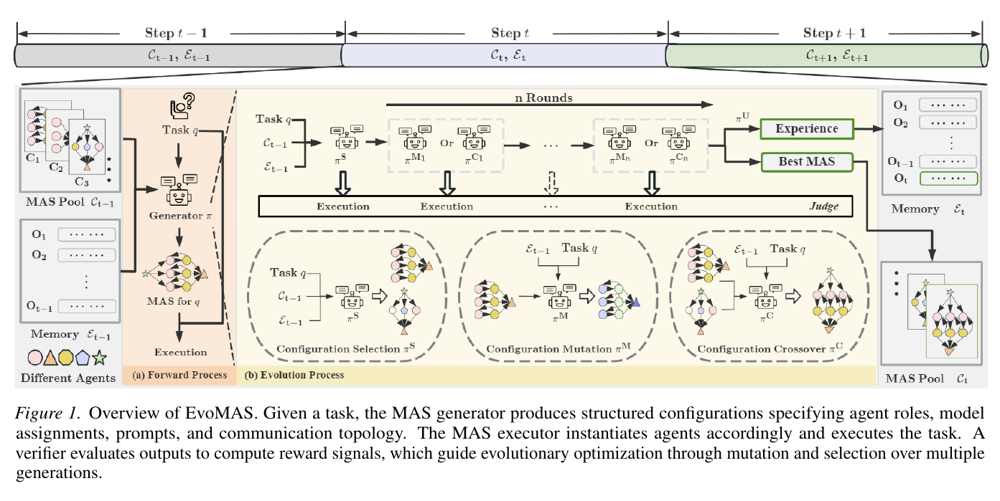](https://icml.cc/virtual/2026/poster/62216)

### D4. 运行框架与异步调度

- [[2024-arXiv]](https://arxiv.org/abs/2402.14034) **AgentScope: A Flexible yet Robust Multi-Agent Platform** [PDF](https://arxiv.org/pdf/2402.14034) [🐙 Code](https://github.com/agentscope-ai/agentscope)
  - 简介：AgentScope 面向多智能体程序的工程实现，把成员、消息、模型包装和工具调用统一为可组合组件；流水线表达顺序、条件和循环关系，消息中心负责组内广播并支持增删参与者，Actor 分布式模式让成员在不同进程或机器上异步执行，在结果真正被依赖时再等待。 **主要结论：** 论文通过群聊、狼人杀和分布式应用示例展示，同一接口可以承载多种通信关系与执行方式，拓扑和运行机制可以分别配置。它主要提供平台机制及用例，没有受控实验支持某种通信图普遍提高推理准确率；适合学习如何实现和运行智能体网络。

  

- [[2024-COLM]](https://openreview.net/forum?id=BAakY1hNKS) **AutoGen: Enabling Next-Gen LLM Applications via Multi-Agent Conversations** [PDF](https://arxiv.org/pdf/2308.08155v2) [🐙 Code](https://github.com/microsoft/autogen)
  - 简介：AutoGen 将 LLM、工具和人统一为可收发消息、生成回复的可交互成员，用自然语言与程序共同控制对话流程；其中 GroupChatManager 可以根据角色和当前聊天记录选择下一位发言者，再把回复广播给团队。因此它既能实现固定工作流，也能实现运行时发言者调度；这里收录的是后者，AutoGen 本身是框架而非一种学习通信图的算法。**主要结论：** 论文的动态群聊案例在 12 个手工构造任务上比较选人提示，加入角色扮演的选择方式比仅提示任务提高完成率、减少调用。这个小规模对照支持显式设计调度规则的价值；各应用还依赖工具执行、验证器和对话控制，不能把框架整体收益都解释为动态拓扑带来的提升。

  

- [[2025-ICLR]](https://proceedings.iclr.cc/paper_files/paper/2025/hash/59c27bf8d56d3d50c7aeaf7535dee975-Abstract-Conference.html) **Internet of Agents: Weaving a Web of Heterogeneous Agents for Collaborative Intelligence** [PDF](https://arxiv.org/pdf/2407.07061v2) [🐙 Code](https://github.com/OpenBMB/IoA)
  - 简介：Internet of Agents（IoA）针对不同工具、框架和知识来源的成员难以直接协作，提供统一的注册、发现和消息接口；成员遇到能力缺口时可以检索新伙伴并递归建立子团队，各群聊再根据当前消息和任务完成状态选择下一位发言者，在讨论、同步／异步分配、等待和结束之间切换。结构因此随子任务需求展开，同时保留明确的协议约束。**主要结论：** 在 153 条开放式指令、以 GPT-4 为评审的实验中，组合 AutoGPT 与 Open Interpreter 的方案分别取得相对两者 76.5%、63.4% 的胜率；但成本分析发现重复转述会使讨论停滞，人工去重后通信成本可下降近一半。结果同时展示异构能力互补的收益与无效交流的代价，动态组队本身并不保证高效通信。

  

- [[2025-Findings of ACL]](https://aclanthology.org/2025.findings-acl.259/) **MegaAgent: A Large-Scale Autonomous LLM-based Multi-Agent System Without Predefined SOPs** [PDF](https://aclanthology.org/2025.findings-acl.259.pdf) [🐙 Code](https://github.com/Xtra-Computing/MegaAgent)
  - 简介：MegaAgent 针对预先写死流程难以管理大量成员的问题，让总负责人拆任务、管理员按需递归招募子成员；组内直接协作，跨组由管理员协调，每个成员通过消息队列批量处理请求，分层监控负责检查进度和返工。 **主要结论：** 五子棋开发案例中，完整配置用七个成员在 800 秒内通过四项检查；去掉并行仍能完成，但耗时增至 4,505 秒，去掉监督虽更快却未通过结束条件检查。政策生成还展示了数百成员运行的可行性，但这是特定应用的扩展演示，不能据此推出成员数量越多、通用任务性能越好。

  [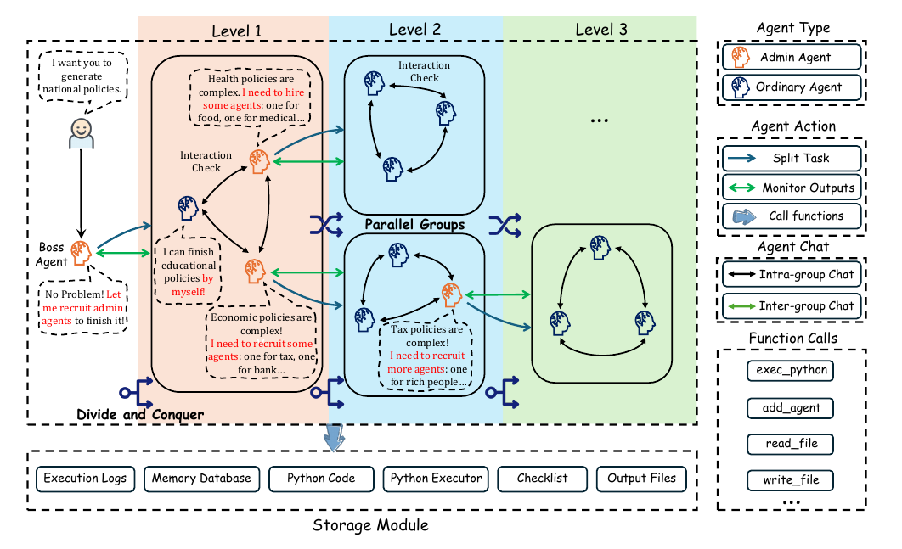](https://aclanthology.org/2025.findings-acl.259/)

- [[2025-ICAPS]](https://ojs.aaai.org/index.php/ICAPS/article/view/36130) **DynTaskMAS: A Dynamic Task Graph-driven Framework for Asynchronous and Parallel LLM-based Multi-Agent Systems** [PDF](https://ojs.aaai.org/index.php/ICAPS/article/download/36130/38284)
  - 简介：DynTaskMAS 针对多智能体串行执行时互相等待、重复传递上下文的问题，把子任务及前置依赖组织成动态任务图；调度器将已满足依赖的任务放入优先队列，结合成员能力、负载和传输代价异步派发，语义索引只分发相关上下文，并根据执行状态调整后续工作流。图中的节点主要是子任务，不等于固定智能体。 **主要结论：** 在论文的 RTX 3090、Llama3.1-8B 配置中，相比串行处理，三档任务复杂度的执行时间缩短 21.3%–33.0%；成员数从 4 增至 16 时吞吐量提高约 3.47 倍，但单任务延迟也上升。因此它主要提供依赖感知调度与系统效率的证据，不能把吞吐量提升解释成推理准确率提升。

  

- [[2026-ICLR]](https://proceedings.iclr.cc/paper_files/paper/2026/hash/b86a195e70f27017c514fa0e5f80595f-Abstract-Conference.html) **Stop Wasting Your Tokens: Towards Efficient Runtime Multi-Agent Systems** [PDF](https://proceedings.iclr.cc/paper_files/paper/2026/file/b86a195e70f27017c514fa0e5f80595f-Paper-Conference.pdf) [🐙 Code](https://github.com/LINs-lab/SupervisorAgent)
  - 简介：SupervisorAgent 针对执行中的错误循环、低效动作和冗长工具结果，在智能体、工具及记忆的交互点加入监督层：先用不调用 LLM 的启发式过滤器识别异常，再让监督者结合全局与局部轨迹选择放行、提示、修正观察或调用验证者。 **主要结论：** GAIA 完整验证集上，Smolagent 接入后保持 50.91% 准确率，总 token 降低 29.68%（含监督开销）。消融中，观察净化主要贡献节省，纠错与行为指导主要维持准确率；过度删去 HTML 等环境线索反而可能损害任务表现，且监督调用会增加延迟。

  [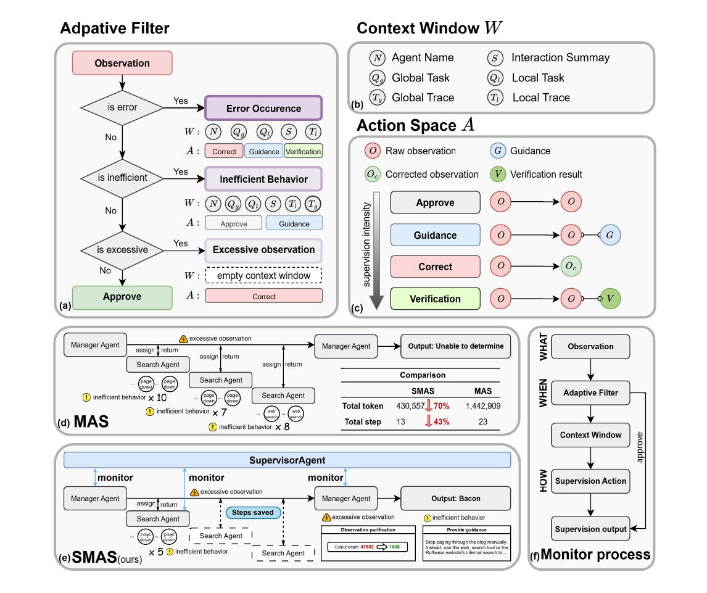](https://proceedings.iclr.cc/paper_files/paper/2026/hash/b86a195e70f27017c514fa0e5f80595f-Abstract-Conference.html)

- [[2026-ICML]](https://icml.cc/virtual/2026/poster/62000) **ScaleSim: Serving Large-Scale Multi-Agent Simulation with Invocation Distance-Based Memory Management** [PDF](https://arxiv.org/pdf/2601.21473) [🐙 Code](https://github.com/PanZaifeng/KVFlow)
  - 简介：ScaleSim 针对大规模模拟中多数成员暂时不调用 LLM、按最近使用时间淘汰显存会反复搬运的问题，让应用提供每个成员距离下次调用的相对距离，可由动作剩余时间、预计相遇时间或传播图跳数估计。后端据此预取即将活跃成员的 KV 缓存或 LoRA，并优先淘汰较晚才使用的状态。 **主要结论：** Qwen2.5-7B、单 H100、限制驻留容量的三类模拟中，相对 SGLang 的最高端到端加速分别为 1.73、1.31、1.74 倍。收益来自稀疏激活下减少搬运等待，依赖应用能提供有用的调用距离；这项工作改进的是运行调度，不是成员的认知记忆或答题准确率。

  [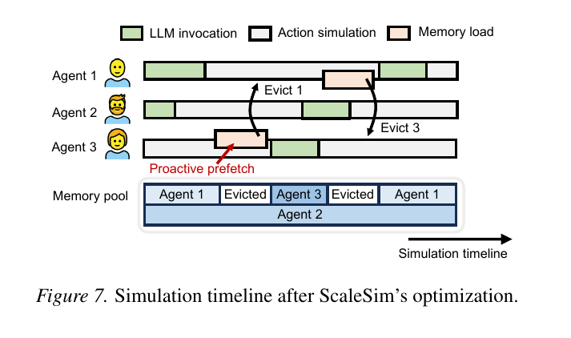](https://icml.cc/virtual/2026/poster/62000)

## E. 协作规律与评估

### E1. 协作收益与规模规律

- [[2024-ICML]](https://proceedings.mlr.press/v235/khan24a.html) **Debating with More Persuasive LLMs Leads to More Truthful Answers** [PDF](https://raw.githubusercontent.com/mlresearch/v235/main/assets/khan24a/khan24a.pdf) [🐙 Code](https://github.com/ucl-dark/llm_debate)
  - 简介：本文研究缺少原文的评委能否借助两位知情模型辨别答案：在 QuALITY 阅读理解中，让两个能读全文的辩手分别支持正确答案与干扰项，借助可核验的原文引句展开辩论，评委仅看辩论记录。作者用 best-of-N 和批评后改写提高论点说服力，并与只有一位顾问陈述的协议比较。 **主要结论：** 最有说服力的配置下，模型评委和人类评委准确率分别达到 76% 和 88%，高于无协助的 48% 和 60%。提高说服力会提升辩论准确率，却可能降低单顾问协议的准确率；增加轮数也不必然有效，较弱评委在两轮后可能退步。结论依赖可核验证据，且这里的强弱差异主要通过是否能读原文构造。

  [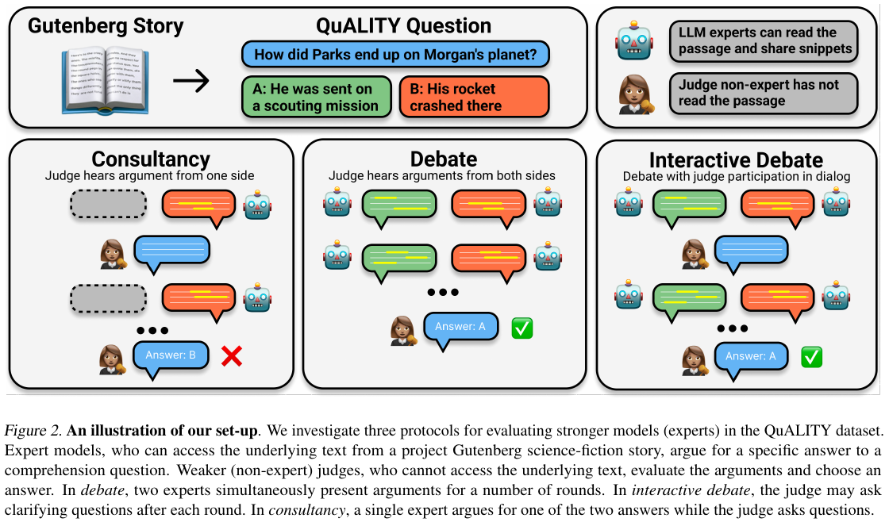](https://proceedings.mlr.press/v235/khan24a.html)

- [[2025-Findings of ACL]](https://aclanthology.org/2025.findings-acl.606/) **Voting or Consensus? Decision-Making in Multi-Agent Debate** [PDF](https://aclanthology.org/2025.findings-acl.606.pdf) [🐙 Code](https://github.com/lkaesberg/decision-protocols)
  - 简介：该论文针对不同辩论工作同时改变提示、轮数与决策方式、难以解释收益的问题，在相同骨干模型和专家配置下比较四种投票与三种共识规则，并单独改变成员数、轮数和消息交互。 **主要结论：** 所测知识任务总体更适合共识，推理任务更适合保留多个候选再投票；更多成员通常有益，延长投票前讨论却可能降低成绩。让成员先独立起草、或限制每轮交流以保留独立思考，比强制批判语气更可靠地提高答案多样性与表现。结果不支持一种决策协议通吃，且辩论相对单模型 CoT 的 token 开销显著增加。

  [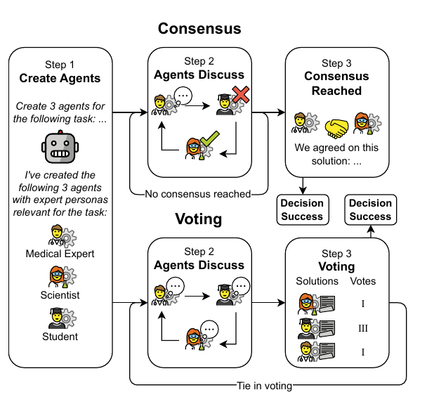](https://aclanthology.org/2025.findings-acl.606/)

- [[2025-NeurIPS]](https://proceedings.neurips.cc/paper_files/paper/2025/hash/934252acd87f254d5d4672fbde283bd2-Abstract-Conference.html) **Debate or Vote: Which Yields Better Decisions in Multi-Agent Large Language Models?** [PDF](https://arxiv.org/pdf/2508.17536v2) [🐙 Code](https://github.com/deeplearning-wisc/debate-or-vote)
  - 简介：论文追问辩论收益究竟来自相互交流还是独立采样的集成：固定五个智能体，对比去中心化、稀疏、中心化辩论与不交流的多数投票，并改变轮数和人数。 **主要结论：** Qwen2.5-7B、Llama3.1-8B 的七个数据集上，辩论通常不能稳定超过投票，增加轮数也不保证改善；部分异质角色配置有例外。作者随后用多数答案引导更新，抑制正确意见被改错，在所测配置中改善普通辩论。其“锁定正确答案”实验依赖真实标签，只用于分析纠错机制，不能当作部署时可用方案。

  

- [[2025-arXiv]](https://arxiv.org/abs/2512.08296) **Towards a Science of Scaling Agent Systems** [PDF](https://arxiv.org/pdf/2512.08296) [🐙 Code](https://github.com/ybkim95/agent-scaling)
  - 简介：论文在三类模型、六个交互式基准的 260 个配置中，对照单智能体与独立、中心化、去中心化、混合协作，控制工具接口与最大执行预算，并用任务属性及运行轨迹解释差异。 **主要结论：** Finance Agent 中心化协作的平均分从 0.349 升至 0.631，相对提升 80.8%；PlanCraft 中所有多智能体配置都下降，独立配置相对下降 70.0%。轨迹分析将差异联系到任务能否并行拆分及协调开销；回归预测只有部分解释力，因此这是有条件的经验规律，并不支持“更复杂任务必然需要更多智能体”。

  

- [[2026-arXiv]](https://arxiv.org/abs/2603.28990) **Drop the Hierarchy and Roles: How Self-Organizing LLM Agents Outperform Designed Structures** [PDF](https://arxiv.org/pdf/2603.28990)
  - 简介：这项比较研究把协调协议与角色自主性分开：中心协调者派工、固定顺序下自主选角色、先广播意向再行动、依据共享历史独立行动，并测试规模、任务复杂度与成员扰动。 **主要结论：** 在相同配置的协议比较中，读取前序已完成产物的 Sequential 优于中心派工与完全自主方案；三个模型的 L3 任务复测支持其相对中心派工的优势。但自由选角色对不同模型的影响可相反，扩大人数也未持续提高质量。结果来自论文构造的任务与模型评审；研究比较的是协调协议与角色自主性，不能把角色变化等同于学得通信图。

  

- [[2026-ICLR]](https://proceedings.iclr.cc/paper_files/paper/2026/hash/e9372abc370b8302459abdce4bdce5a5-Abstract-Conference.html) **Benefits and Limitations of Communication in Multi-Agent Reasoning** [PDF](https://arxiv.org/pdf/2510.13903v2) [🐙 Code](https://github.com/michaelrizvi/coa-algorithmic)
  - 简介：论文从理论上区分“把输入分给更多成员”和“真的减少串行推理”这两件事。在硬注意力 Transformer、输入分块的设定下，将内部生成与成员通信统一为计算图，分析成员数、计算深度与通信预算，并为检索、状态跟踪、多跳推理构造协议。 **主要结论：** 简单检索可以扩展可处理的上下文而只需常数量级通信；可结合的状态跟踪能通过并行归约降低深度，但通信随成员数增加；多跳推理在最坏情形仍受依赖链限制，增加成员不能消除逐跳计算。Llama 8B、70B 的合成任务实验总体支持这些区别。因此是否值得组网取决于任务的可分解性与依赖结构，不能从这套有条件的理论推出通用最优拓扑。

  [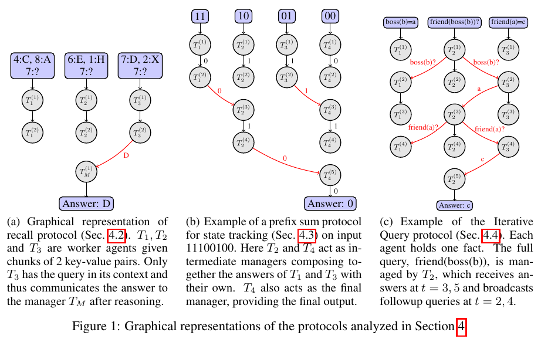](https://proceedings.iclr.cc/paper_files/paper/2026/hash/e9372abc370b8302459abdce4bdce5a5-Abstract-Conference.html)

- [[2026-ICML]](https://icml.cc/virtual/2026/poster/60576) **More Capable, Less Cooperative? When LLMs Fail at Zero-Cost Collaboration** [PDF](https://arxiv.org/pdf/2604.07821)
  - 简介：本文将十个智能体放入信息交换任务：完成任务需要他人持有的信息，发送者保留原信息、分享没有个人代价，所有成员被要求最大化群体收益。通过分别自动代发请求、自动满足请求，实验拆分执行能力与分享行为，避免把所有失败归因于推理能力不足。 **主要结论：** 八个模型的通用能力排名与群体成绩没有显著相关；部分模型在自动获得信息后接近理想策略，却在他人请求信息时仍不充分分享。具体操作指令与分享奖励能缓解不同瓶颈，隐藏同伴进度则有好有坏。这里的“零成本”指环境规则不向发送者计费，并非真实 API 通信免费。

  [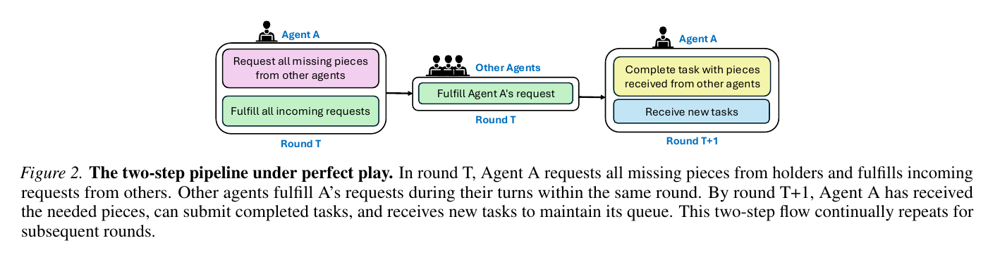](https://icml.cc/virtual/2026/poster/60576)

- [[2026-ICML]](https://icml.cc/virtual/2026/poster/63358) **Multi-Agent Teams Hold Experts Back** [PDF](https://arxiv.org/pdf/2602.01011) [🐙 Code](https://github.com/apappu97/multi-agent-teams-hold-experts-back)
  - 简介：本文检验团队能否利用成员专长，而不只比较是否超过平均成员。实验在排序任务中控制专家知识的分布，并在推理基准中按题识别回答正确的成员；比较不告知专家、明确告知专家，以及理想采纳正确答案的上界。 **主要结论：** 告知专家身份仍不能消除收益缺口；排序任务中从二人扩至八人反而加重专家意见被稀释的现象。对话分析发现，折中整合与较差成绩相关，但没有证明其由对齐训练导致。推理基准的团队有时超过最强固定单模型，仍低于“每题至少一人正确”的上界，不能概括为所有团队必然不如单模型。

  [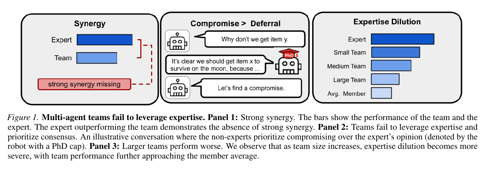](https://icml.cc/virtual/2026/poster/63358)

### E2. 协作能力基准

- [[2024-ICLR]](https://proceedings.iclr.cc/paper_files/paper/2024/hash/b3075b88e583a0e98d8b24338a613060-Abstract-Conference.html) **SOTOPIA: Interactive Evaluation for Social Intelligence in Language Agents** [PDF](https://proceedings.iclr.cc/paper_files/paper/2024/file/b3075b88e583a0e98d8b24338a613060-Paper-Conference.pdf) [🐙 Code](https://github.com/sotopia-lab/sotopia)
  - 简介：SOTOPIA 针对静态问答无法检验互动能力的问题，从 40 个人设和 90 个场景构建 450 项双人任务。双方各持自己的目标和部分可见的人物信息，在至多 20 轮内通过发言或文字描述的行动协商、合作或竞争；结束后按目标达成、行为可信度、关系变化等七个维度评分，并以人评检验 GPT-4 评委。 **主要结论：** 模型在静态语言测试中的表现不能直接代表其交互能力，较弱搭档还会拉低对方表现；在 20 项 SOTOPIA-hard 任务上，人类目标达成得分显著高于 GPT-4，平均每次发言却更短。GPT-4 评分与人评的一致性因维度而异，目标达成上相关性较强，不能把自动评分视为所有社会能力的可靠替代。

  [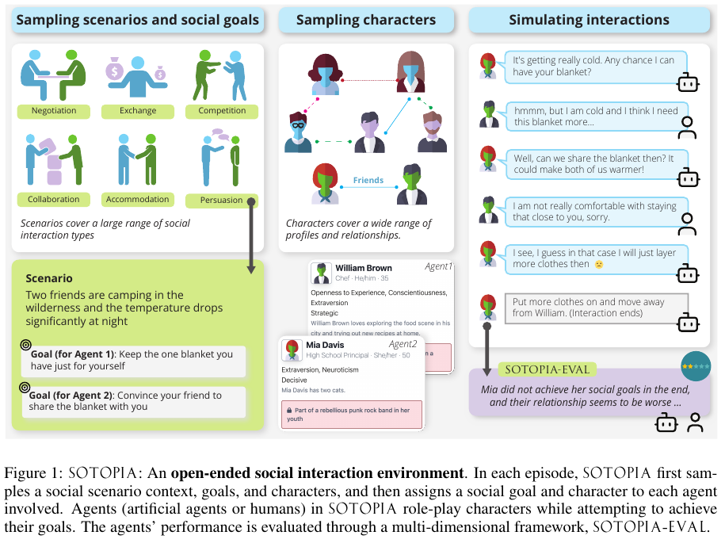](https://proceedings.iclr.cc/paper_files/paper/2024/hash/b3075b88e583a0e98d8b24338a613060-Abstract-Conference.html)

- [[2024-EMNLP]](https://aclanthology.org/2024.emnlp-main.416/) **MAgIC: Investigation of Large Language Model Powered Multi-Agent in Cognition, Adaptability, Rationality and Collaboration** [PDF](https://aclanthology.org/2024.emnlp-main.416.pdf) [🐙 Code](https://github.com/cathyxl/MAgIC)
  - 简介：MAgIC 将智能体交互能力拆为判断、推理、自我认知、合作、协调和理性等维度，在身份推断、成本分摊、囚徒困境与公共物品等游戏中让不同模型对局。配套 PGM-aware 方法先用结构化多视角推断记录各参与者可能的信念，再据此选择发言或动作；此处的概率图描述信念关系，并非学习通信连接。 **主要结论：** 所测模型在不同能力维度上表现不一致；加入信念结构后，多数模型在七项能力中的三至四项显著改善，而不是每项都提高。它适合研究合作、竞争和混合动机下的交互行为，不能把较高胜率直接解释成更好的团队共同收益。

  [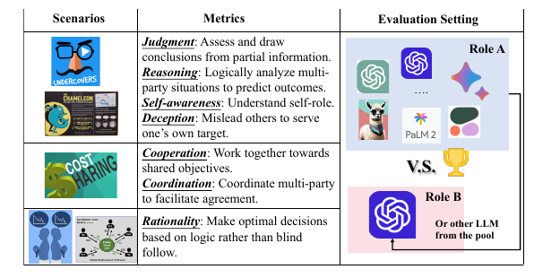](https://aclanthology.org/2024.emnlp-main.416/)

- [[2025-Findings of NAACL]](https://aclanthology.org/2025.findings-naacl.448/) **LLM-Coordination: Evaluating and Analyzing Multi-agent Coordination Abilities in Large Language Models** [PDF](https://aclanthology.org/2025.findings-naacl.448.pdf) [🐙 Code](https://github.com/eric-ai-lab/llm_coordination)
  - 简介：LLM-Coordination 用 Hanabi、Overcooked、合作追捕与逃脱四类游戏检验实际协调，再以 198 道问题分别测环境理解、对伙伴信念的推断和联合规划。实验既比较同类成员组队，也测试面对未见伙伴的配合，避免把语言问答能力直接当作协作能力。 **主要结论：** LLM 在主要依赖可见环境的若干 Overcooked 布局上有竞争力，但 Hanabi 中最好的 GPT-4-turbo 配置仅约 13.33 分，明显低于强化学习基线约 24 分；移除伙伴心理推断与动作验证还会继续退化。理解环境、判断他人知道什么、形成共同计划是不同瓶颈，不能用单一总分代替。

  [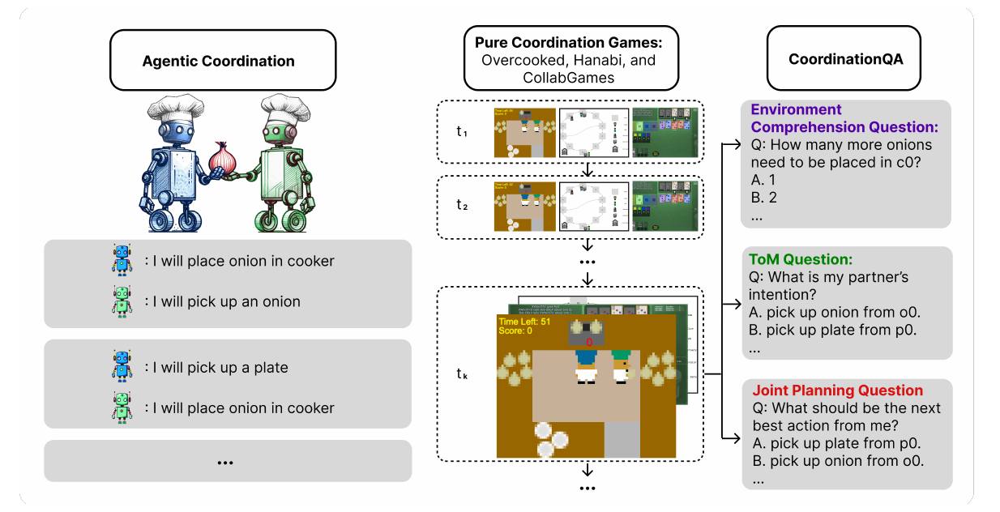](https://aclanthology.org/2025.findings-naacl.448/)

- [[2025-ACL]](https://aclanthology.org/2025.acl-long.421/) **MultiAgentBench: Evaluating the Collaboration and Competition of LLM agents** [PDF](https://arxiv.org/pdf/2503.01935v1) [🐙 Code](https://github.com/ulab-uiuc/MARBLE)
  - 简介：MultiAgentBench 用 MARBLE 统一运行六类合作或竞争任务，除最终任务分数外，还记录里程碑贡献与通信、规划评分；通过固定星形、树形、网状和链式协议，分开比较通信结构与规划提示。 **主要结论：** 研究协作场景中，网状与星形的任务分数接近，树形分数较低且消耗更多 token；固定星形后，基于预期与实际结果差异更新经验的规划方式改善协作评分，而群体讨论规划并未领先。Minecraft 的轮数消融也不单调，表明结构、规划和轮数需要分别验证，不能把该场景的排名当成跨任务定律。

  

- [[2025-EMNLP]](https://aclanthology.org/2025.emnlp-main.249/) **Collab-Overcooked: Benchmarking and Evaluating Large Language Models as Collaborative Agents** [PDF](https://aclanthology.org/2025.emnlp-main.249.pdf) [🐙 Code](https://github.com/YusaeMeow/Collab-Overcooked)
  - 简介：Collab-Overcooked 把两名成员放在资源隔离、任务知识不对称的厨房中，只有一个成员知道完整做法，必须通过沟通与传递资源完成 30 个、六档难度的任务。除成功率外，基准用参考动作轨迹衡量执行效率，并分开评估何时发起协作和如何响应请求。 **主要结论：** 十三个模型的测试中，扩大模型能改善部分简单任务，却未消除长流程退化；相同协作动作移到流程前部更容易成功，发起协作是主要瓶颈。对开放模型的注意力干预可修复部分失败案例，支持它们有时忽略协作规则或环境状态；这不是单靠多聊几轮就能概括的问题。

  [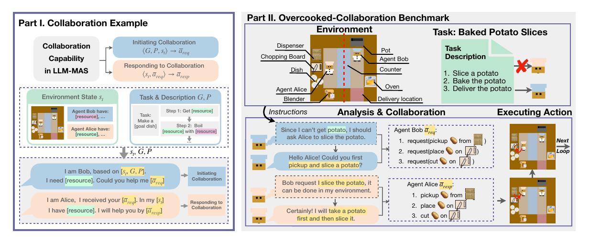](https://aclanthology.org/2025.emnlp-main.249/)

- [[2026-arXiv]](https://arxiv.org/abs/2602.13255) **DPBench: Structural Determinants of Multi-Agent LLM Coordination Under Simultaneous Resource Contention** [PDF](https://arxiv.org/pdf/2602.13255) [🐙 Code](https://github.com/najmulhasan-code/dpbench)
  - 简介：DPBench 用哲学家就餐任务隔离同时行动时的资源协调：每个 LLM 只观察局部资源状态，先按设定交换消息，再提交取用、释放或等待动作；固定模型，比较轮流与同时执行、通信轮数、提示规则及组规模。 **主要结论：** 五成员、同时行动的 Gemini 2.5 Flash 实验中，一轮通信的死锁率为 86.7%，与不通信的 90% 接近；三轮通信在 20 次试验中未观察到死锁，但五轮没有继续改善。明确资源顺序或打破对称的提示也能减少死锁，各策略吞吐与公平性不同。结论针对该有限环境与样本，说明协议能改变协作表现，不是模型具备普遍无死锁保证。

  [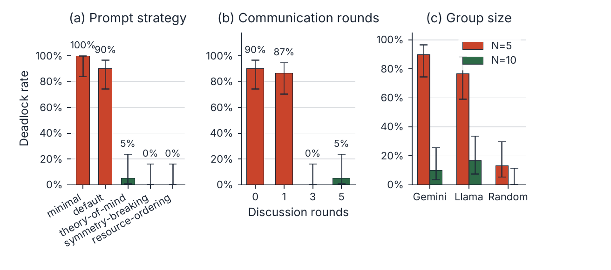](https://arxiv.org/abs/2602.13255)

- [[2026-ICML]](https://icml.cc/virtual/2026/poster/63068) **AgentWebBench: Benchmarking Multi-Agent Coordination in Agentic Web** [PDF](https://arxiv.org/pdf/2604.10938) [🐙 Code](https://github.com/cxcscmu/AgentWebBench)
  - 简介：AgentWebBench 针对集中检索基准无法测出跨网站代理协调的问题，将语料分给网站内容代理，用户代理必须选网站、询问代理并综合证据；用搜索、推荐、问答与深度研究四类任务，对比嵌入选站、LLM 选站后直接检索，以及真正的代理间交互。 **主要结论：** 多代理方案在搜索和深度研究中常落后于可访问全库的集中检索，但问答有时受益于迭代取证；这一差距包含访问条件变化，不能全归因于协调算法。更强模型通常缩小差距，简单减少交互次数不等于更高效率；失败诊断分别暴露选站规划、站内检索及答案综合的瓶颈。

  [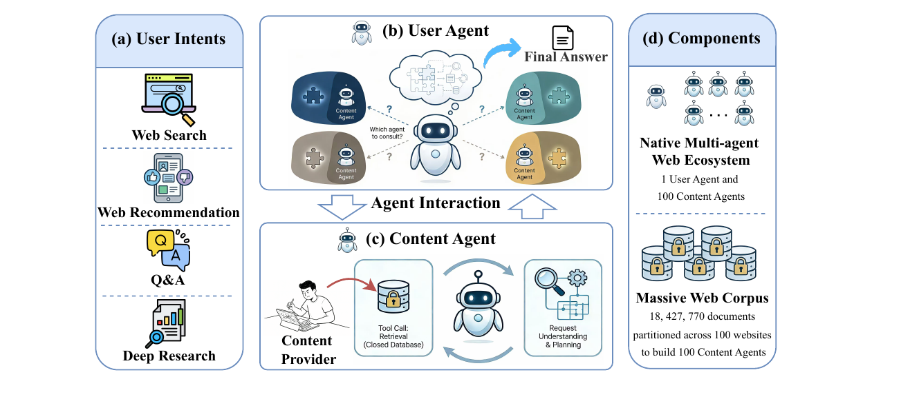](https://icml.cc/virtual/2026/poster/63068)

- [[2026-ICML]](https://icml.cc/virtual/2026/poster/65129) **ProtocolBench: Which LLM MultiAgent Protocol to Choose?** [PDF](https://arxiv.org/pdf/2510.17149) [🐙 Code](https://github.com/ulab-uiuc/AgentProtocols)
  - 简介：ProtocolBench 针对通信协议的影响常被模型、提示和运行环境混杂的问题，固定这些因素及场景拓扑，用薄适配层保留 A2A、ACP、ANP、Agora 各自的重试和流式行为，统一记录任务质量、时延、消息开销与故障恢复。另设 ProtocolRouter，先筛除不满足约束的协议，再按需求和历史表现为场景或模块选型。 **主要结论：** 所测 GAIA 文档协作中 A2A 的任务表现最好，流式队列中 ACP 的平均延迟和波动更低，没有协议全面占优。路由器是低频选择与组合机制，结果依赖所测实现、版本及工作负载，不能解释为协议名称本身决定模型推理能力。

  [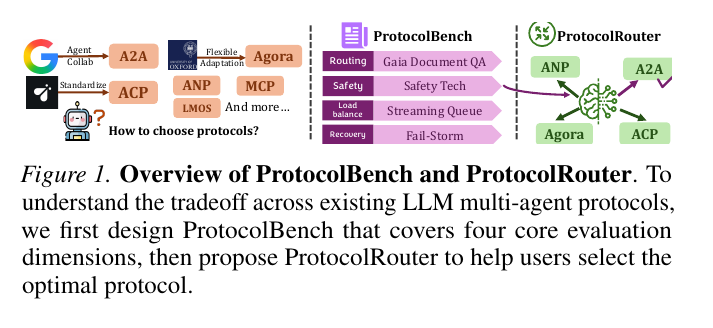](https://icml.cc/virtual/2026/poster/65129)

### E3. 过程诊断与失败归因

- [[2025-ICML]](https://proceedings.mlr.press/v267/zhang25cq.html) **Which Agent Causes Task Failures and When? On Automated Failure Attribution of LLM Multi-Agent Systems** [PDF](https://raw.githubusercontent.com/mlresearch/v267/main/assets/zhang25cq/zhang25cq.pdf) [🐙 Code](https://github.com/mingyin1/Agents_Failure_Attribution)
  - 简介：Who&When 将“团队失败了”拆成哪个成员造成决定性错误、错误发生在哪一步，收集 127 个系统的失败日志并构成 184 个带专家标注的归因任务。论文比较一次读完整日志、逐步检查、二分定位三种方法，并区分是否提供最终正确答案。 **主要结论：** 全量阅读更擅长定位责任成员，逐步检查更擅长精确定位步骤，二者没有统一最优方案；日志变长时，步骤定位尤其容易退化，提供最终答案也只能部分帮助。因此检查整段协作与检查局部动作需要不同的信息组织，能判断答案错了并不等于能找准上游原因。

  

- [[2025-NeurIPS · Datasets and Benchmarks]](https://papers.nips.cc/paper_files/paper/2025/hash/b1041e52d3be19f0a9bc491657488e4a-Abstract-Datasets_and_Benchmarks_Track.html) **Why Do Multi-Agent LLM Systems Fail?** [PDF](https://papers.nips.cc/paper_files/paper/2025/file/b1041e52d3be19f0a9bc491657488e4a-Paper-Datasets_and_Benchmarks_Track.pdf) [🐙 Code](https://github.com/multi-agent-systems-failure-taxonomy/MAST)
  - 简介：MAST 针对最终成功率无法解释团队在哪一步出错的问题，从运行轨迹归纳失败机制。六位专家先分析 150 条轨迹，经迭代标注形成 14 类失败模式，归为规格与系统设计、智能体间失配、任务验证与终止三组；验证标注一致性后，再用 LLM 评判器扩展到七种框架的 1,642 条轨迹。 **主要结论：** 不同框架的失败构成明显不同，共享上下文缺失、忽视同伴信息、缺少验证等问题无法用“模型能力不够”统一解释；针对诊断修改角色提示或工作流可改善部分任务，但不能消除全部失败。该分类适合定位协调和验证缺口；由于框架面对的任务不同，不宜直接拿各自失败率作跨框架能力排名，也不能把全部轨迹称为人工标注。

  

- [[2026-ICLR]](https://proceedings.iclr.cc/paper_files/paper/2026/hash/2f5fdce256ff0d7fb774da76e5e63209-Abstract-Conference.html) **DoVer: Intervention-Driven Auto Debugging for LLM Multi-Agent Systems** [PDF](https://proceedings.iclr.cc/paper_files/paper/2026/file/2f5fdce256ff0d7fb774da76e5e63209-Paper-Conference.pdf)
  - 简介：DoVer 针对只凭日志给失败归因、却无法验证归因是否有用的问题，将轨迹按重新规划点切分，提出可疑步骤，再修改协调者的指令或计划，从保存状态重放，并比较成功率和关键里程碑进展。每项干预重复三次，区分支持、部分支持、反驳及无法判断。 **主要结论：** WW 的受干预试验成功率约 17.6%，GAIA Level 1 为 27.5%；困难 WW 案例约六成归因仍无法判断，常因系统未执行干预。修复后的结果比日志解释提供更直接的检验，但一次失败未被修复并不足以证明原归因错误。

  [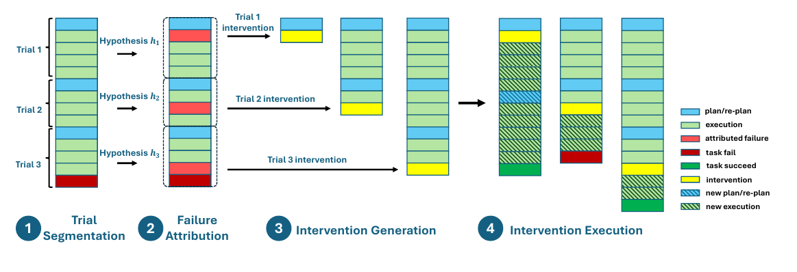](https://proceedings.iclr.cc/paper_files/paper/2026/hash/2f5fdce256ff0d7fb774da76e5e63209-Abstract-Conference.html)

- [[2026-ACL]](https://aclanthology.org/2026.acl-long.912/) **Seeing the Whole Elephant: A Benchmark for Failure Attribution in LLM-based Multi-Agent Systems** [PDF](https://aclanthology.org/2026.acl-long.912.pdf) [🐙 Code](https://github.com/TraceElephant/TraceElephant)
  - 简介：TraceElephant 针对仅凭成员输出难以判断它当时是否收到足够信息的问题，记录每步完整输入、输出、工具交互及系统配置，并保留可重跑环境；数据包含 380 条轨迹，其中 220 条失败，覆盖 Captain-Agent、Magentic-One 和单智能体工具框架 SWE-Agent。 **主要结论：** 表 3 中，交互式归因器读取完整记录时，成员与步骤准确率为 66%、30%；同时去掉输入和元数据后降至 54%、17%。重跑候选步骤进行反事实检查还能改善步骤定位。因此可观测性本身影响归因质量，不能把缺少关键输入的日志上的错误全部归结为分析模型推理不足。

  [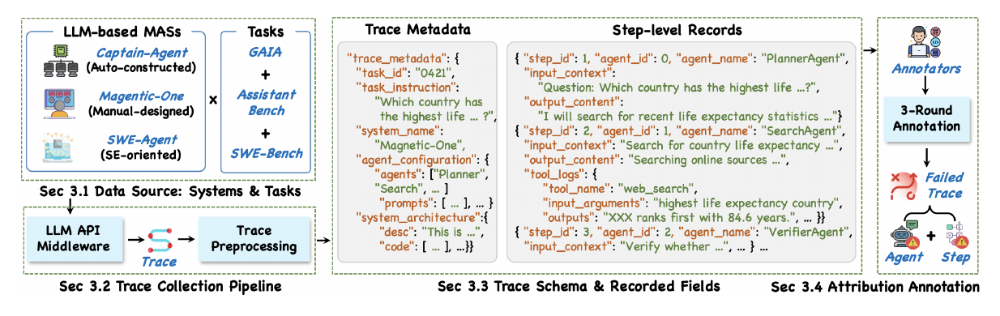](https://aclanthology.org/2026.acl-long.912/)

- [[2026-ICML]](https://icml.cc/virtual/2026/poster/63666) **MAS-ProVe: Understanding the Process Verification of Multi-Agent Systems** [PDF](https://arxiv.org/pdf/2602.03053) [🐙 Code](https://github.com/Wang-ML-Lab/MAS-ProVe)
  - 简介：MAS-ProVe 针对多智能体中间过程怎样验证缺少系统比较的问题，在六种框架中插入统一搜索接口：每步或每轮生成三个候选，由奖励模型、过程奖励模型或 LLM 评审选择继续路径，并改变评审看到的历史范围。 **主要结论：** 没有统一最优的验证粒度：AFlow、ADAS 更受益于逐成员验证，Debate 等更适合整轮验证，DyLAN 的偏好还随任务变化。长历史的数学推理常受益于摘要，但 GAIA 信息提取可能因细节丢失而受损。验证不是免费增益；多候选生成与评分增加计算，这项研究主要提供评估规律。

  [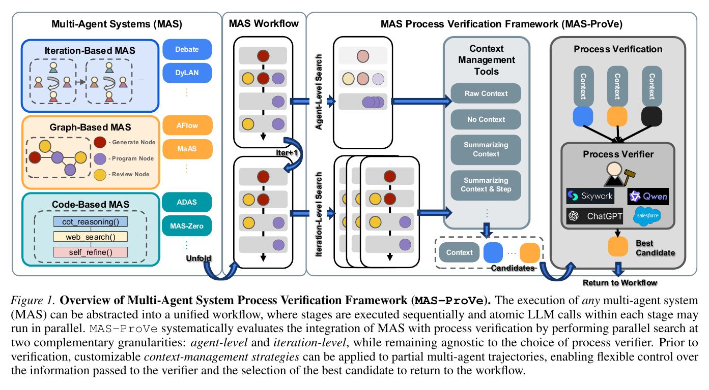](https://icml.cc/virtual/2026/poster/63666)
